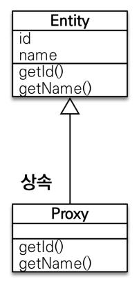

# 1 프록시

> 객체는 객체 그래프로 연관된 객체들을 탐색한다. 그런데 객체가 데이터베이스에 저장되어 있으므로 연관된 객체를 자유롭게 탐색하기는 어렵다. JPA 구현체는 이를 해결하고자 `프록시`라는 기술을 사용한다. **`프록시`를 사용하면 연관된 객체를 처음부터 데이터베이스에서 조회하는 것이 아니라 , 실제 사용하는 시점에 데이터베이스에서 조회할 수 있다.** 이를 `지연 로딩`이라 한다. `지연 로딩` 기능을 사용하려면 실제 엔티티 객체 대신에 데이터베이스 조회를 지연할 수 있는 가짜 객체를 필요로 하는데 이를 `프록시 객체`라고 한다.


## 1.1 프록시 기초

* 엔티티를 실제 사용하는 시점까지 데이터베이스 조회를 미루고 싶다면 `em.find()`대신  `em.getReference()`을 사용하라

* 이 메서드는 데이터베이스를 조회하지 않고 대신에 데이터베이스 접근을 위임한 프록시 객체를 반환한다.

  


## 1.2 프록시 특징



* 프록시 객체는 원본 엔티티를 상속받음, 따라서 타입 체크시 주의해야함
  * `==` 비교 실패, 대신 `instance of` 사용
* 실제 클래스와 겉 모양이 같기 때문에 사용하는 입장에서는 진짜 객체인지
 프록시 객체인지 구분하지 않고 
 사용하면 됨(이론상)
* 프록시 객체는 실제 객체의 참조(target)를 보관
* 프록시 객체를 호출하면 프록시 객체는 실제 객체의 메소드 호출
* 프록시 객체는 실제 사용될 때 데이터베이스를 조회해서 실제 엔티티 객체를 생성하는데 이것을 `프록시 객체의 초기화`라 한다.
* 프록시 객체를 초기화 할 때, 프록시 객체가 실제 엔티티로 바뀌는 것은 아님, 초기화되면 프록시 객체를 통해서 실제 엔티티에 접근 가능
* 영속성 컨텍스트에 찾는 엔티티가 이미 있으면 `em.getReference()`를 호출해도 실제 엔티티 반환
* 영속성 컨텍스트의 도움을 받을 수 없는 준영속 상태일 때, 프록시를 초기화하면 문제 발생



## 1.3 프록시 객체의 초기화

* 프록시 객체는 실제 사용될 때 데이터베이스를 조회해서 실제 엔티티 객체를 생성하는데 이것을 `프록시 객체의 초기화`라 한다.

```java
Member member = em.getReference(Member.class, “id1”); 
member.getName();
```


**프록시 객체 초기화 과정**

1. 프록시 객체에 `member.getName()`을 호출해서 실제 데이터를 조회한다.
2. 프록시 객체는 실제 엔티티가 생성되어 있지 않으면 영속성 컨텍스트에 실제 엔티티를 생성하는 요청을 한다. 이를 초기화라 한다.
3. 영속성 컨텍스트는 데이터베이스를 조회해서 실제 엔티티 객체를 생성한다.
4. 프록시 객체는 생성된 실제 엔티티 객체의 참조를 Member target 멤버변수에 보관한다.
5. 프록시 객체는 실제 엔티티 객체의 getName()을 호출해서 결과를 반환한다.


## 1.4 프록시 확인

**프록시 인스턴스의 초기화 여부 확인**
 

* `PersistenceUnitUtil.isLoaded(Object entity)`

**프록시 클래스 확인 방법**
 

* entity.getClass().getName() 
* 출력(..javasist.. or HibernateProxy...)

**프록시 강제 초기화**


* org.hibernate.Hibernate.initialize(entity);
* JPA 표준은 강제 초기화 없음

* 강제 호출: `member.getName()`

# 2 즉시로딩

* 엔티티를 조회할 때 연관된 엔티티도 조회한다.
* 가급적 지연 로딩만 사용(특히 실무에서)
* 즉시 로딩을 적용하면 예상하지 못한 SQL이 발생
* 즉시 로딩은 JPQL에서 N+1 문제를 일으킨다.
* @ManyToOne, @OneToOne은 기본이 즉시 로딩
 -> LAZY로 설정
* @OneToMany, @ManyToMany는 기본이 지연 로딩


```java
@Entity
public class Member {
  @Id @GeneratedValue 
  private Long id;
  
  @Column(name = "USERNAME") 
  private String name;
  
  @ManyToOne(fetch = FetchType.EAGER) 
  @JoinColumn(name = "TEAM_ID")
  private Team team; ..
}
```


# 3. 지연로딩

* 연관된 엔티티를 실제 사용할 때 조횐한다.

```java
@Entity
public class Member {
  @Id @GeneratedValue 
  private Long id;
  
  @Column(name = "USERNAME") 
  private String name;
  
  @ManyToOne(fetch = FetchType.LAZY) 
  @JoinColumn(name = "TEAM_ID")
  private Team team; ..
}
```

* `Member member = em.find(Member.class, "member1")` 을 호출하면 
* 회원을 조회하고 팀은 조회하지 않는다. 대신 아래와 같이 team 멤버변수로 **프록시 객체**를 넣어둔다.


## 3.1 지연 로딩 활용

지연 로딩 활용 - 실무

* 모든 연관관계에 지연 로딩을 사용해라!
* 실무에서 즉시 로딩을 사용하지 마라!
* JPQL fetch 조인이나, 엔티티 그래프 기능을 사용해라!

* 즉시 로딩은 상상하지 못한 쿼리가 나간다.

# 4. 영속성 전이: CASCADE 

> 특정 엔티티를 영속 상태로 만들 때 연관된 엔티티도 함께 영속 상태로 만들도 싶을 때 사용한다.


## 4.1 영속성 전이: 저장


예: 부모 엔티티를 저장할 때 자식 엔티티도 함께 저장.

@OneToMany(mappedBy="parent", cascade=**CascadeType.PERSIST**)


## 4.2 주의사항

* 영속성 전이는 연관관계를 매핑하는 것과 아무 관련이 없다.
* 엔티티를 영속화할 때 연관된 엔티티도 함께 영속화하는 편리함을 제공할 뿐이다.
* **자식의 소유자(부모)가 하나일 때 사용**하자.


## 4.3CASCADE의 종류

* **ALL: 모두 적용**
* **PERSIST: 영속**
* REMOVE: 삭제
* MERGE: 병합
* REFRESH: REFRESH 
* DETACH: DETACH

# 5. 고아 객체

* 고아 객체 제거란 부모 엔티티와 연관관계가 끊어진 자식 엔티티를 자동으로 삭제하는 기능이다
* 부모 엔티티의 컬렉션에서 자식 엔티티의 참조만 제거하면 자식 엔티티가 자동으로 삭제됨


**예시**

```java
// orphanRemoval 활성화
@OneToMany(mappedBy = "parent", orphanRemoval = true)
private List<Child> Children = new ArrayList<>(); 

...

//자식 엔티티를 컬렉션에서 제거
//Delete SQL 자동 호출
Parent parent = em.find(Parent.class, id); 
parent.getChildren().remove(0);
```


## 5.1 주의사항

* 참조가 제거된 엔티티는 다른 곳에서 참조하지 않는 고아 객체로 보고 삭제하는 기능
* 참조하는 곳이 하나일 때 사용해야한다.
* **특정 엔티티가 개인 소유할 때 사용**한다
* @OneToOne, @OneToMany만 가능

> 참고
>
> 개념적으로 부모를 제거하면 자식은 고아가 된다. 따라서 고아 객체 제거 기능을 활성화 하면, 부모를 제거할 때 자식도 함께 제거된다. 이것은 CascadeType.REMOVE처럼 동작한다.

# 6. 영속성전이+고아객체, 생명주기

* CascadeType.ALL + orphanRemovel=true
* 스스로 생명주기를 관리하는 엔티티는 em.persist()로 영속화, em.remove()로 제거
* 두 옵션을 모두 활성화 하면 **부모 엔티티를 통해서 자식의 생명 주기를 관리**할 수 있음
  * 부모는 em.persist()로 영속화, em.remove()로 제거
  * 자식은 부모를 통해 생명주기를 관리한다.
* 도메인 주도 설계(DDD)의 Aggregate Root개념을 구현할 때 유용
