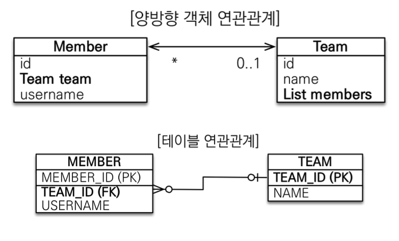
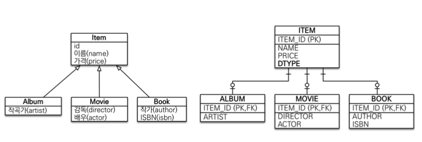
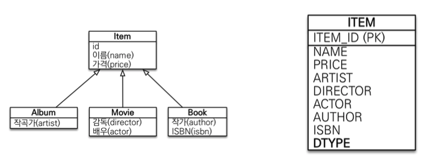
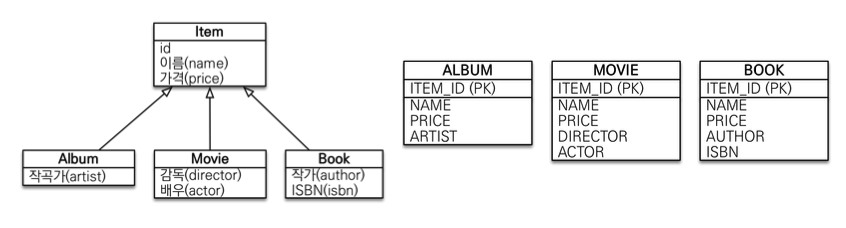

# 1 연관관계 매핑

* 연관관계 매핑이란 객체의 참조와 테이블의 외래 키를 매핑하는 작업이다.

* 객체와 테이블 연관관계의 차이를 이해하자

* 객체의 연관관계

  * 객체는 참조(주소)로 연관관계를 맺는다.
  * 참조를 통한 연관관계는 단방향

* 테이블의 연관관계

  * 테이블은 외래키로 연관관계를 맺는다.
  * 외래키를 통한 연관관계는 양방향


# 2 연관관계 매핑시 고려사항 3가지

1. 다중성
   * 다대일, 일대다, 일대일, 다대다
2. 방향
   * 단방향, 양방향
3. 연관관계의 주인
   * 양방향 연관관계인 경우 연관관계의 주인을 정해야 한다.


## 2.1. 다중성

* 연관관계를 매핑할 떄 다중성을 나타내는 어노테이션은 필수다.


### 2.1.1 @ManyToOne

* 다대일 관계라는 매핑 정보다.
* 가장 많이 사용하는 연관관계이다

| 속성         | 설명                                                         | 기본값          |
| ------------ | ------------------------------------------------------------ | --------------- |
| optional     | false로 설정하면 연관된 엔티티가 항상 있어야 한다.           | TRUE            |
| fetch        | 글로벌 페치 전략을 설정한다.                                 | FetchType.EAGER |
| cascade      | 영속성 전이 기능을 사용한다.                                 |                 |
| targetEntity | 연관된 엔티티의 타입 정보를 설정한다. 이 기능은 거 의 사용하지 않는다. 컬렉션을 사용해도 제네릭으로 타 입 정보를 알 수 있다. |                 |


### 2.1.2 @OneToMany

* 일대다 관계라는 매핑 정보다.
* 양방향 매핑에서만 사용하자
* 일대다 단방향 매핑(일이 연관관계의 주인인 경우)
  * 엔티티가 관리하는 외래 키가 다른 테이블에 있다
  * 연관관계 관리를 위해 추가로 UPDATE SQL 실행
  * 일대다 단방향 매핑보다는 **다대일 양방향 매핑을 사용**하자
  * @JoinColumn을 꼭 사용해야 함. 그렇지 않으면 조인 테이블 방식을 사용함

| 속성         | 설명                                                         | 기본값         |
| ------------ | ------------------------------------------------------------ | -------------- |
| mappedBy     | 연관관계의 주인 필드의 이름을 값으로 지정해야 한다.          |                |
| fetch        | 글로벌 페치 전략을 설정한다.                                 | FetchType.LAZY |
| cascade      | 영속성 전이 기능을 사용한다.                                 |                |
| targetEntity | 연관된 엔티티의 타입 정보를 설정한다. 이 기능은 거 의 사용하지 않는다. 컬렉션을 사용해도 제네릭으로 타 입 정보를 알 수 있다. |                |


### 2.1.3 @OneToOne

* 일대일 관계라는 매핑 정보다.
* 주테이블 또는 대상 테이블 중 하나에 외래키를 설정한다.
* 다대일 양방향 매핑 처럼 **외래 키가 있는 곳이 연관관계의 주인**이다
  * 주인이 아닌 곳은 mappedBy를 적용한다.


**주 테이블에 외래 키를 설정**

* 주 객체가 대상 객체의 참조를 가지는 것 처럼 주 테이블에 외래 키를 두고 대상 테이블을 찾음
* 객체지향 개발자 선호
* JPA 매핑 편리
* 주 테이블만 조회해도 대상 테이블에 데이터가 있는지 확인이 가능하다.
* 값이 없으면 외래 키에 null 허용해야 한다.


**대상 테이블에 외래 키를 설정**

* 대상 테이블에 외래 키가 존재
* 전통적인 데이터베이스 개발자 선호하는 방식이다.
* 주 테이블에 외래 키를 설정하는 것과 다르게 null을 허용하지 않아도 된다.
* 주 테이블과 대상 테이블을 일대일에서 일대다 관계로 변경할 때 테이블 구조를 그대로 유지할 수 있다.
* 프록시 기능의 한계로 지연 로딩으로 설정해도 항상 즉시 로딩됨
  * 대상 테이블에 외래 키를 저장하면, 멤버의 락커를 조회하는 상황에서 멤버 테이블만 조회해서는 락커를 같이 조회할 수 없다. 락커 테이블을 조회해 해당 멤버를 참조하는 락커를 확인 하는 쿼리가 추가적으로 필요하다. 즉 지연 로딩으로 설정해도 즉시 로딩처럼 쿼리 발생하게 된다.

* 대상 테이블에 외래 키가 있는 단방향 관계는 JPA가 지원하지 않는다.
* 따라서 일대일 매핑에서 대상 테이블에 외래 키를 두고 싶으면 양방향으로 매핑한다.


### 2.1.4 @ManyToMany

* 다대다 관계라는 매핑 정보다.
* 관계형 데이터베이스는 정규화된 테이블 2개로 다대다 관계를 표현할 수 없다.
* 연결 테이블을 사용해서 일대다, 다대일 관계로 풀어낸다.
  * 연결테이블을 엔티티로 승격한다.
* `@JoinTable`로 연결 테이블을 지정한다.
* **실무에서는 사용하지 않는다.**
  * 연결 테이블용 엔티티 추가해서 다대다 관계를 일대다, 다대일 관계로 풀어낸다.

**다대다 연관관계 정리**

* 다대다 관계를 일대다 다대일 관계로 풀어내기 위해 연결 테이블을 만들 때 식별자를 구성하는 방법
  * 식별 관계 : 받아온 식별자를 기본기 + 외래 키로 사용
  * 비식별 관계: 받아온 식별자를 외래 키로만 사용하고 새로운 식별자를 추가한다.
* 비식별 관계를 사용하면 복합 키를 위한 식별자 클래스를 만들지 않아도 되므로 편리하게 ORM 매핑을 할 수 있다.  따라서 비식별 관계를 추천한다.


## 2.2방향


### 2.2.1 단방향 연관관계

#### @JoinColumn

* 외래 키를 매핑할 때 사용한다.

**속성**

| 속성 | 설명                  |
| ---- | --------------------- |
| name | 매핑할 외래 키의 이름 |


### 2.2.2 양방향 연관관계

**양방향 연관관계**

* **단방향 매핑만으로도 이미 연관관계 매핑은 완료된다**. 따라서 양방향 연관관계가 필수적이지 않다면 단방향 매핑으로 끝낸다.
  * JPQL에서 역방향으로 탐색할 일이 발생한다면 양방향 연관관계를 고려해보자
  * 테이블에 영향을 주지 않기 때문에 양방향 매핑은 필요할 때 추가한다.
* 양방향의 장점은 반대방향으로 객체 그래프 탐색 기능이 추가된 것뿐이다.




**객체의 양방향 관계**

* 객체의 양방향 관계는 사실 양방향 관계가 아니라 서로 다른 단 뱡향 관계 2개다.
* 객체를 양방향으로 참조하려면 단방향 연관관계를 2개 만들어야 한다.
  * `Member.team`
  * `Team.members`


**테이블의 양방향 연관관계**

* 테이블은 외래 키 하나로 두 테이블의 연관관계를 관리한다.
  * `TEAM_ID`


**양방향 매핑**

* 양방향 연관관계 중에서 하나를 연관관계의 주인으로 지정해야한다.
  * **외래 키가 있는 있는 곳을 주인으로 정해라**
* 연관관계의 주인만이 외래 키를 관리한다.
* 주인이 아닌쪽은 읽기만 가능
* 주인이 아니면 mappedBy 속성으로 주인 지정한다.

```java
@Entity
public class Member {
	@Id @GeneratedValue 
  private Long id;
	
  @Column(name = "USERNAME") 
  private String name; 
  
  private int age;
	
  //연관관계의 주인
  @ManyToOne
	@JoinColumn(name = "TEAM_ID")
	private Team team;

}
```

```java
@Entity
public class Team {
  @Id @GeneratedValue 
  private Long id;
  
  private String name;
  
  
  @OneToMany(mappedBy = "team")
  List<Member> members = new ArrayList<Member>();
}
```

* 양쪽 방향으로 객체 그래프 탐색이 가능하다.

```java
//Member -> Team 조회
Member findMember = em.find(Member.class, member.getId());
Team findTeam = findMember.getTeam();
//Team -> Member 조회
Team findTeam = em.find(Team.class, team.getId());
int memberSize = findTeam.getMembers().size();
```


## 2.3 연관관계의 주인

> 엄밀히 말하면 객체에서는 양방향 연관관계라는 것은 없다. 서로 다른 단방향 연관관계 2개를 논리적으로 묶어서 양방향인 것처럼 보이게 하는 것이다. 반면에 테이블은 외래 키 하나로 두 테이블의 연관관계를 관리한다. 만약 엔티티를 단방향으로 매핑하면 참조를 하나만 사용하게 되고 이 참조로 외래키를 관리하면 된다. 반면에 엔티티를 양방향으로 매핑하면 참조는 두개가되고 외래 키는 하나다. 따라서 두 개의 참조 중 하나를 선택해 외래 키를 관리하도록 해야 한다. 외래 키를 관리하는 쪽을 연관관계의 주인이라고 한다. 


**연관관계의 주인(Owner)**

* 객체의 두 관계중 하나를 연관관계의 주인으로 지정해야 한다.

* **외래 키가 있는 있는 곳을 주인으로 정한다.**

* 연관관계의 주인만이 데이터베이스 연관관계와 매핑되고 외래 키를 관리할 수 있다.

* 주인이 아닌쪽은 읽기만 가능하다.

* 주인이 아니면 mappedBy 속성으로 주인을 지정한다.

  

**주의사항**

* 비즈니스 로직을 기준으로 연관관계의 주인을 선택하면 안된다.
* 양방향 매핑시 연관관계의 주인에 값을 입력해야 한다.
  * 데이터베이스에 외래 키값이 정상적으로 저장되지 않으면 의심해보자.
* **순수 객체 상태를 고려해서 항상 양쪽에 값을 설정하자**
  * 연관관계 편의 메소드를 생성하자
* 양방향 매핑시에 무한 루프를 조심하자
  * 예: toString(), lombok, JSON 생성 라이브러리


# 3 상속관계 매핑

* 관계형 데이터베이스는 상속 관계가 없으며 슈퍼타입 서브타입 관계라는 모델링 기법이 객체 상속과 유사하다.
* 상속관계 매핑이란 객체의 상속 구조와 DB의 슈퍼타입 서브타입 관계를 매핑하는 것이다.
* 조인전략, 단일 테이블 전략, 구현 클래스마다 테이블 전략 총 3가지 방법이 존재한다.


## 3.1 조인 전략

* 엔티티 각각을 테이블로 만들고 자식 테이블이 부모 테이블의 기본 키를 받아서 기본 키 + 외래 키로 사용하는 전략이다. 
* 조회 할 때 조인을 사용한다.
* 객체는 타입으로 구분할 수 있지만 테이블은 타입의 개념이 없다
  * 따라서 타입을 구분하는 컬럼 DTYPE 컬럼을 추가해야한다



**장점**

* 테이블 정규화
* 외래 키 참조 무결성 제약조건 활용가능
* 저장공간 효율

**단점**

* 조회시 조인을 많이 사용해 성능이 저하된다.
* 조회 쿼리가 복잡하다
* 데이터 저장시 INSERT SQL 2번 호출된다.

**예시**

* `@DiscriminatorColumn(name = "DTYPE")`: 부모 클래스에서 구분 컬럼을 지정

```java
@DiscriminatorColumn(name = "DTYPE")
@Inheritance(strategy = InheritanceType.JOINED)
@Entity
public abstract class Item {

  @Id
  @GeneratedValue
  @Column(name = "ITEM_ID")
  private Long id;

  private String name;
  private int price;
}
```

* `@DiscriminatorValue("A")` : 엔티티를 저저아할 때 구분 컬럼에 입력할 값을 지정함
  * Album 엔티티를 저장하면 구분 컬럼 DTYPE에 값 `A`가 저장됨

```java
@DiscriminatorValue("A")
@Entity
public class Album extends Item {
  private String artist;
}
```

```java
@DiscriminatorValue("M")
@Entity
public class Movie extends Item {
  private String director;
  private String actor;
}
```


## 3.2 단일 테이블 전략



**장점**

- 조인이 필요 없으므로 일반적으로 조회 성능이 빠름
- 조회 쿼리가 단순함

**단점**

* 자식 엔티티가 매핑한 컬럼은 모두 null 허용
* 단일 테이블에 모든 것을 저장하므로 테이블이 커질 수 있다.
* 상황에 따라서 조회 성능이 오히려 느려질 수 있다.

**예시**

```java
@Entity
@Inheritance(strategy = InheritanceType.SINGLE_TABLE)
@DiscriminatorColumn(name = "dtype")
@Getter
@Setter
public abstract class Item {
    @Id
    @GeneratedValue
    @Column(name = "item_id")
    private Long id;

    private String name;

    private int price;

    private int stockQuantity;

    @ManyToMany(mappedBy = "items")
    private List<Category> categories = new ArrayList<Category>();
}
```

* `@DiscriminatorValue("B")`
  * 자식 엔티티에서 @DiscriminatorValue를 지정하지 않으면 기본으로 엔티티 이름(Book, Movie)을 사용한다

```java
@Entity
@DiscriminatorValue("B")
@Getter @Setter
public class Book extends Item {
	private String author;
	private String isbn;
}
```

```java
@Entity
@DiscriminatorValue("M")
@Getter @Setter
public class Movie extends Item {
  private String director;
  private String actor;
}
```


## 3.3 구현 클래스마다 테이블 전략

> 이 전략은 데이터베이스 설계자와 ORM 전문가 둘 다 추천하지 않는다.



장점

* 서브 타입을 명확하게 구분해서 처리할 때 효과적
* not null 제약조건 사용 가능 • 단점

단점

* 여러 자식 테이블을 함께 조회할 때 성능이 느림(UNION SQL 필요)
* 자식 테이블을 통합해서 쿼리하기 어려움


## 3.4 주요 어노테이션

### 3.4.1 @Inheritance

* 상속 관계 매핑은 부모 클래스에 @Inheritance를 사용한다.
* 그리고 매핑 전략을 지정한다.
  * `@Inheritance(strategy=InheritanceType.SINGLE_TABLE)`

| strategy 속성에 사용 가능한 전략 | 설명                        |
| -------------------------------- | --------------------------- |
| JOINED                           | 조인 전략                   |
| SINGLE_TABLE                     | 단일 테이블 전략            |
| TABLE_PER_CLASS                  | 구현 클래스마다 테이블 전략 |


### 3.4.2 @DiscriminatorColumn

* 부모 클래스에 구분 컬럼을 지정한다. 
* 이 컬럼으로 자식 테이블을 구분할 수 있다.
* `@DiscriminatorColumn(name="DTYPE")`


### 3.4.3 @DiscriminatorValue

* 자식 클래스에 @DiscriminatorValue를 사용한다.
* 엔티티 저장 시 구분 컬럼에 입력할 값을 지정한다.
* `@DiscriminatorValue("XXX")`


# 4 @MappedSuperclass

* 공통 매핑 정보가 필요할 때 사용한다.
* 엔티티가 아니기 때문에 테이블과 매핑하지 않는다.
* 부모 클래스를 상속 받는 **자식 클래스에 매핑 정보만 제공한다**
* 상속관계 매핑이 아니다.
* 직접 생성해서 사용할 일이 없으므로 **추상 클래스 권장한다**
* 테이블과 관계 없고, 단순히 엔티티가 공통으로 사용하는 매핑 정보를 모으는 역할을 한다.
  * 주로 등록일, 수정일, 등록자, 수정자 같은 전체 엔티티에서 공통으로 적용하는 정보를 모을 때 사용한다.
  * [JPA-Auditing.md](../JPA-Auditing/JPA-Auditing.md) 참고

```java
@MappedSuperclass
public abstract class DateEntity {

    @CreatedDate
    @Column(nullable = false, updatable = false)
    private LocalDateTime createdDateTime;

    @LastModifiedDate
    @Column(nullable = false)
    private LocalDateTime updatedDateTime;

}
```


# 5 복합 키와 식별 관계 매핑


## 5.1 식별 관계 vs. 비식별 관계

* 데이터베이스 테이블 사이에 관계는 외래 키가 기본 키에 포함되는지 여부에 따라 식별 관계와 비식별 관계로 구분한다.
* 최근에는 `비식별 관계`를 주로 사용하고 꼭 필요한 경우에만 `식별관계`를 사용하는 추세이다.
  * 식별 관계는 부모 테이블의 기본 키를 자식 테이블로 전파하면서 자식 테이블의 기본 키 컬럼이 점점 늘어난다.
  * 식별 관계는 2개 이상의 컬럼을 합해서 복합 기본키로 만들어야 하는 경우가 많다.


**식별 관계**

> 식별 관계는 부모 테이블의 기본 키를 내려받아서 자식 테이블의 기본 키이자 외래 키로 사용하는 관계이다.


**비식별 관계**

> 비식별 관계는 부모 테이블의 기본 키를 받아서 자식 테이블의 외래 키로만 사용하는 관계이다. 
>
> 필수적 비식별 관계: 외래 키에 NULL을 허용하지 않는다. 즉 연관관계를 필수적으로 맺는다.
>
> 선택적 비식별 관계: 외래 키에 NULL을 허용한다. 즉 연관관계를 선택적으로 맺는다.
>
> **가급적 필수적 비식별 관계를 사용하자.** 선택적 비식별 관계를 사용하면 NULL을 허용하므로 조인 할 때 외부 조인을 사용해야 한다. 반면 필수적 비식별 관계는 NOT NULL로 항상 관계가 있다는 것을 보장하기에 내부 조인만 사용해도 된다.


참조

* [자바 ORM 표준 JPA 프로그래밍](http://www.acornpub.co.kr/book/jpa-programmig)
* 인프런 자바 ORM 표준 JPA 프로그래밍

