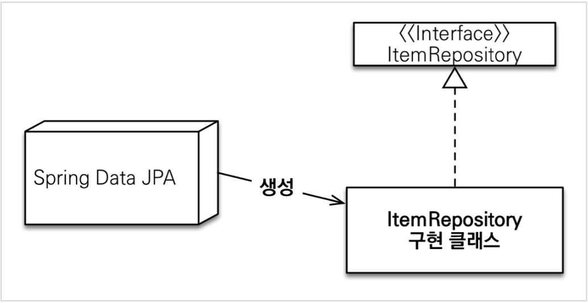

# 1 Spring Data JPA

* Spring Data JPA의 목표는 데이터 액세스 계층을 구현하는 데 필요한 틀에박힌 코드 양을 크게 줄이는 것입니다.
* **엔티티에대한 기본적인 CRUD, 페이징 기능을 사용하고 싶으면 직접 리포지토리를 구현하는 것이 아니라 JpaRepository를 상속받는 인터페이스를 만들면 된다.**
  * 해당 인터페이스의 구현체는 Spring Data JPA가 생성해서 주입해준다.
  * 따라서 직접 리포지토리를를 구현하지 않고 기본적인 기능들은 인터페이스를 만드는 것만으로도 이용할 수 있다.


**스프링 데이터 JPA가 구현 클래스 대신 생성**

*  JpaRepository를 상속받는 인터페이스 ItemRepository의 구현 클래스를 Spring Data JPA가 생성해준다



# 2 인터페이스 구성

	 						 		


## 2.1 JpaRepository 인터페이스

* 가장 중심이 되는 인터페이스
* type argument로 도메인 클래스와 ID의 타입이 필요하다
  * 예) <Member, Long>

```java
public interface MemberRepository extends JpaRepository<Member, Long> {
}
```

**사용 예시**

* MemberRepository는 인터페이스이다. `memberRepository.save()`라는 메소드를 구현한적이 없지만 사용이 가능하다
* 이는 Spring Data JPA가 MemberRepository를 구현한 구현체를 주입받기 때문이다.
* 이처럼 기본적인 CRUD는 직접 구현하지 않아도 된다.

```java
@SpringBootTest
@Transactional
public class MemberRepositoryTest {
    @Autowired
    MemberRepository memberRepository;
    
  	@Test
    public void testMember() {
    	Member member = new Member("memberA");
      Member savedMember = memberRepository.save(member);
      Member findMember = memberRepository.findById(savedMember.getId()).get();
      
      Assertions.assertThat(findMember.getId()).isEqualTo(member.getId());
			Assertions.assertThat(findMember.getUsername()).isEqualTo(member.getUsername());
			Assertions.assertThat(findMember).isEqualTo(member);
		}
}
```


## 2.2 CrudRepository 인터페이스

* CrudRepository 인터페이스는 관리 중인 엔터티 클래스에 대해 CRUD 기능을 제공합니다.

```java
public interface CrudRepository<T, ID> extends Repository<T, ID> {

  // 주어진 엔티티 저장하기
  <S extends T> S save(S entity);      

  // 주어진 ID로 엔티티를 찾아 반환
  Optional<T> findById(ID primaryKey); 

  // 모든 엔티티를 반환
  Iterable<T> findAll();               

  // 엔티티의 수를 반환
  long count();                        

  // 주어진 엔티티를 삭제
  void delete(T entity);               

  // 주어진 ID를 가지는 엔티티의 존재 유무 반환
  boolean existsById(ID primaryKey);   

  // … more functionality omitted.
}
```


## 2.3 PagingAndSortingRepository 인터페이스

* PagingAndSortingRepository를 통해 페이징 기능을 사용할 수 있다

```java
public interface PagingAndSortingRepository<T, ID> extends CrudRepository<T, ID> {

  Iterable<T> findAll(Sort sort);

  Page<T> findAll(Pageable pageable);
}
```


**사용 예시**

```java
PagingAndSortingRepository<User, Long> repository = // … get access to a bean
Page<User> users = repository.findAll(PageRequest.of(1, 20));
```


# 3 Query Methods

* 메소드 이름으로 쿼리를 생성해주는 기능을 제공한다.
* 자동 생성된 쿼리가 상황에 맞지 않다면 JPA Named Query나 @Query를 이용해 직접 쿼리를 생성할 수 있다.


**쿼리 메소드의 3가지 기능**

1. 메소드 이름으로 쿼리 생성
2. 메소드 이름으로 JPA Named Query 호출
3. @Query 어노테이션을 사용해서 리포지토리 인터페이스에 쿼리 직접 정의


## 3.1 메소드 이름으로 쿼리 생성

```java
public interface UserRepository extends Repository<User, Long> {
  List<User> findByEmailAddressAndLastname(String emailAddress, String lastname);
}
```

* 메소드 이름으로 `select u from User u where u.emailAddress = ?1 and u.lastname = ?2`라고 query를 생성해준다.
* 엔티티의 필드명이 변경되면 인터페이스에 정의한 메서드 이름도 꼭 함께 변경해야 한다. 
  * 그렇지 않으면 애플리케이션을 시작하는 시점에 오류가 발생한다.


**[메소드 이름으로 지원되는 키워드](https://docs.spring.io/spring-data/jpa/docs/2.5.5/reference/html/#jpa.query-methods.query-creation)**

| Keyword                | Sample                                                       | JPQL snippet                                                 |
| :--------------------- | :----------------------------------------------------------- | :----------------------------------------------------------- |
| `Distinct`             | `findDistinctByLastnameAndFirstname`                         | `select distinct … where x.lastname = ?1 and x.firstname = ?2` |
| `And`                  | `findByLastnameAndFirstname`                                 | `… where x.lastname = ?1 and x.firstname = ?2`               |
| `Or`                   | `findByLastnameOrFirstname`                                  | `… where x.lastname = ?1 or x.firstname = ?2`                |
| `Is`, `Equals`         | `findByFirstname`,`findByFirstnameIs`,`findByFirstnameEquals` | `… where x.firstname = ?1`                                   |
| `Between`              | `findByStartDateBetween`                                     | `… where x.startDate between ?1 and ?2`                      |
| `LessThan`             | `findByAgeLessThan`                                          | `… where x.age < ?1`                                         |
| `LessThanEqual`        | `findByAgeLessThanEqual`                                     | `… where x.age <= ?1`                                        |
| `GreaterThan`          | `findByAgeGreaterThan`                                       | `… where x.age > ?1`                                         |
| `GreaterThanEqual`     | `findByAgeGreaterThanEqual`                                  | `… where x.age >= ?1`                                        |
| `After`                | `findByStartDateAfter`                                       | `… where x.startDate > ?1`                                   |
| `Before`               | `findByStartDateBefore`                                      | `… where x.startDate < ?1`                                   |
| `IsNull`, `Null`       | `findByAge(Is)Null`                                          | `… where x.age is null`                                      |
| `IsNotNull`, `NotNull` | `findByAge(Is)NotNull`                                       | `… where x.age not null`                                     |
| `Like`                 | `findByFirstnameLike`                                        | `… where x.firstname like ?1`                                |
| `NotLike`              | `findByFirstnameNotLike`                                     | `… where x.firstname not like ?1`                            |
| `StartingWith`         | `findByFirstnameStartingWith`                                | `… where x.firstname like ?1` (parameter bound with appended `%`) |
| `EndingWith`           | `findByFirstnameEndingWith`                                  | `… where x.firstname like ?1` (parameter bound with prepended `%`) |
| `Containing`           | `findByFirstnameContaining`                                  | `… where x.firstname like ?1` (parameter bound wrapped in `%`) |
| `OrderBy`              | `findByAgeOrderByLastnameDesc`                               | `… where x.age = ?1 order by x.lastname desc`                |
| `Not`                  | `findByLastnameNot`                                          | `… where x.lastname <> ?1`                                   |
| `In`                   | `findByAgeIn(Collection<Age> ages)`                          | `… where x.age in ?1`                                        |
| `NotIn`                | `findByAgeNotIn(Collection<Age> ages)`                       | `… where x.age not in ?1`                                    |
| `True`                 | `findByActiveTrue()`                                         | `… where x.active = true`                                    |
| `False`                | `findByActiveFalse()`                                        | `… where x.active = false`                                   |
| `IgnoreCase`           | `findByFirstnameIgnoreCase`                                  | `… where UPPER(x.firstname) = UPPER(?1)`                     |


## 3.2 메소드 이름으로 JPA Named Query 호출

* 실무에서 거의 사용하는 일이 없다.
* 애플리케이션 실행 시점에 문법 오류를 발견할 수 있음

**Annotation 베이스로 Named Query 설정하기**

```java
@Entity
@NamedQuery(name = "User.findByEmailAddress",
  query = "select u from User u where u.emailAddress = ?1")
public class User {

}
```

**Interface 선언하기**

* 메소드 이름으로 쿼리를 생성하는 것이 아니라 위에서 설정된 Named Query가 실행된다.

```java
public interface UserRepository extends JpaRepository<User, Long> {
  User findByEmailAddress(String emailAddress);
}
```


## 3.3 @Query를 사용해 직접 쿼리 생성

* `@org.springframework.data.jpa.repository.Query` 어노테이션을 사용
* 실행할 메서드에 정적 쿼리를 직접 작성하므로 이름 없는 Named 쿼리라 할 수 있다
* **애플리케이션 실행 시점에 문법 오류를 발견할 수 있음**
* 실무에서는 메소드 이름으로 쿼리 생성 기능은 파라미터가 증가하면 메서드 이름이 매우 지저분해진다.
* **간단한 경우 메소드 이름으로 쿼리를 생성하고 복잡해 지면 @Query 기능을 사용하자**


**엔티티 조회**

```java
  @Query("select m from Member m where m.username= :username and m.age = :age")
  List<Member> findUser(@Param("username") String username, @Param("age") int age);
```


**값 조회**

```java
  @Query("select m.username from Member m")
  List<String> findUsernameList();
```


**DTO 직접 조회**

```java
@Query("select new study.datajpa.dto.MemberDto(m.id, m.username, t.name) " +
       "from Member m join m.team t")
List<MemberDto> findMemberDto();
```


**파라미터 바인딩**

```java
@Query("select m from Member m where m.username = :name")
Member findMembers(@Param("name") String username);
```


**컬렌션 파라미터 바인딩**

```java
@Query("select m from Member m where m.username in :names")
List<Member> findByNames(@Param("names") List<String> names);
```


**반환 타입**

* 컬렉션
  * 조회 결과가 없으면 빈 컬렉션 반환
* 단건 조회
  * 조회 결과가 없으면 null 반환
  * 결과가 2건 이상이면 `javax.persistence.NonUniqueResultException` 예외 발생

```java
//컬렉션 
List<Member> findByUsername(String name)
//단건
Member findByUsername(String name);
//단건 Optional
Optional<Member> findByUsername(String name);
```

> 참고 
>
> 단건으로 지정한 메서드를 호출하면 스프링 데이터 JPA는 내부에서 JPQL의 Query.getSingleResult() 메서드를 호출한다. 이 메서드를 호출했을 때 조회 결과가 없으면 javax.persistence.NoResultException 예외가 발생하는데 개발자 입장에서 다루기가 상당히 불편하다. 스프링 데이터 JPA는 단건을 조회할 때 이 예외가 발생하면 예외를 무시하고 대신에 null 을 반환한다.


# 4 페이징

**페이징 인터페이스**

* `org.springframework.data.domain.Sort` : 정렬 기능
* `org.springframework.data.domain.Pageable` : 페이징 기능
  * 내부에 Sort를 포함한다

* 실제 사용시 해당 인터페이스를 구현한 `org.springframework.data.domain.PageRequest` 사용


**특별한 반환 타입**

* `org.springframework.data.domain.Page` 
  * content 쿼리와 count 쿼리 결과를 포함하는 페이징
* `org.springframework.data.domain.Slice` 
  * 추가 count 쿼리 없이 다음 페이지만 확인 가능 (내부적으로 limit + 1조회)
* List (자바 컬렉션)
  * 추가 count 쿼리 없이 결과만 반환

```java
//count 쿼리 사용
Page<Member> findByUsername(String name, Pageable pageable);
//count 쿼리 사용 안함
Slice<Member> findByUsername(String name, Pageable pageable); 
//count 쿼리 사용 안함
List<Member> findByUsername(String name, Pageable pageable);
List<Member> findByUsername(String name, Sort sort);
```


## 4.1 페이징 사용하기

* PageRequest 생성자의 첫 번째 파라미터에는 현재 페이지를, 두 번째 파라미터에는 조회할 데이터 수를 입력한다. 
* 여기에 추가로 정렬 정보도 파라미터로 사용할 수 있다. 
* 참고로 페이지는 0부터 시작한다.


**인터페이스 정의**

* 페이징를 적용하고 싶은 메소드에 매개변수로  Pageable을 추가한다
* 반환타입이 Page이기 때문에 count 쿼리도 추가적으로 나간다

```java
public interface MemberRepository extends Repository<Member, Long> {
	Page<Member> findByAge(int age, Pageable pageable);
}
```

**실제 사용**

```java
@Test
public void page() throws Exception {
  memberRepository.save(new Member("member1", 10));
  memberRepository.save(new Member("member2", 10));
  memberRepository.save(new Member("member3", 10));
  memberRepository.save(new Member("member4", 10));
  memberRepository.save(new Member("member5", 10));

  // 페이징 사용
  PageRequest pageRequest = PageRequest.of(0, 3, Sort.by(Sort.Direction.DESC, "username"));
  Page<Member> page = memberRepository.findByAge(10, pageRequest);

  //조회된 데이터
  List<Member> content = page.getContent(); 
  //조회된 데이터 수
  assertThat(content.size()).isEqualTo(3);
  //전체 데이터 수
  assertThat(page.getTotalElements()).isEqualTo(5);
  //페이지 번호
  assertThat(page.getNumber()).isEqualTo(0);
  //전체 페이지 번호
  assertThat(page.getTotalPages()).isEqualTo(2);
  //첫번째 항목인가?
  assertThat(page.isFirst()).isTrue();
  //다음 페이지가 있는가?
  assertThat(page.hasNext()).isTrue(); 
}
```


## 4.2 **Page** 인터페이스

* 반환형으로 `Page`를 사용하면 추가적으로 조회된 데이터 수를 가져오기 위한 count 쿼리가 실행된다

```java
public interface Page<T> extends Slice<T> {
  int getTotalPages(); 					//전체 페이지 수
  long getTotalElements(); 			//전체 데이터 수
  <U> Page<U> map(Function<? super T, ? extends U> converter); //변환기
}
```

**페이지를 유지하면서 엔티티를 DTO로 변환하기**

* HTTP API 응답으로 엔티티를 직접 반환하는 것은 좋지 않다 따라서 아래와 같이 DTO로 변환해서 응답하자

```java
Page<Member> page = memberRepository.findByAge(10, pageRequest);
Page<MemberDto> dtoPage = page.map(m -> new MemberDto(m));
```


## 4.3 **Slice** 인터페이스

```java
public interface Slice<T> extends Streamable<T> {
  int getNumber();							// 현재 페이지
  int getSize();								// 페이지 크기
  int getNumberOfElements();		// 현재 페이지에 나올 데이터 수
  List<T> getContent();					// 조회된 데이터
  boolean hasContent();					// 조회된 데이터 존재 여부
  Sort getSort();								// 정렬 정보
  boolean isFirst();						// 현재 페이지가 첫 페이지 인지 여부
  boolean isLast();							// 현재 페이지가 마지막 페이지 인지 여부
  boolean hasNext();						// 다음 페이지 여부
  boolean hasPrevious();				// 이전 페이지 여부
  Pageable getPageable();				// 페이지 요청 정보
  Pageable nextPageable();			// 다음 페이지 객체
  Pageable previousPageable();	//이전 페이지 객체
  <U> Slice<U> map(Function<? super T, ? extends U> converter); //변환기
}
```


## 4.4 count 쿼리를 분리하기

* 성능 최적화를 위해 countQuery에서는 불필요한 left join을 제거한 쿼리로 대채했다

```java
@Query(value = "select m from Member m left join m.team t",
 countQuery = "select count(m.username) from Member m")
Page<Member> findMemberAllCountBy(Pageable pageable);
```


## 4.5 Web 확장 - 페이징과 정렬

* 스프링 데이터가 제공하는 페이징과 정렬 기능을 스프링 MVC에서 편리하게 사용할 수 있다.
* 파라미터로 Pageable 을 받을 수 있다.
* Pageable 은 인터페이스, 실제는 org.springframework.data.domain.PageRequest 객체 생성된다.
* 요청예시 : `/members?page=0&size=3&sort=id,desc&sort=username,desc`
  * page: 현재 페이지, 0부터 시작한다
  * size: 한 페이지에 노출할 데이터 건수
  * sort: 정렬 조건을 정의한다. 
    * 예) 정렬 속성,정렬 속성...(ASC | DESC)
    * 정렬 방향을 변경하고 싶으면 sort파라미터 추가 ( asc 생략 가능)

```java
@GetMapping("/members")
public Page<Member> list(Pageable pageable) {
    Page<Member> page = memberRepository.findAll(pageable);
    return page;
}
```

**글로벌 설정하기**

```properties
spring.data.web.pageable.default-page-size=20 # 기본 페이지 사이즈/
spring.data.web.pageable.max-page-size=2000 # 최대 페이지 사이즈
```

**개별 설정하기**

```java
@RequestMapping(value = "/members_page", method = RequestMethod.GET)
public String list(@PageableDefault(size = 12, sort = "username",
                                    direction = Sort.Direction.DESC) Pageable pageable) {
  ... 
}
```


# 5 벌크성 수정 쿼리

* 보통 단건 수정이라면 더티 체킹 기능을 사용해 수정하지만 전 직원 연봉 10프로 상승 같이 다건 수정의 경우 더티 체킹을 이용한 업데이트는 비효율적이다
* 위와 같은 경우 벌크성 수정, 삭제 쿼리를 사용하고 @Modifying 어노테이션을 반드시 적용해야한다
  * 사용하지 않으면 예외가 발생한다.
* `@Modifying(clearAutomatically = true)`
  * 벌크성 쿼리 실행 후 영속성 컨텍스트를 자동으로 초기화
  * clearAutomatically 옵션의 기본값은 false이다
  


**벌크성 수정 쿼리 선언**

* 반환 값 int는 업데이트 된 레코드의 수

```java
@Modifying
@Query("update Member m set m.age = m.age + 1 where m.age >= :age")
int bulkAgePlus(@Param("age") int age);
```

**테스트**

```java
@Test
public void bulkUpdate() throws Exception {
  // given
  memberRepository.save(new Member("member1", 10));
  memberRepository.save(new Member("member2", 19));
  memberRepository.save(new Member("member3", 20));
  memberRepository.save(new Member("member4", 21));
  memberRepository.save(new Member("member5", 40));
  
  // when
  int resultCount = memberRepository.bulkAgePlus(20);
  
  // then
  assertThat(resultCount).isEqualTo(3);
}
```


## 5.1 주의 사항

* 벌크 연산은 영속성 컨텍스트를 무시하고 실행하기 때문에, 영속성 컨텍스트에 있는 엔티티의 상태와 DB에 엔티티 상태가 달라질 수 있다

**해결법**

1. 영속성 컨텍스트에 엔티티가 없는 상태에서 벌크 연산을 먼저 실행한다
2. 부득이하게 영속성 컨텍스트에 엔티티가 있으면 벌크 연산 직후 영속성 컨텍스트를 초기화 한다


**테스트**

* 아래와 같이 벌크 연산 후 멤버를 조회 했을 때 나이가 그대로 20인 것을 볼 수 있다
* 그 이유는 벌크 연산은 영속성 컨텍스트를 무시하고 실행되서 영속성 컨텍스트 안에 있는 멤버의 나이는 여전히 20이다
* 다시 멤버를 조회하면 영속성 컨텍스트에 있는 멤버가 조회되서 여전히 나이가 20인 것이다

```java
@Test
void test() {
  //given
  Member member = memberRepository.save(new Member("member1", 20));

  //when
  memberRepository.bulkAgePlus(20);

  //then
  Member findMember = memberRepository.findById(member.getId()).get();
  assertThat(findMember.getAge()).isEqualTo(20);
}
```

* 위 문제를 해결하기 위해 아래와 같이 clearAutomatically 속성을 true로 설정한다
* 이렇게 하면 벌크 수정 쿼리 이후 영속성 컨텍스트가 비워져 다시 엔티티를 조회하면 영속성 컨텍스트가 아니라 DB에서 가져온다

```java
@Modifying(clearAutomatically = true)
@Query("update Member m set m.age = m.age + 1 where m.age >= :age")
int bulkAgePlus(int age);
```

* 위와 같이 수정 후 다시 테스트를 해보면 테스트를 통과한다

```java
@Test
void test() {
  //given
  Member member = memberRepository.save(new Member("member1", 20));

  //when
  memberRepository.bulkAgePlus(20);

  //then
  Member findMember = memberRepository.findById(member.getId()).get();
  assertThat(findMember.getAge()).isEqualTo(21);
}
```


# 6 @EntityGraph

* 간단한 jpql이라면 직접 작성하지 않고 @EntityGraph를 사용하면 편리하다
* 연관된 엔티티를 SQL 한번에 조회하는 방법
* @EntityGraph를 사용하면 jpql을 직접 작성하지 않고 연관된 엔티티를 한번에 가져올 수 있다.
  * 페치 조인(FETCH JOIN)의 간편 버전이다


**JPQL 페치 조인**

* 멤버와 연관된 엔티티 팀을 SQL에 한번에 조회함
* @EntityGraph를 사용하면 jpql을 직접 작성하지 않고 연관된 엔티티를 한번에 가져올 수 있다.

```java
 @Query("select m from Member m left join fetch m.team")
 List<Member> findMemberFetchJoin();
```


**@EntityGraph 사용하기**

```java
// 연관된 team 같이 조회하기
@Override
@EntityGraph(attributePaths = {"team"})
List<Member> findAll();

//JPQL + 엔티티 그래프
@EntityGraph(attributePaths = {"team"})
@Query("select m from Member m")
List<Member> findMemberEntityGraph();

//메서드 이름으로 쿼리에서 특히 편리하다.
@EntityGraph(attributePaths = {"team"})
List<Member> findByUsername(String username)
```


# 7 JPA Hint

* SQL 힌트가 아니라 JPA 구현체에게 제공하는 힌트


**쿼리 힌트 사용하기**

* org.hibernate.readOnly = true
* 성능 최적화를 위해 읽기 전용으로 만든다
  * 읽기 전용이기 때문에 영속성 컨텍스트에 스냅샷을 만들지 않는다.(읽기 전용이라 변경이 없기 때문이다.)
  * 스냅샷을 위한 메모리를 절약할 수 있고 변경 감지를 할 필요도 없어져 성능상 이점이 있다.

```java
@QueryHints(value = @QueryHint(name = "org.hibernate.readOnly", value = "true"))
Member findReadOnlyByUsername(String username);
```

```java
@Test
public void queryHint() throws Exception {
			//given
      memberRepository.save(new Member("member1", 10));
      em.flush();
      em.clear();

  		//when
      Member member = memberRepository.findReadOnlyByUsername("member1");
      member.setUsername("member2");
  		em.flush(); //Update Query 실행X 
}
```


# 8 Lock

* `org.springframework.data.jpa.repository.Lock` 어노테이션을 사용
* [Lock.md](../Lock/Lock.md) 참고

```java
@Lock(LockModeType.PESSIMISTIC_WRITE)
List<Member> findByUsername(String name);
```


# 9 네이티브 쿼리

* 가급적 네이티브 쿼리는 사용하지 않는게 좋음, 정말 어쩔 수 없을 때 사용하자
* 페이징 지원
* 반환 타입
  * Object[]
  * Tuple
  * DTO(스프링 데이터 인터페이스 Projections 지원)
* 제약
  * Sort 파라미터를 통한 정렬이 정상 동작하지 않을 수 있음(믿지 말고 직접 처리) 
  * JPQL처럼 애플리케이션 로딩 시점에 문법 확인 불가
  * 동적 쿼리 불가


# 10 사용자 정의 리포지토리 구현

* [Custom-Repository.md](../Custom-Repository/Custom-Repository.md)


# 11 JPA Auditing

* [JPA-Auditing.md](../JPA-Auditing/JPA-Auditing.md) 


# 12 Web 확장

* 스프링 데이터가 제공하는 페이징과 정렬 기능을 스프링 MVC에서 편리하게 사용할 수 있다.


**페이징과 정렬 예제**

* 파라미터로 Pageable 을 받을 수 있다.
* Pageable 은 인터페이스, 실제는 org.springframework.data.domain.PageRequest 객체 생성

```java
@GetMapping("/members")
public Page<Member> list(Pageable pageable) {
  Page<Member> page = memberRepository.findAll(pageable);
  return page;
}

```


**요청 파라미터**

* 예) /members?page=0&size=3&sort=id,desc&sort=username,desc
* page: 현재 페이지, 0부터 시작한다.
* size: 한 페이지에 노출할 데이터 건수
* sort: 정렬 조건을 정의한다.
  * 예) 정렬 속성,정렬 속성...(ASC | DESC)
  * 정렬 방향을 변경하고 싶으면 sort 파라미터 추가 ( asc 생략 가능)


**기본 값**

```properties
spring.data.web.pageable.default-page-size=20 /# 기본 페이지 사이즈/ 
spring.data.web.pageable.max-page-size=2000 /# 최대 페이지 사이즈/
```


**개별 설정**

```java
@GetMapping("/members_page")
public String list(@PageableDefault(size = 12, sort = "username",
                                    direction = Sort.Direction.DESC) Pageable pageable) {
  Page<Member> page = memberRepository.findAll(pageable);
  return page;
}
```


참고

* [실전! 스프링 데이터 JPA](https://www.inflearn.com/course/%EC%8A%A4%ED%94%84%EB%A7%81-%EB%8D%B0%EC%9D%B4%ED%84%B0-JPA-%EC%8B%A4%EC%A0%84/dashboard)
