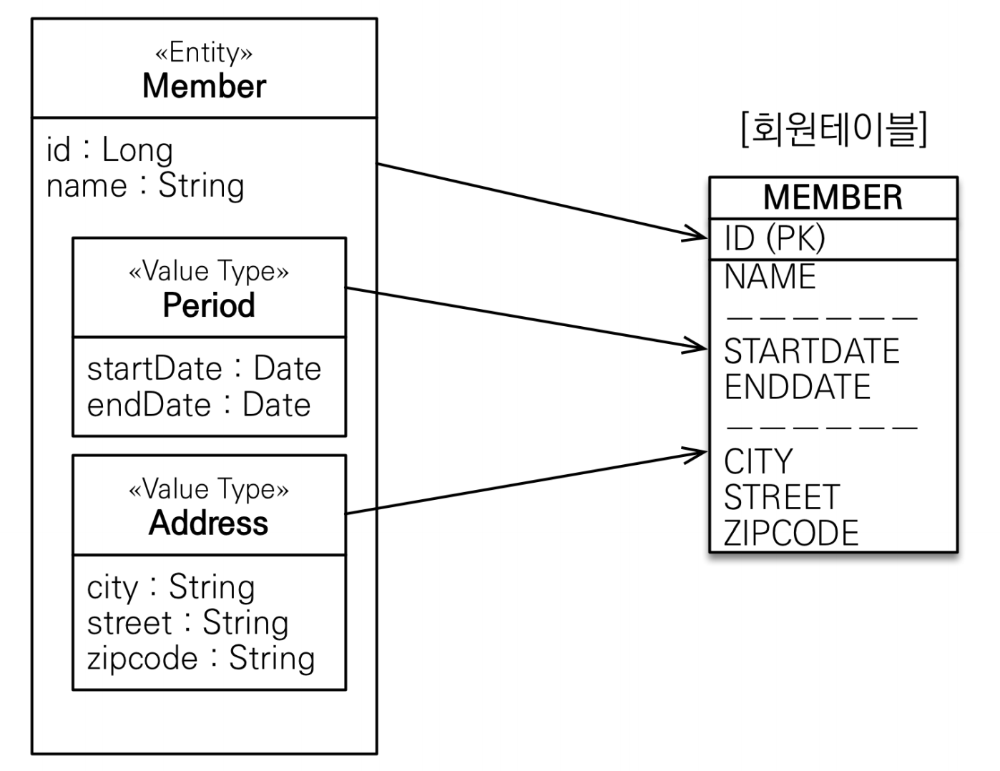

# 1 값 타입

* JPA의 데이터 타입을 가장 크게 분류하면 엔티티 타입과 값 타입으로 나눌 수 있다
  * 엔티티 타입: @Entity로 정의한 객체
  * 값 타입: int, Integer, String 처럼 단순히 값으로 사용하는 자바 기본 타입이나 객체를 말한다.


**값 타입 예시**

```java
@Embeddable
@Getter
public class Address {
  private String city;
  private String street;
  private String zipcode;
}
```

* 값 타입은 변경 불가능하게 설계해야 한다.
*  @Setter 를 제거하고, 생성자에서 값을 모두 초기화해서 변경 불가능한 클래스를 만든다
* JPA 스펙상 엔티티나 임베디드 타입( @Embeddable )은 자바 기본 생성자(default constructor)를 `public` 또는 `protected` 로 설정해야 한다. 
  * `public` 으로 두는 것 보다는 `protected` 로 설정하는 것이 그나마 더 안전 하다.
  * JPA가 이런 제약을 두는 이유는 JPA 구현 라이브러리가 객체를 생성할 때 리플랙션 같은 기술을 사용할 수 있도록 지원해야 하기 때문이다.


## 1.1 값 타입의 특징

* 식별자가 없다
* 생명 주기를 엔티티에 의존한다
* 공유하지 않는 것이 안전하다
  * 값을 복사해서 사용한다
  * 오직 하나의 주인만이 관리해야 한다
  * 불변 객체로 만드는 것이 안전하다


# 2 엔티티 타입과 비교

* 엔티티 타입은 식별자를 통해 지속해서 추적할 수 있지만 값 타입은 식별자가 없고 숫자나 문자같은 속성만 있으므로 추적할 수 없다
* 예를 들어 회원 엔티티는 회원의 키나 나이 값을 변경해도 같은 회원이다
  * 모든 데이터를 변경해도 식별자만 유지하면 같은 회원으로 인식
* 반면 숫자 값 100을 200으로 변경하면 완전히 다른 값으로 대체된다


# 3 값 타입의 종류

## 3.1 기본값 타입

* 기본값 타입은 자바의 기본 타입과 래퍼 클래스 그리고 String이 있다
* 예) int, double, Integer


**예시**

- name과 age가 값 타입이다.
- name과 age는 별도의 식별자 값도 없고 생명주기도 Member 엔티티에 의존하게 된다.
  - Memeber를 삭제하면 name과 age도 삭제된다.
- 값 타입은 공유되면 안 된다.
  - 공유하게 되면 나의 이름을 변경했을 때 다른 Member의 이름도 변경될 수 있기 때문이다.

```java
public class Member {
  @Id @GeneratedValue
  private Long id;
  private String name;
  private int age;
}
```


## 3.2 임베디드 타입

* 임베디드 타입이란 사용자가 직접 정의한 새로운 값 타입이다
* 임베디드 타입도 기본값 타입(int, String)처럼 값 타입이다.
* **기본 생성자가 필수**
* 임베디드 타입이 null이면 매핑한 컬럼 값은 모두 null이다.


**예시**

```java
public class Member {
  @Id
  @GeneratedValue
  private Long id;

  private LocalDate startDate;
  private LocalDate endDate;

  private String city;
  private String street;
  private String zipcode;
}
```

* 회원이 상세한 데이터를 그대로 가지고 있는 것은 객체지향적이지 않으며 응집성이 떨어진다.
* 상세한 데이터: 이름, 근무 시작일, 근무 종료일, 주소 도시, 주소 번지, 주소 우편 번호를
* 응집성을 높인 객체지향적인 데이터: 이름, 근무 기간, 집 주소를 가진다
* 상세한 데이터를 임베디드 타입을 이용해서 응집성을 높여보자


```java
@NoArgsConstructor
@Embeddable
public class Address {
  private String city;
  private String street;
  private String zipcode;
}
```

```java
@NoArgsConstructor
@Embeddable
public class Period {
  private LocalDate startDate;
  private LocalDate endDate;
}
```

* startDate, endDate를 합쳐서 Period(기간) 클래스를 만들었다
* city, street, zipcode를 합쳐서 Address(주소) 클래스를 만들었다
* 값 타입을 정의하는 곳에 `@Embeddable` 애노테이션을 사용한다.


```java
@Entity
public class Member {
    @Id
    @GeneratedValue
    private Long id;
    @Embedded
    private Period period;
    @Embedded
    private Address address;
}
```

- 값 타입을 사용하는 곳에는 `@Embedded` 애노테이션을 사용한다.


## 3.3 컬렉션 값 타입

- 값 타입을 하나 이상 저장하려면 컬렉션에 보관하고 `@ElementCollection`, `@CollectionTable`을 사용하면 된다.


# 4 애노테이션

## 4.1 @Embeddable

* 값 타입을 정의하는 곳에 표시

```java
@NoArgsConstructor
@Embeddable
public class Address {
  private String city;
  private String street;
  private String zipcode;
}
```


## 4.2 @Embedded

* 값 타입을 사용하는 곳에 표시

```java
@Entity
public class Member {
    @Id
    @GeneratedValue
    private Long id;
    @Embedded
    private Address address;
}
```


## 4.3 @AttributeOverrides

* 하나의 엔티티에 같은 값 타입을 중복해서 쓰면 테이블 매핑시 컬럼명이 중복된다
* 이를 해결하려면 `@AttributeOverrides` 을 사용해서 중복이 되지 않도록 컬럼명을 재정의 하면된다


**예시**

* 값 타입 Address를 중복 사용해 `@AttributeOverrides`을 이용해 컬럼명 재정의

```java
@Entity
public class Member {
  @Id
  @GeneratedValue
  private Long id;

  @Embedded
  private Period period;

  @Embedded
  private Address homeAddress;

  @AttributeOverrides({
    @AttributeOverride(name = "city", column = @Column(name ="company_city")),
    @AttributeOverride(name = "street", column = @Column(name ="company_street")),
    @AttributeOverride(name = "zipcode", column = @Column(name ="company_zipcode"))})
  @Embedded
  private Address companyAddress;
}
```


# 5 임베디드 타입과 테이블 매핑



* 임베디드 타입을 엔티티의 값일 뿐이다
* 따라서 값이 속한 엔티티의 테이블에 매핑한다


# 6 불변 객체

- 값 타입은 부작용 걱정 없이 사용할 수 있게 불변 객체로 만들어야 한다.
- 한 번 만들면 절대 변경할 수 없는 객체를 불변 객체라 한다.
- 불변 객체도 객체이기 때문에 인스턴스의 참조 값을 공유하게 되지만 불변 객체의 공유 인스턴스를 공유해도 값을 수정할 수 없으므로 부작용이 발생하지 않는다.
- 불변 객체는 이펙티브 자바 [Item17.md](../../../Language/Java/Effective-Java/Chapter4/Item17/Item17.md) 참고


참고

* [자바 ORM 표준 JPA 프로그래밍](http://www.kyobobook.co.kr/product/detailViewKor.laf?mallGb=KOR&ejkGb=KOR&barcode=9788960777330)
