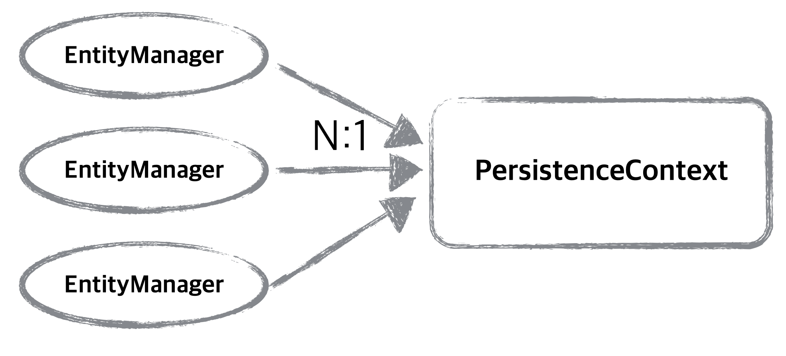

## JPA에서 가장 중요한 것

* 객체와 관계형 데이터베이스 매핑하기

* 영속성 컨텍스트


## 엔티티 매니저 팩토리와 엔티티 매니저

* 엔티티 매니저 팩토리
  * 엔티티 매니저를 생성한다.
  * 데이터베이스를 하나만 사용하는 애플리케이션은 일반적으로 엔티티 매니저 팩토리를 하나만 생성한다.
    * 엔티티 매니저 팩토리를 만드는 비용이 굉장히 크기 때문이다.
  * 여러 스레드가 동시에 접근해도 안전하다
* 엔티티 매니저
  * 연결이 필요한 시점에 DB 커넥션 풀에서 커넥션을 얻어 사용한다.
    * 보통 트랜잭션을 시작할 떄 커넥션을 얻는다.
  * 엔티티 매니저를 통해서 영속성 컨텍스트에 접근
  * 엔티티 매니저 만드는 비용이 거의 들지 않는다.
  * 여러 스레드가 동시에 접근하면 동시성 문제가 발생할 수 있다.
    * 스레드간 공유는 하면 안된다.


## 영속성 컨텍스트

* “엔티티를 영구 저장하는 환경”이라는 뜻
* 논리적인 개념으로 눈에 보이지 않는다.
* 엔티티 매니저를 생성할 때 만들어진다.
* 엔티티 매니저를 통해서 영속성 컨텍스트에 접근하고 관리한다.
* 스프링 프레임워크 같은 컨테이너 환경에서는 엔티티 매니저와 영속성 컨텍스트가 N:1이다




## 엔티티의 생명주기


* 비영속 (new/transient)


  * 영속성 컨텍스트와 전혀 관계가 없는 새로운 상태

  * ```java
    //객체를 생성한 상태(비영속)
    Member member = new Member();
    member.setId("member1");
    member.setUsername("회원1");
    ```

* 영속 (managed)


  * 영속성 컨텍스트에 관리되는 상태

  * ```java
    //객체를 생성한 상태(비영속)
    Member member = new Member();
    member.setId("member1");
    member.setUsername(“회원1”);
    EntityManager em = emf.createEntityManager();
    em.getTransaction().begin();
    //객체를 저장한 상태(영속)
    em.persist(member);
    ```

* 준영속 (detached)


  * 영속성 컨텍스트에 저장되었다가 분리된 상태

  * 영속성 컨텍스트가 제공하는 기능을 사용 못함

    * 지연로딩을 할 수 없다.

  * ```java
    //회원 엔티티를 영속성 컨텍스트에서 분리, 준영속 상태
    em.detach(member);
    //영속성 컨텍스트를 완전히 초기화
    em.clear()
    //영속성 컨텍스트를 종료
    em.close()
    ```

* 삭제 (removed)
 

  * 삭제된 상태

  * ```java
    //객체를 삭제한 상태(삭제)
    em.remove(member);
    ```


## 영속성 컨텍스트의 이점

* 1차 캐시
* 동일성(identity) 보장
* 트랜잭션을 지원하는 쓰기 지연
 (transactional write-behind)
* 변경 감지(Dirty Checking) 
* 지연 로딩(Lazy Loading)

### 1차 캐시

* 영속성 컨텍스트 내부에는 캐시를 가지고 있는데 이것을 1차 캐시라고 한다.

* 영속 상태의 엔티티들은 모두 이곳에 저장된다.

* 쉽게 말하면 맵이 있다고 할 수 있다.

  * key: @Id 로 매핑한 식별자

  * 데이터 베이스의 기본 키와 같다
  * value: 엔티티 인스턴스

**엔티티 생성과 영속**

```java
//엔티티를 생성한 상태(비영속)
Member member = new Member();
member.setId("member1");
member.setUsername("회원1");
//엔티티를 영속
em.persist(member);
```


**1차 캐시에서 엔티티 조회**

* 우선 1차 캐시에서 식별자 값으로 엔티티를 찾는다. 있으면 데이터베이스에서 조회하지 않고 메모리에 있는 1차 캐시에서 엔티티를 조회한다.

```java
 Member member = new Member();
 member.setId("member1");
 member.setUsername("회원1");
 //1차 캐시에 저장됨
 em.persist(member);
 //1차 캐시에서 조회
 Member findMember = em.find(Member.class, "member1");
```

				 		

​				 		

**데이터베이스에서 조회**

* 엔티티가 1차 캐시에 없으면 데이터베이스에서 조회한다.
* 데이터베이스에서 조회한 엔티티를 1차캐시에 저장한다.
* 영속상태인 엔티티를 반환한다.

```java
Member findMember2 = em.find(Member.class, "member2");
```


### 동일성(identity) 보장

**영속 엔티티의 동일성 보장**

* 1차 캐시에 있는 같은 인스턴스를 반환하기에 엔티티 동일성을 보장한다.

```java
Member a = em.find(Member.class, "member1");
Member b = em.find(Member.class, "member1");
System.out.println(a == b); //동일성 비교 true
```


### 트랜잭션을 지원하는 쓰기 지연
 (transactional write-behind)

* 엔티티 매니저는 트랙잭션 커밋이 발생하기 전까지 SQL을 모아서 한번에 DB로 보내는데 이것을 트랜잭션을 지원하는 쓰기 지연이라고 한다.

**엔티티 저장**

```java
EntityManager em = emf.createEntityManager();
EntityTransaction transaction = em.getTransaction();
//엔티티 매니저는 데이터 변경시 트랜잭션을 시작해야 한다.
transaction.begin(); // [트랜잭션] 시작
em.persist(memberA); 
em.persist(memberB);
//여기까지 INSERT SQL을 데이터베이스에 보내지 않는다.
//커밋하는 순간 데이터베이스에 INSERT SQL을 보낸다.
transaction.commit(); // [트랜잭션] 커밋
```

* 영속성 컨텍스트의 상태 변화
* em.persist(memberA); 


* em.persist(memberB);


* transaction.commit();


### 변경 감지(Dirty Checking) 

* JPA로 엔티티를 수정할 때는 단순히 엔티티를 조회해서 데이터만 변경하면 된다.
* 엔티티의 변경사항을 자동으로 데이터베이스에 반영하는 이 기능을 변경감지(Dirty Checking)라고 한다.
  * 변경 감지는 영속성 컨텍스트가 관리하는 영속 상태의 엔티티만 적용된다.
* Dirty Checking 과정
  * 엔티티를 영속성 컨텍스트에 보관할 때 최초 상태의 스냅샷을 저장한다.
  * 플러시 시점에 스냅샷과 엔티티를 비교하고 변경된 엔티티를 찾는다.
  * 수정 쿼리를 작성해서 쓰기 지연 SQL 저장소에 보낸다.
  * 쓰기 지연 SQL 저장소의 SQL을 데이터베이스로 보낸다.

> **플러시란?**
>
> 영속성 컨텍스트의 변경내용을
 데이터베이스에 반영하는 것이다.
>
> **플러시 과정**
>
> * 변경 감지가 동작해서 영속성 컨텍스트의 모든 엔티티를 스냅샷과 비교한다.
> * 수정된 엔티티를 찾아 수정 쿼리를 쓰기 지연 SQL 저장소에 등록한다.
> * 쓰기 지연 저장소의 SQL을 데이터베이스로 보낸다.
>
> **영속성 컨텍스트를
 플러시하는 방법**
>
> * em.flush() - 직접 호출
> * 트랜잭션 커밋 - 플러시 자동 호출
> * JPQL 쿼리 실행 - 플러시 자동 호출
>
> **특징**
>
> * 영속성 컨텍스트를 비우지 않음
> * 영속성 컨텍스트의 변경내용을 데이터베이스에 동기화
> * 트랜잭션이라는 작업 단위가 중요 -> 커밋 직전에만 동기화 하면 됨

**예시**

```java
EntityManager em = emf.createEntityManager();
EntityTransaction transaction = em.getTransaction();
transaction.begin(); // [트랜잭션] 시작
// 영속 엔티티 조회
Member memberA = em.find(Member.class, "memberA");
// 영속 엔티티 데이터 수정
memberA.setUsername("hi");
memberA.setAge(10);
//em.update(member) 이런 코드가 있어야 하지 않을까?
transaction.commit(); // [트랜잭션] 커밋
```

**영속성 컨텍스트의 상태 변화**

* transaction.commit();
  * flush가 발생하고 엔티티의 스냅냣과 비교를하고 달라진점이 있으면 UPADATA SQL을 생성하고 flush한다.


### 지연 로딩(Lazy Loading)


참조

* [자바 ORM 표준 JPA 프로그래밍](http://www.acornpub.co.kr/book/jpa-programmig)
* 인프런 자바 ORM 표준 JPA 프로그래밍
