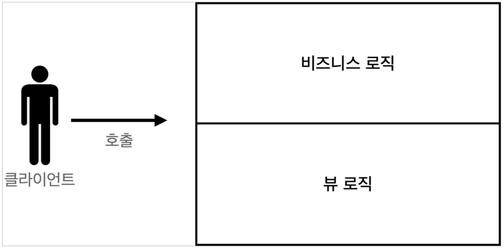
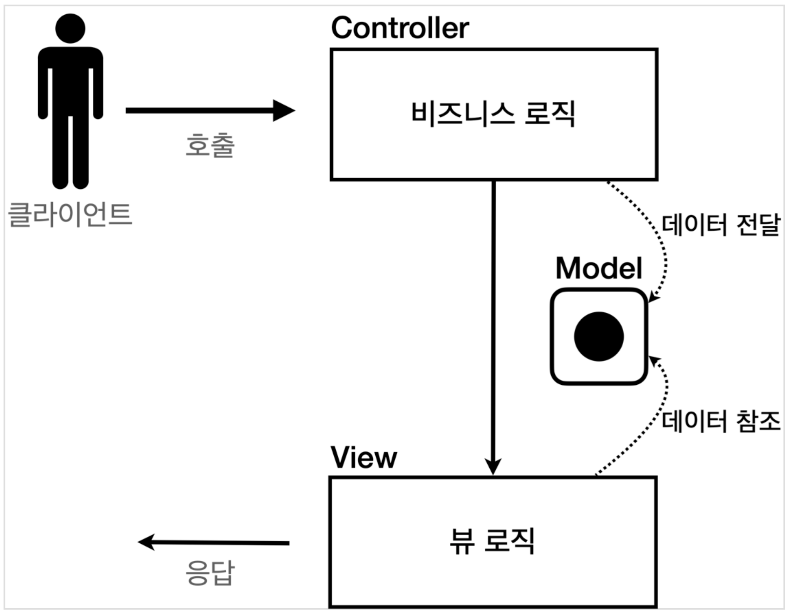
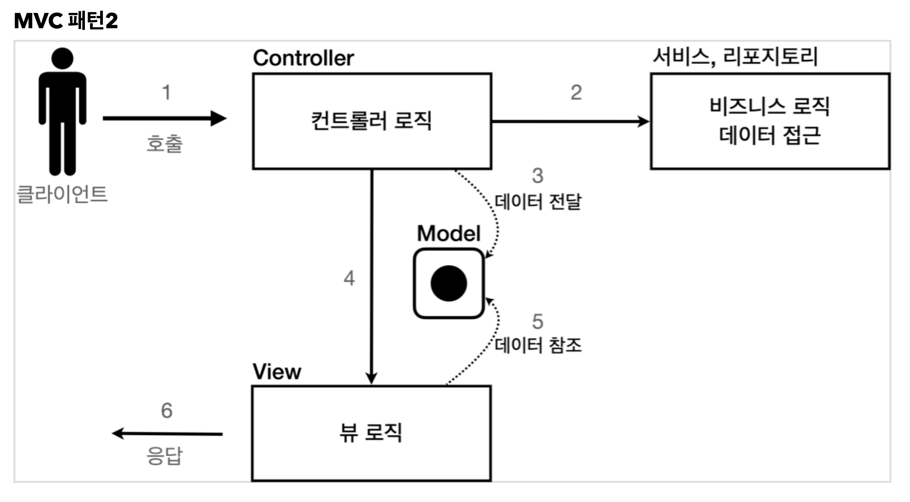

## MVC Pattern

## Model

> 뷰에 출력할 데이터를 담아둔다. 뷰가 필요한 데이터를 모두 모델에 담아서 전달해주는 덕분에 뷰는 비즈니스 로직이나 데이터 접근을 몰라도 되고, 화면을 렌더링 하는 일에 집중할 수 있다.

## View

> 모델에 담겨있는 데이터를 사용해서 화면을 그리는 일에 집중한다. 여기서는 HTML을 생성하는 부분을 말한다.

## Controller

> HTTP 요청을 받아서 파라미터를 검증하고, 비즈니스 로직을 호출하는 역할을 한다. 그리고 뷰에 전달할 결과 데이터를 조회해서 모델에 담는다.
>
> > 참고
> > 컨트롤러에 비즈니스 로직을 둘 수도 있지만, 이렇게 되면 컨트롤러가 너무 많은 역할을 담당한다. 그래서
> > 일반적으로 비즈니스 로직은 서비스(Service)라는 계층을 별도로 만들어서 처리한다. 그리고 컨트롤러는 비즈니스 로직이 있는 서비스를 호출하는 담당한다. 참고로 비즈니스 로직을 변경하면 비즈니스 로직을 호출하는 컨트롤러의 코드도 변경될 수 있다. 앞에서는 이해를 돕기 위해 비즈니스 로직을 호출한다는 표현 보다는, 비즈니스 로직이라 설명했다.

MVC 패턴 이전

*  비즈니스 로직과 뷰 로직이 분리되지 않았다.

MVC 패턴1

*  비즈니스 로직과 뷰 로직이 분리되었다.

MVC 패턴2

* 컨트롤러에 비즈니스 로직을 둘 수도 있지만, 이렇게 되면 컨트롤러가 너무 많은 역할을 담당한다.
* 일반적으로 비즈니스 로직은 서비스(Service)라는 계층을 별도로 만들어서 처리한다. 
* 그리고 컨트롤러는 비즈니스 로직이 있는 서비스를 호출하는 담당한다.

