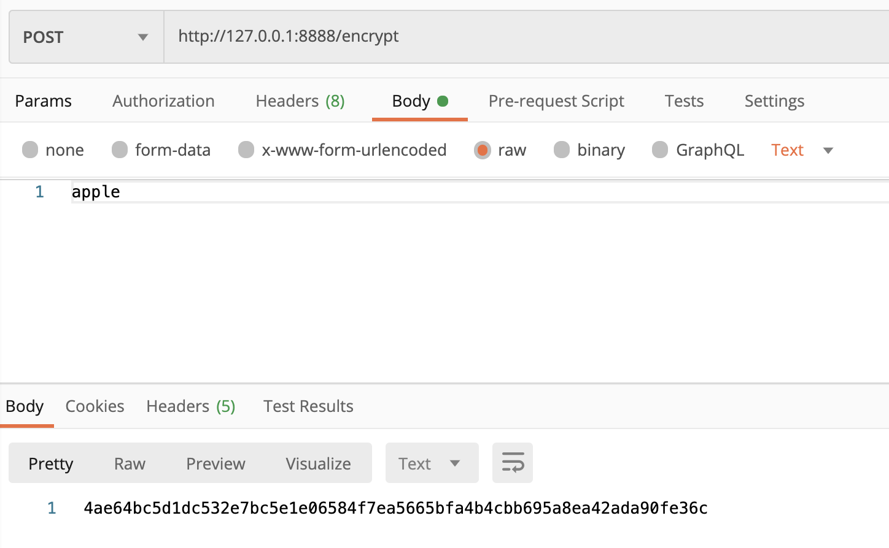
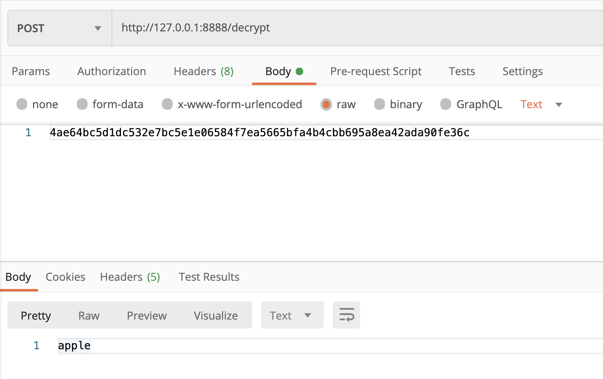

# 1. Spring Cloud Config

> Spring Cloud Config는 분산 시스템에서 외부화 된 configuration을 위한 서버 측 및 클라이언트 측 지원을 제공합니다. Config Server를 사용하면 모든 환경에서 애플리케이션의 외부 속성을 중앙에서 관리할 수 있습니다. 클라이언트와 서버의 개념은 Spring 환경 및 PropertySource 추상화와 동일하게 매핑되므로 Spring 애플리케이션과 매우 잘 맞지만 모든 언어로 실행되는 모든 애플리케이션에서 사용할 수 있습니다. 애플리케이션이 배포 파이프라인을 통해 개발에서 테스트 및 운영 환경으로 이동할 때 이러한 환경 간의 구성을 관리하고 애플리케이션이 마이그레이션 시 실행해야 하는 모든 사항을 충족할 수 있습니다.서버 스토리지 백엔드의 기본 구현은 git을 사용하므로 레이블이 지정된 configuration 환경 버전을 쉽게 지원할뿐만 아니라 콘텐츠 관리를위한 다양한 도구에 액세스 할 수 있습니다. 대체 구현을 추가하고이를 Spring 구성으로 연결하는 것은 쉽습니다.

* 분산 시스템에서 서버 클라이언트 구성에 필요한 configuration 정보를 외부 시스템에서 관리
* 하나의 중앙화 된 저장소에서 구성요소 관리
* 각 서비스를 다시 빌드하지 않고, 바로 적용 가능
* 애플리케이션 배포 파이프라인을 통해 dev-test-prod 환경에 맞는 구성 정보 사용

# 2. Spring Cloud Config Server

> Spring Cloud Config Server는 외부 configuration (이름-값 쌍 또는 YAML 콘텐츠)을위한 HTTP 리소스 기반 API를 제공합니다. 

**dependency 추가**

```xml
<dependency>
  <groupId>org.springframework.cloud</groupId>
  <artifactId>spring-cloud-config-server</artifactId>
</dependency>
```


**Config Server 실행 방법**

* Config 서버는 `@EnableConfigServer` 어노테이션을 사용하여 Spring Boot 애플리케이션에 임베드 할 수 있습니다. 결과적으로 아래는 애플리케이션은 Config Server 입니다.

```java
@SpringBootApplication
@EnableConfigServer
public class ConfigServer {
  public static void main(String[] args) {
    SpringApplication.run(ConfigServer.class, args);
  }
}
```


**Config Server configuration**

* Spring Boot 애플리케이션과 마찬가지로 기본적으로 포트 8080에서 실행되지만  8888 포트가 컨벤션이다.
* `spring.cloud.config.server.git.uri` : configuration(YAML 및 properties 파일)이 저장된 깃 저장소를 지정
* 여기서 `${user.home}/config-repo`는 YAML 및 properties 파일이 포함 된 git 저장소입니다.

```yml
server:
  port: 8888
spring:
  application:
    name: config-service
  cloud:
    config:
      server:
        git:
          uri: file://${user.home}/config-repo
```

> git 저장소에 로컬 파일 시스템을 사용하는 것은 테스트용입니다.


**깃 저장소에 configuration 파일 만들기**

* 앞서 지정한 깃 저장소에 아래와 같이 `ecommerce.yml` 이라는 이름으로 configuration 파일을 만들어 보자.

```yml
token:
  expiration_time: 86400000
  secret: user_token

gateway:
  ip: 192.168.0.12
```

* 서버를 기동하고 http://localhost:8888/ecommerce/default 요청에 대한 응답

```json
// 20210531222910
// http://localhost:8888/ecommerce/default

{
  "name": "ecommerce",
  "profiles": [
    "default"
  ],
  "label": null,
  "version": "c99217a8823b3d63d38fcc75b5831a438817906f",
  "state": null,
  "propertySources": [
    {
      "name": "file://Users/YT/Desktop/project/study-spring-cloud/git-local-repo/ecommerce.yml",
      "source": {
        "token.expiration_time": 86400000,
        "token.secret": "user_token",
        "gateway.ip": "192.168.0.12"
      }
    }
  ]
}
```


## 2.1 [Environment Repository](https://docs.spring.io/spring-cloud-config/docs/current/reference/html/#_environment_repository)

* Config Server가 가지고 있는 configuration이 저장되는 곳
* git, file system 등이 있다.


## 2.2 [Encryption and Decryption](https://docs.spring.io/spring-cloud-config/docs/current/reference/html/#_encryption_and_decryption)

> 원격 property를 암호화된 내용으로 git repository에 저장하고 있으면 HTTP를 통해 클라이언트에 전송하기 전에 암호가 해독됩니다. 이를 통해 property 값을 일반 텍스트로 저장할 필요가 없고 보안성 이점이 있습니다.

**디펜던시 추가**

```xml
<dependency>
  <groupId>org.springframework.cloud</groupId>
  <artifactId>spring-cloud-starter-bootstrap</artifactId>
</dependency>
```


**bootstrap.yml 작성**

* `/src/main/resources` 경로에 bootstrap.yml을 작성하자.
* 암호화의 사용될 대칭키를 아래와 같이 임의로 작성했다.
* profile 별로 bootstrap-{profile}.yml 형태로 관리할 수 있다.

```yml
encrypt:
  key: xcmweroixkjcvnsdi13407sdfph23m
```


**대칭키 예시**

* 플레인 텍스트를 암호화 해보자
* `http://127.0.0.1:8888/encrypt`로 바디에 플레인 텍스트롤 넣어서 POST로 요청하면 아래와 같이 플레인 텍스트가 암호화 된 응답을 받을 수 있다.



* 다시 복호화 해보자
* `http://127.0.0.1:8888/decrypt`로 바디에 암호화된 텍스트롤 넣어서 POST로 요청하면 복호화된 응답을 받을 수 있다.



* 실제 사용
  * `apple` 이라는 플레인 텍스트를 위에 예시와 같이 암호화 한다.
  * `user-service.yml` 를 아래와 같이 작성
  * 암호화된 텍스트 앞에 `{cipher}` 를 붙여 암호화된 텍스트임을 알린다.

```yml
spring:
  datasource:
    driver-class-name: org.h2.Driver
    url: jdbc:h2:mem:testdb
    username: sa
    password: '{cipher}30655a4310418c2b71e4a39f85933aea3abaced6f7f0f547f756e0f990dc0fe0'
```

* `http://localhost:8888/user-service/default` config 서버로 다음과 같이 요청을 하면

```json
{
  "name": "user-service",
  "profiles": [
    "default"
  ],
  "label": null,
  "version": "c99217a8823b3d63d38fcc75b5831a438817906f",
  "state": null,
  "propertySources": [
    {
      "name": "file://Users/YT/Desktop/project/study-spring-cloud/git-local-repo/user-service.yml",
      "source": {
        "spring.datasource.driver-class-name": "org.h2.Driver",
        "spring.datasource.url": "jdbc:h2:mem:testdb",
        "spring.datasource.username": "sa",
        "spring.datasource.password": "apple"
      }
    },
    {
      "name": "file://Users/YT/Desktop/project/study-spring-cloud/git-local-repo/application.yml",
      "source": {
        "token.expiration_time": 86400000,
        "token.secret": "user_token_application_4",
        "gateway.ip": "192.168.0.12"
      }
    }
  ]
}
```

* "spring.datasource.password": "apple" 복호화된 암호를 얻을 수 있다.

**비대칭키 예시**

1. 비대칭키 만들기

```bash
keytool -genkeypair -alias apiEncryptionKey -keyalg RSA \
         -dname "CN=Youngthree, OU=API Development, O=nys.co.kr, L=Seoul, C=KR" \
         -keypass "1q2w3e4r" -keystore apiEncryptionKey.jks -storepass "1q2w3e4r"
```

2. 확인

```bash
keytool -list -keystore apiEncryptionKey.jks -v
키 저장소 비밀번호 입력:
키 저장소 유형: PKCS12
키 저장소 제공자: SUN

키 저장소에 1개의 항목이 포함되어 있습니다.

별칭 이름: apiencryptionkey
생성 날짜: 2021. 6. 13.
항목 유형: PrivateKeyEntry
인증서 체인 길이: 1
인증서[1]:
소유자: CN=Youngthree, OU=API Development, O=nys.co.kr, L=Seoul, C=KR
발행자: CN=Youngthree, OU=API Development, O=nys.co.kr, L=Seoul, C=KR
일련 번호: 56de8a7f
적합한 시작 날짜: Sun Jun 13 13:01:12 KST 2021 종료 날짜: Sat Sep 11 13:01:12 KST 2021
인증서 지문:
	 SHA1: 41:02:13:67:DF:69:2E:AB:D3:A0:03:31:F2:19:A2:D8:2A:4D:E3:FC
	 SHA256: 93:0C:8A:66:D4:0E:2B:04:41:AA:40:24:5B:96:AE:A2:87:0B:C4:54:DD:21:0D:86:2B:AB:27:06:D6:2E:F4:5C
서명 알고리즘 이름: SHA256withRSA
주체 공용 키 알고리즘: 2048비트 RSA 키
버전: 3

확장:

#1: ObjectId: 2.5.29.14 Criticality=false
SubjectKeyIdentifier [
KeyIdentifier [
0000: 7B 67 24 05 86 B6 FE 32   8A 0A A0 E3 5D FD 82 5A  .g$....2....]..Z
0010: 59 9D 37 F2                                        Y.7.
]
]


*******************************************
*******************************************
```

3. 퍼블릭 키 추출하기

```bash
keytool -export -alias apiEncryptionKey -ke
ystore apiEncryptionKey.jks -rfc -file trustServer.cer
키 저장소 비밀번호 입력:
인증서가 <trustServer.cer> 파일에 저장되었습니다.

keytool -import -alias trustServer -file trustServer.cer -keystore publickey.jks
```

4. Config server의 `bootstrap.yml` 작성
   * 키스토어의 위치와 패스워드 입력

```yml
encrypt:
  key-store:
    location: file://${user.home}/Desktop/project/study-spring-cloud/keystore/apiEncryptionKey.jks
    password: 1q2w3e4r
    alias: apiEncryptionKey
```


# 3. Spring Cloud Config Client

**dependency 추가**

```xml
<dependency>
<groupId>org.springframework.cloud</groupId>
<artifactId>spring-cloud-starter-config</artifactId>
</dependency>

<dependency>
  <groupId>org.springframework.cloud</groupId>
  <artifactId>spring-cloud-starter-bootstrap</artifactId>
</dependency>
```

```groovy
implementation 'org.springframework.cloud:spring-cloud-starter-config'
implementation 'org.springframework.cloud:spring-cloud-starter-bootstrap'
```


## 3.1 Config First Bootstrap

* Config Server를 사용하려는 모든 클라이언트 애플리케이션에 `bootstrap.yml`이 필요합니다.

* Config Server에 연결하려면 부트스트랩을 활성화해야 합니다

  * `spring-cloud-starter-bootstrap starter` 디펜던시 추가를 통해 활성화 할 수 있다.
  * 또는 `spring.cloud.bootstrap.enabled=true` 로 설정해서 활성화한다.

* 부트스트랩을 활성화하면 클래스 경로에 `Spring Cloud Config Client`가 있는 애플리케이션이 Config Server에 연결됩니다. 

  * 클라이언트가 시작되면 Config 서버에 바인딩되고( `bootstrap.yml` 에 정의된 `spring.cloud.config.uri` 로 바인딩)
  * 원격 property 소스를 사용하여 Spring Environment를 초기화합니다.


### 3.1.1 bootstrap.yml 작성

* 프로파일 별로 bootstrap.yml을 지정할 수 있다.

**bootstrap.yml**

```yml
spring:
  cloud:
    config:
      uri: http://139.150.75.239:8888/
      name: user-service
```

**bootstrap-local.yml**

* 로컬 환경에선 config 서버를 사용하지 않도록 아래와 같이 설정할 수 있다

```yml
spring:
  cloud:
    config:
      enabled: false
```
