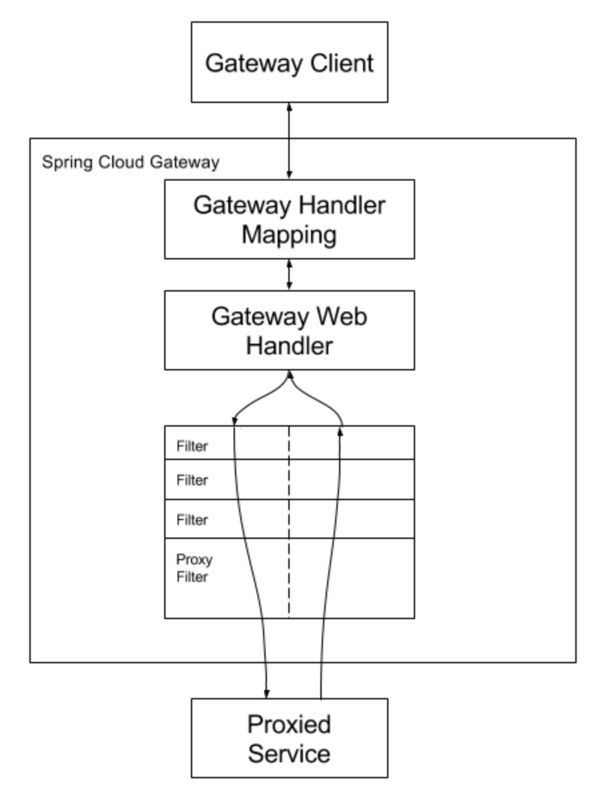

# Spring Cloud Gateway

> Spring Cloud Gateway는 Spring WebFlux 위에 API Gateway를 구축하기위한 라이브러리이다. Spring Cloud Gateway는 API로 라우팅하는 간단하면서도 효과적인 방법을 제공하고 보안, 모니터링 / 메트릭 및 탄력성과 같은 cross cutting concerns을 제공하는 것을 목표로합니다.


## 특징

* Built on Spring Framework 5, Project Reactor and Spring Boot 2.0
* Able to match routes on any request attribute.
* Predicates and filters are specific to routes.
* Circuit Breaker integration.
* Spring Cloud DiscoveryClient integration
* Easy to write Predicates and Filters
* Request Rate Limiting
* Path Rewriting


## 용어 사전

**Route**

* 게이트웨이의 기본 구성 요소입니다. 
* ID, 대상 URI, `Predicate` 모음 및 `Filter` 모음으로 정의됩니다. 
* 모든 `Predicate` 가 참이면 경로가 일치합니다.

**Predicate**

* Java 8 Function Predicate
* 쉽게 말하면 조건이며 이 조건이 만족될 때 해당 요청을 라우팅시킨다
* 입력 타입은 Spring Framework ServerWebExchange입니다.
* 이를 통해 헤더 또는 매개 변수와 같은 HTTP 요청의 모든 항목을 일치시킬 수 있습니다.

**Filter**

* 특정 팩토리로 구성된 `GatewayFilter`의 인스턴스입니다
* `Filter`에서 다운 스트림 요청을 보내기 전이나 후에 요청과 응답을 수정할 수 있습니다.


## Spring Cloud Gateway의 동작 방식

1. 클라이언트는 Spring Cloud Gateway에 요청을합니다. 
2. `Gateway Handler Mapping`이 요청이 경로와 일치한다고 판단하면 `Gateway Web Handler`로 전송됩니다. 
3. 이 핸들러는 요청에 특정한 필터 체인을 통해 요청을 실행합니다. 
4. 필터가 점선으로 구분되는 이유는 필터가 프록시 요청이 전송되기 전과 후에 로직을 실행할 수 있기 때문입니다. 
5. 모든 "pre"필터 로직이 실행됩니다. 
6. 그런 다음 프록시 요청이 이루어집니다. 
7. 프록시 요청이 이루어진 후 "post"필터 로직이 실행됩니다.



> 포트없이 경로에 정의 된 URI는 각각 HTTP 및 HTTPS URI에 대해 기본 포트 값인 80 및 443을 나타냅니다.


## Configuration

```yaml
spring:
  cloud:
    gateway:
      routes:
      - id: after_route
        uri: https://example.org
        predicates:
        - name: Cookie
          args:
            name: mycookie
            regexp: mycookievalue
```

```yaml
spring:
  cloud:
    gateway:
      routes:
      - id: after_route
        uri: https://example.org
        predicates:
        - Cookie=mycookie,mycookievalue
```


참고

* https://docs.spring.io/spring-cloud-gateway/docs/current/reference/html/#shortcut-configuration