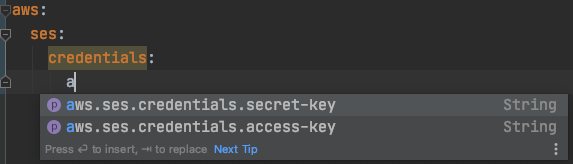

# Type-safe Configuration Properties

> @Value("${property}") 주석을 사용하여 properties를 주입하는 것은 번거로우며, 특히 여러 속성을 사용 중이거나 데이터가 계층 구조인 경우에는 더욱 그렇습니다. Spring Boot는 strongly typed Bean이 애플리케이션 properties를 관리하고 유효성을 검사 할 수 있도록하는 대체 방법을 제공합니다.


##  application.yml

* 아래 application.yml을 사용해서 프로퍼티들을 빈에 바인딩해보자.

**예시1**

```yml
aws:
  ses:
    credentials:
      access-key: sadfsadf
      secret-key: qsdxzsd
```


**예시2**

```yml
web-client:
  blockchain:
    base-url: http://220.90.208.174:3000
  ipfs:
    base-url: http://220.90.208.69:9094
```


## JavaBean properties binding

* 다음 예제와 같이 표준 JavaBean 속성을 선언하는 Bean을 바인딩 할 수 있습니다.
* setter가 필요합니다.

**예시1**

```java
@Setter
@Getter
@ConfigurationProperties(prefix = "aws.ses.credentials")
public class AwsSesProperties {
    private String accessKey;
    private String secretKey;
}
```

**예시2**

```java
@Setter
@Getter
@ConfigurationProperties(prefix = "web-client")
public class WebClientProperties {

    private BlockChain blockChain = new BlockChain();
    private Ipfs ipfs = new Ipfs();

    @Setter
    @Getter
    public class BlockChain {
        private String baseUrl;
    }

    @Setter
    @Getter
    public class Ipfs {
        private String baseUrl;
    }
}
```


## Constructor binding

* `@ConstructorBinding`를 추가하면 생성자 바인딩이 가능합니다.
* Setter가 필요없다. 대신 생성자가 필요하다.

```java
@Getter
@ConstructorBinding
@RequiredArgsConstructor
@ConfigurationProperties(prefix = "aws.ses.credentials")
public class AwsSesProperties {
    private final String accessKey;
    private final String secretKey;
}
```


## Property Class 빈으로 등록하기

* Spring Boot는 `@ConfigurationProperties` 클래스를 바인딩하고 bean으로 등록할 수 있는 인프라를 제공한다.
* 클래스별로 Property Class를 활성화 하거나 @ComponentSacn과 같은 방식으로 pakage를 중심으로 `@ConfigurationProperties`가 설정된 클래스들을 모두 빈으로 등록할 수 있다.


1. `@EnableConfigurationProperties`
   * 클래스별로 Property Class를 활성화 하는 방식이다.
   * `@Configuration` 이 붙은 클래스라면 어디에나 `@EnableConfigurationProperties` 을 사용할 수 있다.
   * 빈으로 등록할 Property Class를 명시한다.
     * 예) `AwsSesProperties.class`

```java
@RequiredArgsConstructor
@EnableConfigurationProperties(AwsSesProperties.class)
@Configuration
public class AmazonConfig {

    private final AwsSesProperties awsSesProperties;

    @Bean
    public AmazonSimpleEmailService amazonSimpleEmailService() {
        BasicAWSCredentials basicAWSCredentials = new BasicAWSCredentials(awsSesProperties.getAccessKey(), awsSesProperties.getSecretKey());
        AWSStaticCredentialsProvider awsStaticCredentialsProvider = new AWSStaticCredentialsProvider(basicAWSCredentials);

        return AmazonSimpleEmailServiceClientBuilder.standard()
                .withCredentials(awsStaticCredentialsProvider)
                .withRegion("ap-northeast-2")
                .build();
    }
}
```


2. `@ConfigurationPropertiesScan`: 스캐닝 방식 활용

* 보통 메인 어플리케이션에 적용하나 `@Configuration` 이 붙은 클래스라면 어디에나 적용가능하다.
* `@ConfigurationProperties`가 붙은 Property Class를 스캐닝할 패키지를 지정해준다.
  * 예) "com.example.app", "com.example.another"

```java
@RequiredArgsConstructor
@ConfigurationPropertiesScan({ "com.example.app", "com.example.another" })
@Configuration
public class AmazonConfig {

    private final AwsSesProperties awsSesProperties;

    @Bean
    public AmazonSimpleEmailService amazonSimpleEmailService() {
        BasicAWSCredentials basicAWSCredentials = new BasicAWSCredentials(awsSesProperties.getAccessKey(), awsSesProperties.getSecretKey());
        AWSStaticCredentialsProvider awsStaticCredentialsProvider = new AWSStaticCredentialsProvider(basicAWSCredentials);

        return AmazonSimpleEmailServiceClientBuilder.standard()
                .withCredentials(awsStaticCredentialsProvider)
                .withRegion("ap-northeast-2")
                .build();
    }
}
```


## Configuration annotationProcessor 추가

* configuration annotationProcessor를 추가하면 IDE 자동 완성 및 메타 데이터 활용을 지원해준다.

```groovy
dependencies {
    annotationProcessor "org.springframework.boot:spring-boot-configuration-processor"
}
```

* 아래는 자동 완성 및 메타 데이터 활용을 지원 예시이다.




참고

* https://docs.spring.io/spring-boot/docs/current/reference/html/features.html#features.external-config.typesafe-configuration-properties
* https://pompitzz.github.io/blog/Spring/SpringBoot_Custom_Config_Properties.html#_3-property-class-%E1%84%83%E1%85%B3%E1%86%BC%E1%84%85%E1%85%A9%E1%86%A8