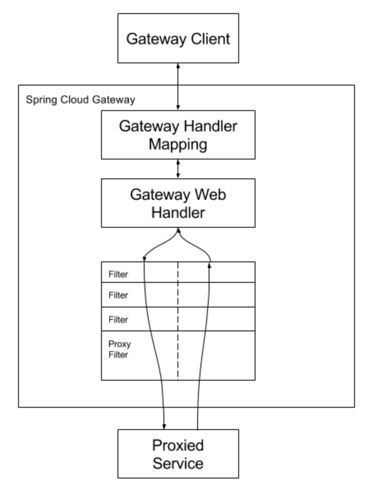

# 1 Spring Cloud Gateway

> Spring Cloud Gateway는 Spring WebFlux 위에 API Gateway를 구축하기위한 라이브러리이다. Spring Cloud Gateway는 API로 라우팅하는 간단하면서도 효과적인 방법을 제공하고 보안, 모니터링 / 메트릭 및 탄력성과 같은 cross cutting concerns을 제공하는 것을 목표로한다.


## 1.1 특징

* Built on Spring Framework 5, Project Reactor and Spring Boot 2.0
* Able to match routes on any request attribute.
* Predicates and filters are specific to routes.
* Circuit Breaker integration.
* Spring Cloud DiscoveryClient integration
* Easy to write Predicates and Filters
* Request Rate Limiting
* Path Rewriting


## 1.2 용어 사전

**Route**

* 게이트웨이의 기본 구성 요소다.
* ID, 목적지 URI, `Predicate` 모음 및 `Filter` 모음으로 구성된다. 
* 클라이언트 요청에 대해 모든 `Predicate`가 참이면 `Filter` 를 적용해 목적지 URL로 요청을 포워딩하고 응답에 다시 `Filter`를 적용해 클라이언트에게 응답한다.


**Predicate**

* Java 8 Function Predicate
* 쉽게 말하면 조건이며 이 조건이 만족될 때 해당 요청을 라우팅시킨다
* 입력 타입은 Spring Framework ServerWebExchange다.
* 이를 통해 헤더 또는 매개 변수와 같은 HTTP 요청의 모든 항목을 일치시킬 수 있다.


**Filter**

* 특정 팩토리로 구성된 `GatewayFilter`의 인스턴스다
* `Filter`에서 다운 스트림 요청을 보내기 전이나 후에 요청과 응답을 수정할 수 있다.


> **업스트림**
>
> 업스트림(upstream)은 클라이언트나 로컬 기기(일반적으로 컴퓨터나 모바일기기)에서 서버나 원격 호스트(이하 서버)로 보내지는 데이터 또는 보내는 것을 의미한다.
>


> **다운스트림**
>
> 다운스트림은 반대로 서버에서 로컬 기기로 전송되는 데이터의 흐름을 말한다.


# 2 Spring Cloud Gateway의 동작 방식

1. 클라이언트가 Spring Cloud Gateway에 요청한다
2. `Gateway Handler Mapping`이 요청이 경로와 일치한다고 판단하면 `Gateway Web Handler`로 전달한다.
   - 모든 Predicate가 참이어야 전달된다.
3. `Gateway Web Handler`는 요청에 특정한 필터 체인을 통해 요청을 실행한다
4. 모든 "pre filter"  로직이 실행된다.
5. 그런 다음 프록시 요청이 이루어진다.
6. 프록시 요청이 이루어진 후 "post filter"필터 로직이 실행된다




# 3 Configuration

* Gateway의 라우팅 정보을 `yml` 또는 `java configuration` 으로 설정할 수 있다.


**yml로 설정하기**

* Fully Expanded Arguments 버전

```yaml
spring:
  cloud:
    gateway:
      routes:
      - id: after_route
        uri: https://example.org
        predicates:
        - name: Cookie
          args:
            name: mycookie
            regexp: mycookievalue
```

* 위 설정과 같은 Shortcut  버전

```yaml
spring:
  cloud:
    gateway:
      routes:
      - id: after_route
        uri: https://example.org
        predicates:
        - Cookie=mycookie,mycookievalue
```


**java configuration으로 설정하기**

```java
@Configuration
public class FilterConfig {

    @Bean
    public RouteLocator gatewayRoutes(RouteLocatorBuilder routeLocatorBuilder) {
        return routeLocatorBuilder.routes()
                .route(r -> r.path("/first-service/**")
                        .filters(f -> f.addRequestHeader("first-request", "first-request-value")
                                .addResponseHeader("first-response", "first-response-value"))
                        .uri("http://localhost:8081"))
                .route(r -> r.path("/second-service/**")
                        .filters(f -> f.addRequestHeader("second-request", "second-request-value")
                                .addResponseHeader("second-response", "second-response-value"))
                        .uri("http://localhost:8082"))
                .build();
    }

}
```

* 위와 같은 설정

```yaml
spring:
  cloud:
    gateway:
      routes:
        - id: first-service
          uri: http://localhost:8081/
          predicates:
            - Path=/first-service/**
          filters:
            - AddRequestHeader= first-request, first-request-value
            - AddResponsetHeader= first-response, first-response-value
        - - id: second-service
            uri: http://localhost:8082/
            predicates:
              - Path=/second-service/**
            filters:
              - AddRequestHeader= second-request, second-request-value
              - AddResponsetHeader= second-response, second-response-value
```


# 4 Route Predicate Factories

> Spring Cloud Gateway는 Spring WebFlux HandlerMapping 인프라의 일부로 `routes`를 일치시킵니다. Spring Cloud Gateway에는 많은 내장 `Route Predicate` 팩토리가 포함되어 있습니다. 이러한 모든 `Predicate`는 HTTP 요청의 다른 속성과 일치합니다. 여러 `Route Predicate` 팩토리를 and 조건으로 결합할 수 있습니다.

* 아래와 같은 `Predicate` 팩토리를 사용할 수 있다.
* [참고](https://docs.spring.io/spring-cloud-gateway/docs/current/reference/html/#gateway-request-predicates-factories)

```yaml
predicates:
  - After=2017-01-20T17:42:47.789-07:00[America/Denver]
  - Before=2017-01-20T17:42:47.789-07:00[America/Denver]
  - Between=2017-01-20T17:42:47.789-07:00[America/Denver], 2017-01-21T17:42:47.789-07:00[America/Denver]
  - Cookie=chocolate, ch.p
  - Header=X-Request-Id, \d+
  - Host=**.somehost.org,**.anotherhost.org
  - Method=GET,POST
  - Path=/red/{segment},/blue/{segment}
  - Query=green
  - RemoteAddr=192.168.1.1/24
  - Weight=group1, 2
```


## 4.1 Path Route Predicate Factory

- [레퍼런스](https://docs.spring.io/spring-cloud-gateway/docs/current/reference/html/#the-path-route-predicate-factory)


**예시**

- `/red/1`, `/red/1/`, `/red/blue`, `/blue/green` 등이 매칭된다.
- Path Route Predicate Factory는 matchTrailingSlash을 인자로 받는다.
  - 이 파라미터로 마지막 슬래시의 값 매칭 유무를 설정할 수 있다.
  - 기본값 `true`
  - 해당 값을 `false`로 넘겨주면 `/red/1/`은 더 이상 매칭되지 않는다.

```yml
spring:
  cloud:
    gateway:
      routes:
      - id: path_route
        uri: https://example.org
        predicates:
        - Path=/red/{segment},/blue/{segment}
```


# 5 GatewayFilter Factories

* `Route filter`를 사용하면 들어오는 HTTP 요청 또는 나가는 HTTP 응답을 수정할 수 있다. 
* `Route filter`는 특정 `route`로 범위가 지정됩니다. 
* Spring Cloud Gateway에는 많은 내장 `GatewayFilter` 팩토리가 포함되어 있습니다.
  * [참고](https://docs.spring.io/spring-cloud-gateway/docs/current/reference/html/#gatewayfilter-factories)


## 5.1 AddRequestHeader GatewayFilter Factory

* AddRequestHeader GatewayFilter 팩토리를 이용해 요청의 헤더를 추가할 수 있다.
* 아래는 요청 헤더의 이름을 `X-Request-red` 으로 값은 `blue` 로 설정하는 예시이다.

```yml
spring:
  cloud:
    gateway:
      routes:
      - id: add_request_header_route
        uri: https://example.org
        filters:
        - AddRequestHeader=X-Request-red, blue
```

* URI 변수를 사용하는 예시

```yaml
spring:
  cloud:
    gateway:
      routes:
      - id: add_request_header_route
        uri: https://example.org
        predicates:
        - Path=/red/{segment}
        filters:
        - AddRequestHeader=X-Request-Red, Blue-{segment}
```


## 5.2 AddResponseHeader GatewayFilter Factory

* AddResponseHeader GatewayFilter Factory를 이용해 응답 헤더를 추가할 수 있다.
* 아래는 응답 헤더의 이름을 `X-Request-red` 으로 값은 `blue` 로 설정하는 예시이다.

```yaml
spring:
  cloud:
    gateway:
      routes:
      - id: add_response_header_route
        uri: https://example.org
        filters:
        - AddResponseHeader=X-Response-Red, Blue
```

* URI 변수를 사용하는 예시

```yaml
spring:
  cloud:
    gateway:
      routes:
      - id: add_response_header_route
        uri: https://example.org
        predicates:
        - Host: {segment}.myhost.org
        filters:
        - AddResponseHeader=foo, bar-{segment}
```


## 5.3 RewritePath GatewayFilter Factory

* RewritePath GatewayFilter 팩토리로 요청 path를 재작성 할 수 있습니다.
* a path regexp 변수와 a replacement 변수를 사용합니다.
* 요청 경로를 재 작성하기 위해 Java 정규식을 사용합니다.

```yml
spring:
  cloud:
    gateway:
      routes:
      - id: rewritepath_route
        uri: https://example.org
        predicates:
        - Path=/red/**
        filters:
        - RewritePath=/red/?(?<segment>.*), /$\{segment}
```

> `/red/blue` 요청 경로의 경우 다운 스트림 요청을 만들기 전에 경로를 `/blue`로 재설정합니다. YAML 사양으로 인해 `$`는 `$\`로 대체되어야합니다


## 5.4 Default Filters

* 모든 route에 필터를 적용하고 싶다면  `spring.cloud.gateway.default-filters`를 사용하면 된다.
* `spring.cloud.gateway.default-filters` 속성에 아래와 같이 필터를 등록합니다.

```yml
spring:
  cloud:
    gateway:
      default-filters:
        - name: GlobalFilter
          args:
            baseMessage: Spring Cloud Gateway Global Filter
            preLogger: true
            postLogger: true
```


# 6 Custom

- [레퍼런스](https://docs.spring.io/spring-cloud-gateway/docs/current/reference/html/#developer-guide)


## 6.1 Custom Route Predicate Factories


## 6.2 Custom GatewayFilter Factories

* [레퍼런스](https://docs.spring.io/spring-cloud-gateway/docs/current/reference/html/#writing-custom-gatewayfilter-factories)
* GatewayFilter를 작성하려면 GatewayFilterFactory를 구현해 빈으로 등록하면 된다.
* AbstractGatewayFilterFactory라는 추상 클래스를 상속받아 GatewayFilterFactory을 구현한다


**예시1**

```java
public class PreGatewayFilterFactory extends AbstractGatewayFilterFactory<PreGatewayFilterFactory.Config> {

  public PreGatewayFilterFactory() {
    super(Config.class);
  }

  @Override
  public GatewayFilter apply(Config config) {
    // grab configuration from Config object
    return (exchange, chain) -> {
      //If you want to build a "pre" filter you need to manipulate the
      //request before calling chain.filter
      ServerHttpRequest.Builder builder = exchange.getRequest().mutate();
      //use builder to manipulate the request
      return chain.filter(exchange.mutate().request(builder.build()).build());
    };
  }

  public static class Config {
    //Put the configuration properties for your filter here
  }

}
```


**예시2**

```java
@Slf4j
@Component
public class JwtFilter extends AbstractGatewayFilterFactory<JwtFilter.Config> {

  public JwtFilter() {
    super(Config.class);
  }

  @Override
  public GatewayFilter apply(Config config) {
    return (exchange, chain) -> {
      ServerHttpRequest request = exchange.getRequest();
      ServerHttpResponse response = exchange.getResponse();
				
      log.info("Custom PRE filter : request id -> {}", request.getId());

      
      
      return chain
        .filter(exchange)
        .then(Mono.fromRunnable(() -> { 
          log.info("Custom POST filter : response code -> {}", response.getStatusCode());
        }));
    };
  }

  public static class Config {

  }
}
```


**커스텀 필터 적용**

```yaml
spring:
  application:
    name: apigateway-service
  cloud:
    gateway:
      routes:
        - id: first-service
          uri: http://localhost:8081/
          predicates:
            - Path=/first-service/**
          filters:
            - CustomFilter
        - id: second-service
          uri: http://localhost:8082/
          predicates:
            - Path=/second-service/**
          filters:
            - CustomFilter
```


## 6.3 Writing Custom Global Filters

* 글로벌 필터를 만들기 위해서 GlobalFilter 인터페이스의 구현체를 만들어 빈으로 등록해주면 된다.
* 아래와 같이 글로벌 필터를 만들 수 있다.


**Pre Filter 만들기**

```java
@Bean
public GlobalFilter customGlobalFilter() {
  return (exchange, chain) -> exchange.getPrincipal()
    .map(Principal::getName)
    .defaultIfEmpty("Default User")
    .map(userName -> {
      //adds header to proxied request
      exchange.getRequest().mutate().header("CUSTOM-REQUEST-HEADER", userName).build();
      return exchange;
    })
    .flatMap(chain::filter);
}
```


**Post Filter 만들기**

```java
@Bean
public GlobalFilter customGlobalPostFilter() {
  return (exchange, chain) -> chain.filter(exchange)
    .then(Mono.just(exchange))
    .map(serverWebExchange -> {
      //adds header to response
      serverWebExchange.getResponse().getHeaders().set("CUSTOM-RESPONSE-HEADER",
                                                       HttpStatus.OK.equals(serverWebExchange.getResponse().getStatusCode()) ? "It worked": "It did not work");
      return serverWebExchange;
    })
    .then();
}
```


참고

* https://docs.spring.io/spring-cloud-gateway/docs/current/reference/html/