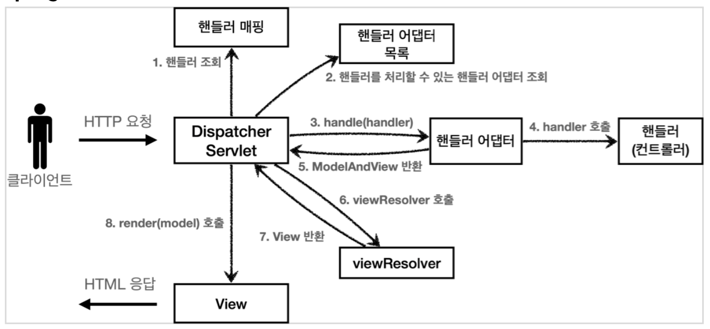

# 1. [DispatcherServlet](https://docs.spring.io/spring-framework/docs/5.2.5.RELEASE/spring-framework-reference/web.html#mvc-servlet)

* Spring MVC는 다른 웹 프레임워크와 마찬가지로 front controller pattern으로 디자인 되었다. 
* 여기서  front controller란 `DispatcherServlet` 를 의미한다.
* `DispatcherServlet`은 모든 Controller 앞에 위치하여 요청에 대한 공통된 로직을 처리를 할 수 있다. 
* `DispatcherServlet`은 설정 가능한 여러 요소들에게 일을 위임시키는 방식으로 동작한다. 
  * 이러한 방식은 유연성을 제공해 다양한 작업 방식을 지원한다.
* DispacherServlet 도 부모 클래스에서 HttpServlet 을 상속 받아서 사용하고, 서블릿으로 동작한다.
* `DispatcherServlet`은 다른 `Servlet` 과 마찬가지로 Servlet specification에 따라 선언되고 매핑되어야 하는데 이때 specification으로 Java configuration 또는 `web.xml` 을 사용할 수 있다.
* 스프링 부트는 `DispacherServlet`을 서블릿으로 자동으로 등록하면서 **모든 경로**( urlPatterns="/" )에 대해서 매핑한다.


## 1.1 FrontController 패턴 특징

* 프론트 컨트롤러 서블릿 하나로 클라이언트의 요청을 받음 프론트 컨트롤러가 요청에 맞는 컨트롤러를 찾아서 호출한다
* 입구를 하나로 만들어 공통 처리가 가능하다
* 프론트 컨트롤러를 제외한 나머지 컨트롤러는 서블릿을 사용하지 않아도 된다
* 스프링 웹 MVC의 **DispatcherServlet**이 FrontController 패턴으로 구현되어 있다


# 2 DispatcherServlet 선언

* Java Configuration 또는 xml로 DispatcherServlet을 선언하고 등록할 수 있다


## 2.1 Java Configuration으로 DispatcherServlet 선언

```java
public class MyWebApplicationInitializer implements WebApplicationInitializer {

 @Override
 public void onStartup(ServletContext servletCxt) {

     // Load Spring web application configuration
     AnnotationConfigWebApplicationContext ac = new AnnotationConfigWebApplicationContext();
     ac.register(AppConfig.class);
     ac.refresh();

     // Create and register the DispatcherServlet
     DispatcherServlet servlet = new DispatcherServlet(ac);
     ServletRegistration.Dynamic registration = servletCxt.addServlet("app", servlet);
     registration.setLoadOnStartup(1);
     registration.addMapping("/app/*");
 }
}
```


## 2.2 xml로 DispatcherServlet 선언

```xml
<web-app>

 <listener>
     <listener-class>org.springframework.web.context.ContextLoaderListener</listener-class>
 </listener>

 <context-param>
     <param-name>contextConfigLocation</param-name>
     <param-value>/WEB-INF/app-context.xml</param-value>
 </context-param>

 <servlet>
     <servlet-name>app</servlet-name>
     <servlet-class>org.springframework.web.servlet.DispatcherServlet</servlet-class>
     <init-param>
         <param-name>contextConfigLocation</param-name>
         <param-value></param-value>
     </init-param>
     <load-on-startup>1</load-on-startup>
 </servlet>

 <servlet-mapping>
     <servlet-name>app</servlet-name>
     <url-pattern>/app/*</url-pattern>
 </servlet-mapping>

</web-app>
```


# 3 DispacherServlet 동작 과정



1. 핸들러 조회
   * 디스페처 서블릿은 내부에 HandlerMapping 목록을 가지고 있다.
   * HandlerMapping을 사용해서 매핑되는 핸들러를 찾는다.
   * HandlerMapping을 순서대로 사용해 매핑되는 핸들러를 찾으면 바로 반환한다.
   * 즉 uri가 매핑되는 핸들러(컨트롤러) 객체를 찾아서 반환한다.
   * DispacherServlet이 가지고 있는 HandlerMapping 목록들
     * RequestMappingHandlerMapping: 애노테이션 기반의 컨트롤러인 @RequestMapping에서 사용
     * BeanNameUrlHandlerMapping: 스프링 빈의 이름으로 핸들러를 찾는다.
2. 핸들러 어댑터 목록 조회
   * DispacherServlet은 핸들러 어댑터 리스트를 가지고 있다
   * 핸들러를 찾았으니 해당 핸들러를 실행시켜줄 핸들러 어댑터를 찾는다.
   * 가지고 있는 어댑터 목록을 하나씩 조회하며 `adapter.supports()` 메서드를 호출한다.
   * `adapter.supports()`가 true를 반환하면 해당 어댑터가 핸들러를 실행할 수 있다는 것이다.
3. 핸들러 어댑터 실행: 
   * 핸들러 어댑터를 찾았으니 핸들러 어댑터를 통해 핸들러를 실행한다.
4. 핸들러 실행: 
   * 핸들러 어댑터가 실제 핸들러를 실행한다.
5. ModelAndView 반환: 
   * 핸들러 어댑터는 핸들러가 반환하는 정보를 ModelAndView로 변환해서 반환한다.
6. viewResolver 호출: 
   * 뷰 리졸버를 찾고 실행한다.
   * JSP의 경우: InternalResourceViewResolver 가 자동 등록되고, 사용된다.
7. View반환:
   * 뷰 리졸버는 뷰의 논리 이름을 물리 이름으로 바꾸고,렌더링 역할을 담당하는 뷰 객체를 반환한다.
   * JSP의 경우 InternalResourceView(JstlView) 를 반환하는데, 내부에 forward() 로직이 있다.
8. 뷰렌더링:
   * 뷰를 통해서 뷰를 렌더링한다.


# 4 핸들러 매핑과 핸들러 어댑터

* 스프링은 이미 필요한 핸들러 매핑과 핸들러 어댑터를 대부분 구현해두었다. 
  * 개발자가 직접 핸들러 매핑과 핸들러 어댑터를 만드는 일은 거의 없다.


## 4.1 핸들러 매핑

* 핸들러 매핑에서 컨트롤러를 찾는다
* 예)스프링 빈의 이름으로 핸들러를 찾을 수 있는 핸들러 매핑이 필요하다


**자동 등록되는 핸들러 매핑**

* 실제로 더 많다

1. RequestMappingHandlerMapping
   * 애노테이션 기반의 컨트롤러인 @RequestMapping에서
2. BeanNameUrlHandlerMapping
   * 스프링 빈의 이름으로 핸들러를 찾는다.


**애노테이션 기반 컨트롤러**

```java
@Controller
public class SpringMemberFormControllerV1 {
  @RequestMapping("/springmvc/v1/members/new-form")
  public ModelAndView process() {
    return new ModelAndView("new-form");
  }
}
```

* @Controller
  * 스프링이 자동으로 스프링 빈으로 등록한다.
  * 스프링 MVC에서 애노테이션 기반 컨트롤러로 인식한다.
* @RequestMapping
  * 요청 정보를 매핑한다.
  * 해당 URL이 호출되면 이 메서드가 호출된다.
  * 애노테이션을 기반으로 동작하기 때문에, 메서드의 이름은 임의로 지으면 된다.


## 4.2 핸들러 어댑터

* 핸들러 매핑을 통해서 찾은 핸들러를 실행할 수 있는 핸들러 어댑터가 필요하다.
* 예) Controller 인터페이스를 실행할 수 있는 핸들러 어댑터를 찾고 실행해야 한다.

**자동 등록되는 핸들러 어댑터**

1. RequestMappingHandlerAdapter
   * 애노테이션 기반의 컨트롤러인 @RequestMapping에서 사용
2. HttpRequestHandlerAdapter
   * HttpRequestHandler 처리
3. SimpleControllerHandlerAdapter
   * Controller 인터페이스(애노테이션X, 과거에 사용)


# 5 뷰 리졸버

* 스프링 부트는 `InternalResourceViewResolver` 라는 뷰 리졸버를 자동으로 등록한다
* application.properties 에 등록한 `spring.mvc.view.prefix`, `spring.mvc.view.suffix`설정 정보를 사용해서 등록한다.

```properties
spring.mvc.view.prefix=/WEB-INF/views/
spring.mvc.view.suffix=.jsp
```

* `@ResponseBody` , `HttpEntity`를 사용하면  뷰 템플릿을 사용하는 것이 아니라, HTTP 메시지 바디에 직접 응답 데이터를 출력할 수 있다. 즉 뷰 리졸버를 실행하지 않는다.


**스프링 부트가 자동 등록하는 뷰 리졸버**

1. BeanNameViewResolver
   * 빈 이름으로 뷰를 찾아서 반환한다. (예: 엑셀 파일 생성 기능에 사용)
2. InternalResourceViewResolver
   * JSP를 처리할 수 있는 뷰를 반환한다.

>  참고
>
>  Thymeleaf 뷰 템플릿을 사용하면 ThymeleafViewResolver 를 등록해야 한다. 최근에는 라이브러리 만추가하면 스프링 부트가 이런 작업도 모두 자동화해준다 아래는 기본 설정을 수정해서 사용할 수 있다.
>
>  ```properties
>  # application.properties
>  spring.thymeleaf.prefix=classpath:/templates/ 
>  spring.thymeleaf.suffix=.html
>  ```


## HTTP 메시지 컨버터

* 뷰 템플릿으로 HTML을 생성해서 응답하는 것이 아니라, HTTP API처럼 JSON 데이터를 HTTP 메시지 바디에서 직접 읽거나 쓰는 경우 HTTP 메시지 컨버터를 사용하면 편리하다.
* `@ResponseBody` , `HttpEntity` 를 사용하면 `viewResolver` 대신에 `HttpMessageConverter`가 동작
* 기본적으로 등록된 HTTP 메시지 컨버터
  * byte 처리 등등 기타 처리: `HttpMessageConverter`
  * 기본 문자처리: `StringHttpMessageConverter`
  * 기본 객체처리: `MappingJackson2HttpMessageConverter`
* 스프링 부트는 다양한 메세지 컨버터를 제공하고 대상 클래스 타입과 미디어 타입 체크해서 컨버터를 선정한다.
  * 응답의 경우 클라이언트의 HTTP Accept 해더와 서버의 컨트롤러 반환 타입 정보 둘을 조합해서 선정한다.
* 호출 순서
  * `RequestMappingHandlerAdaptor` -> `ArgumentResolver` -> `HttpMessageConverter`
  * `RequestMappingHandlerAdaptor` -> `ReturnValueHandle` -> `HttpMessageConverter`


**HTTP** **메시지 컨버터 인터페이스**

* `org.springframework.http.converter.HttpMessageConverter`

* HTTP 메시지 컨버터는 HTTP 요청과 HTTP 응답 모두에서 사용된다.

* `canRead()`

  * HTTP 요청 데이터 읽기
    * 컨트롤러에서 `@RequestBody` , `HttpEntity` 파라미터를 사용할 때를 의미한다.
  * 메시지 컨버터가 메시지를 읽을 수 있는지 확인하기 위해 canRead() 를 호출한다.
  * 대상 클래스 타입을 지원하는가.
    * 예) byte[] , String , Object
  * HTTP 요청의 Content-Type 미디어 타입을 지원하는가.
    * 예) `text/plain` , `application/json` , `*/*`
  * 위 조건을 만족하면 `read()`를 호출해서 개체를 생성해서 반환한다.

*  `canWrite()`

  * HTTP 응답 데이터 생성
    * 컨트롤러에서 @ResponseBody , HttpEntity 로 값이 반환할 때를 의미한다.
  * 메시지 컨버터가 메시지를 쓸 수 있는지 확인하기 위해 `canWrite()` 를 호출한다.
  * 대상 클래스 타입을 지원하는가.
  * `canWrite()` 조건을 만족하면 `write()` 를 호출해서 HTTP 응답 메시지 바디에 데이터를 생성한다.

  

```java
package org.springframework.http.converter;

import org.springframework.http.HttpInputMessage;
import org.springframework.http.HttpOutputMessage;

import java.io.IOException;

public interface HttpMessageConverter<T> {
    boolean canRead(Class<?> clazz, @Nullable MediaType mediaType);

    boolean canWrite(Class<?> clazz, @Nullable MediaType mediaType);

    List<MediaType> getSupportedMediaTypes();

    T read(Class<? extends T> clazz, HttpInputMessage inputMessage)
            throws IOException, HttpMessageNotReadableException;

    void write(T t, @Nullable MediaType contentType, HttpOutputMessage
            outputMessage)
            throws IOException, HttpMessageNotWritableException;
}
```


**주요 컨버터**

* ByteArrayHttpMessageConverter 
  * byte[] 데이터를 처리한다.
  * 클래스 타입: byte[] , 미디어타입: `*/*` 
  * 요청 예) @RequestBody byte[] data
  * 응답 예) @ResponseBody return byte[] 쓰기 미디어타입 application/octet-stream
* StringHttpMessageConverter
  * String 문자로 데이터를 처리한다. 
  * 클래스 타입: String , 미디어타입: `*/*`
  * 요청 예) @RequestBody String data
  * 응답 예) @ResponseBody return "ok" 쓰기 미디어타입 text/plain
* MappingJackson2HttpMessageConverter
  * application/json
  * 클래스 타입: 객체 또는 HashMap , 미디어타입 application/json 관련
  * 요청 예) @RequestBody HelloData data
  * 응답 예) @ResponseBody return helloData 쓰기 미디어타입 application/json 관련


참조

* https://docs.spring.io/spring-framework/docs/5.2.5.RELEASE/spring-framework-reference/web.html#mvc-servlet
* https://www.inflearn.com/course/%EC%8A%A4%ED%94%84%EB%A7%81-mvc-1#