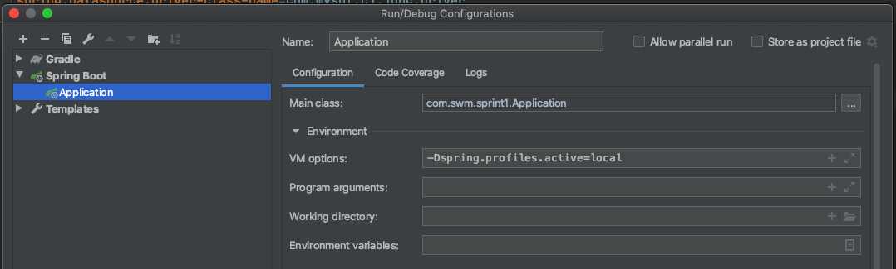

# Profiles

> 스프링 프로파일은 애플리케이션 Configuration을 관심사 별로 구분할 수 있게 하고 특정한 환경에서만 이용가능 하도록 할 수 있습니다.

예시

* 프로파일이 production일 경우에만 활성화되는 Configuration

```java
@Configuration(proxyBeanMethods = false)
@Profile("production")
public class ProductionConfiguration {

    // ...

}
```


## @Profile을 사용하는 곳

* @Component
* @Configuration
* @ConfigurationProperties


## Profile을 활성화 하는 법

* apllication.properties를 수정

```properties
spring.profiles.active=production, hsqldb
```

* 인텔리제이에서 활성화 하는 법

  * VM options = -Dspring.profiles.active=prod
  * 

* 커멘드 라인을 이용하는 법

  * ```bash
    java -jar sprint1-0.0.1-SNAPSHOT.jar --spring.profiles.active=dev
    ```

  


어떤 프로파일을 추가할 것인가? ● spring.profiles.include

프로파일용 프로퍼티

● application-{profile}.properties

