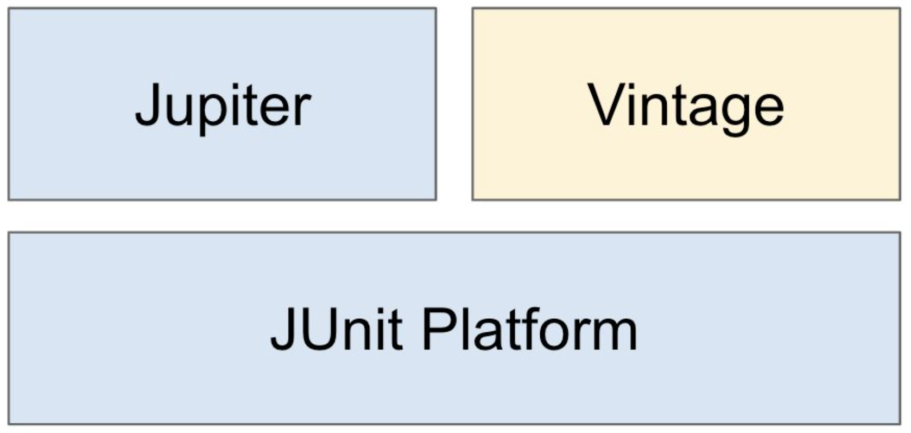

#### JUnit 5: 소개

* 자바 개발자가 가장 많이 사용하는 테스팅 프레임워크.
* 자바8이상을필요로함.
* 대체제: TestNG, Spock, ...



* JUnit Platform: 테스트를 실행해주는 런처 제공. TestEngine API 제공. 
* Jupiter: TestEngine API 구현체로 JUnit 5를 제공.
* Vintage: JUnit 4와 3을 지원하는 TestEngine 구현체.


#### mockMvc response body 한글 깨짐

* 요청 accept header에 charset=UTF-8을 추가

  * ```
    this.mockMvc.perform( post("/someUrl") .accept(MediaType.APPLICATION_JSON_UTF8) .params(params) .cookie(getLoginCookie()) )
    
    출처: https://luvstudy.tistory.com/115 [파란하늘의 지식창고]
    ```

* .getContentAsString() 대신 .getContentAsString(StandardCharsets.UTF_8) 사용하기

  * ```
    String contentAsString = result.getResponse().getContentAsString(StandardCharsets.UTF_8);
    ```

    

#### json path test

* [link](https://goessner.net/articles/JsonPath/)

