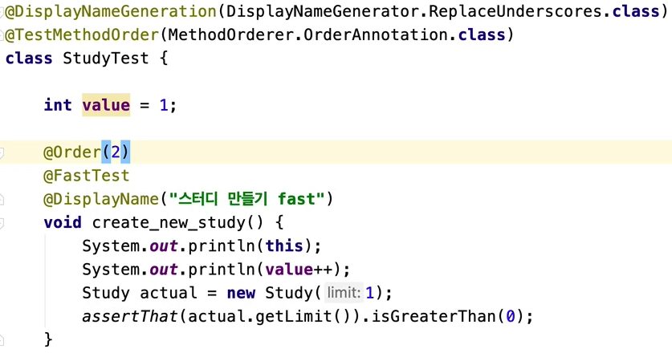

### Junit


#### JUnit5 소개

* 자바 개발자가 가장 많이 사용하는 테스팅 프레임워크.
* 자바8이상을필요로함.
* 대체제: TestNG, Spock, ...


* JUnit Platform: 테스트를 실행해주는 런처 제공. TestEngine API 제공. 
* Jupiter: TestEngine API 구현체로 JUnit 5를 제공.
* Vintage: JUnit 4와 3을 지원하는 TestEngine 구현체.


#### Junit5 시작하기

2.2+ 버전의 스프링 부트 프로젝트를 만든다면 기본으로 JUnit 5 의존성 추가 됨.

```xml
<dependency> 
  <groupId>org.junit.jupiter</groupId> 
  <artifactId>junit-jupiter-engine</artifactId> 
  <version>5.5.2</version> 
  <scope>test</scope>
</dependency>
```


#### 기본 애노테이션

- @Test

- @BeforeAll / @AfterAll

  ```java
  @AfterAll
  static void afterAll(){
  	...
  }
  ```

- @BeforeEach / @AfterEach

  ```java
  @AfterEach
  void afterEach(){
  	...
  }
  ```

- @Disabled

  - 테스트를 하고싶지 않은 메소드 위에 선언

  ```java
  @Disabled
  @Test
  void test(){
  	...
  }	
  ```

* @DisplayNameGeneration

  * Method와 Class 레퍼런스를 사용해서 테스트 이름을 표기하는 방법 설정.
  * 기본 구현체로 ReplaceUnderscores 제공

* @DisplayName

  * 어떤 테스트인지 테스트 이름을 보다 쉽게 표현할 수 있는 방법을 제공하는 애노테이션.
  * @DisplayNameGeneration 보다 우선 순위가 높다.

  ```java
  @DisplayName("메뉴 추가")
  @Test
  void createMenu() throws Exception {
  	...
  }
  ```


#### JUnit5 Assertion

* org.junit.jupiter.api.Assertions.*
* AssertJ, Hemcrest, Truth 등의 라이브러리를 사용할 수도 있다.

* assertEqulas(expected, actual)
  * 실제 값이 기대한 값과 같은지 확인
* assertNotNull(actual)
  * 값이 null이 아닌지 확인
* assertTrue(boolean)
  * 다음 조건이 참(true)인지 확인
* assertAll(executables...)
  * 모든 확인 구문 확인
* assertThrows(expectedType, executable)
  * 예외 발생 확인
* assertTimeout(duration, executable)
  * 특정 시간 안에 실행이 완료되는지 확인


#### JUnit 5 테스트 인스턴스

* JUnit은 테스트 메소드 마다 테스트 인스턴스를 새로 만든다.

  * 테스트 메소드를 독립적으로 실행하여 예상치 못한 부작용을 방지하기 위함이다.

* @TestInstance(Lifecycle.PER_CLASS)

  * 테스트 클래스당 인스턴스를 하나만 만들어 사용한다.

  * 경우에 따라, 테스트 간에 공유하는 모든 상태를 @BeforeEach 또는 @AfterEach에서

    초기화 할 필요가 있다.

  * @BeforeAll과 @AfterAll을 인스턴스 메소드 또는 인터페이스에 정의한 default 메소드로 정의할 수도 있다.

  * 


#### JUnit5 테스트 순서

* 테스트의 순서는 항상 일정하지 않다.
* 순서대로 테스트를 실행하고 싶은 경우
  * @TestMethodOrder를 사용해 테스트 메소드의 순서를 정할 수 있다. 
  * @TestInstance(Lifecycle.PER_CLASS)와 함께 사용하여 유즈 케이스나 시나리오 테스트를 하는데 용이하다.

#### JUnit 5: 확장 모델

* JUnit 4의 확장 모델은 @RunWith(Runner), TestRule, MethodRule.
* JUnit 5의 확장 모델은 단 하나, Extension.


#### JUnit5 -> JUnit4 마이그레이션

* junit-vintage-engine을 의존성으로 추가하면, JUnit 5의 junit-platform으로 JUnit 3과 4로 작성된 테스트를 실행할 수 있다.
* 스프링 부트 버전을 2.2.X대로 올린다. 
* 더 이상 @RunWith을 쓰지 않는다.

| JUnit 4                                    | JUnit 5                                        |
| ------------------------------------------ | ---------------------------------------------- |
| @Category(Class)                           | @Tag(String)                                   |
| @RunWith, @Rule, @ClassRule                | @ExtendWith, @RegisterExtension                |
| @Ignore                                    | @Disabled                                      |
| @Before, @After, @BeforeClass, @AfterClass | @BeforeEach, @AfterEach, @BeforeAll, @AfterAll |

 

### Mockito

* [레퍼런스](https://javadoc.io/doc/org.mockito/mockito-core/latest/org/mockito/Mockito.html)

* 스프링 부트 2.2+ 프로젝트 생성시 spring-boot-starter-test에서 자동으로 Mockito 추가해 줌.

* ```xml
  <dependency> 
    <groupId>org.mockito</groupId> 
    <artifactId>mockito-core</artifactId> 
    <version>3.1.0</version> <scope>test</scope>
  </dependency>
  
  <dependency>
  	<groupId>org.mockito</groupId> 
    <artifactId>mockito-junit-jupiter</artifactId> 
    <version>3.1.0</version>
  	<scope>test</scope>
  </dependency>
  ```


#### Mock 객체 만들기

* Mockito.mock() 메소드로 만드는 방법

  * ```java
    MemberService memberService = Mockito.mock.mock(MemberService.class); StudyRepository studyRepository = mock(StudyRepository.class);
    ```

* @Mock 애노테이션으로 만드는 방법

  * ```java
    @ExtendWith(MockitoExtension.class) class StudyServiceTest {
        @Mock MemberService memberService;
        @Mock StudyRepository studyRepository;
    ```

  * JUnit 5 extension으로 MockitoExtension을 사용해야 한다.

  * ```java
    @ExtendWith(MockitoExtension.class) class StudyServiceTest {
        @Test
        void createStudyService(@Mock MemberService memberService,
    @Mock StudyRepository studyRepository) { StudyService studyService = new StudyService(memberService,
    studyRepository);
            assertNotNull(studyService);
    } }
    ```

  * 메소드 매개변수도 가능하다.


#### mockMvc response body 한글 깨짐

* 요청 accept header에 charset=UTF-8을 추가

  * ```java
    this.mockMvc.perform( post("/someUrl") .accept(MediaType.APPLICATION_JSON_UTF8) .params(params) .cookie(getLoginCookie()) )
    ```
  
* .getContentAsString() 대신 .getContentAsString(StandardCharsets.UTF_8) 사용하기

  * ```java
    String contentAsString = result.getResponse().getContentAsString(StandardCharsets.UTF_8);
    ```

    


#### json path test

* [link](https://goessner.net/articles/JsonPath/)

