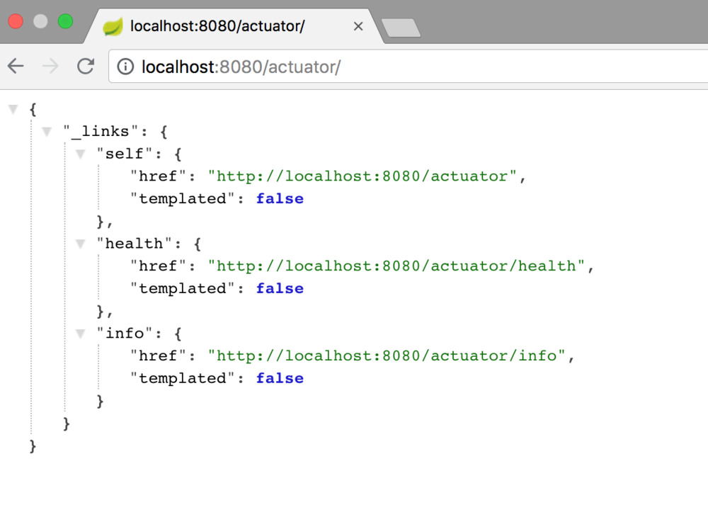
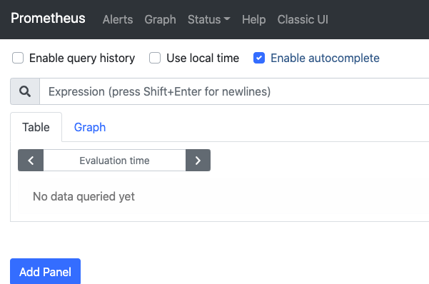
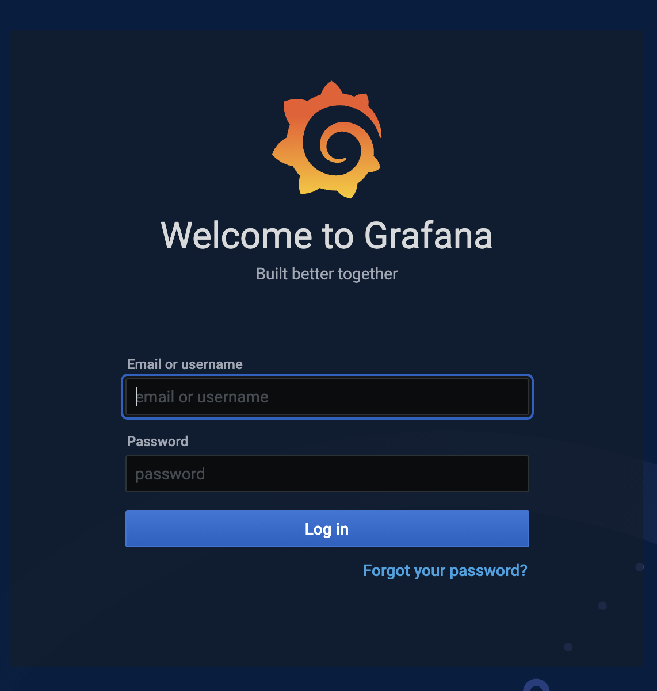
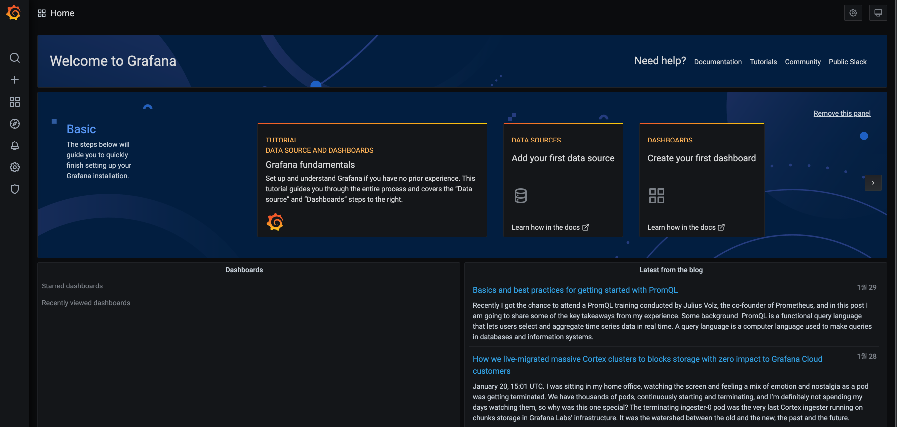
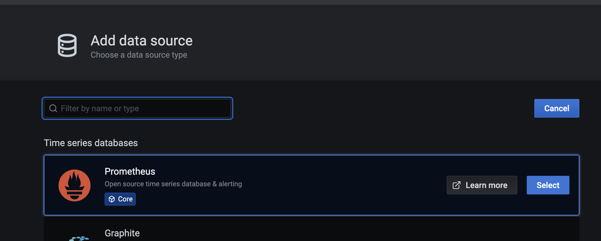
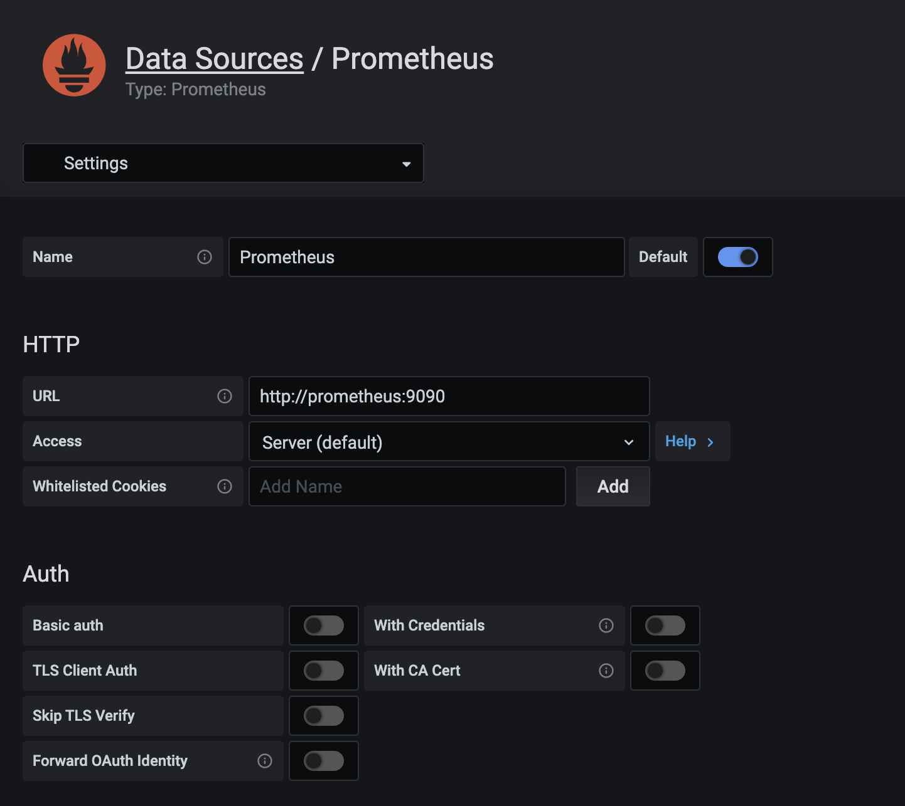
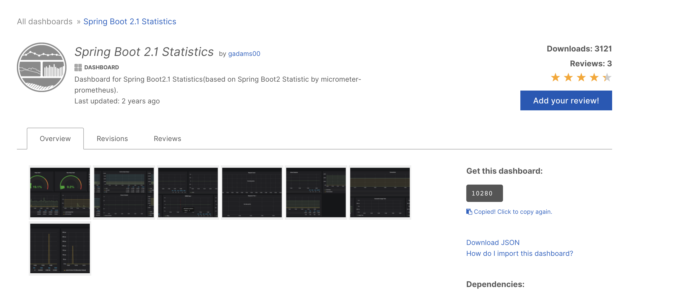
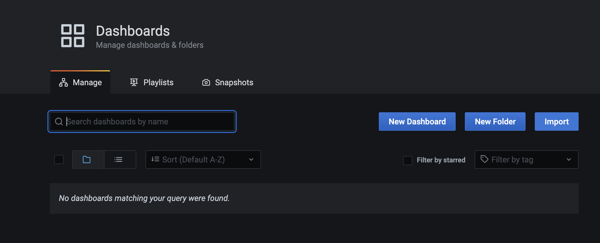
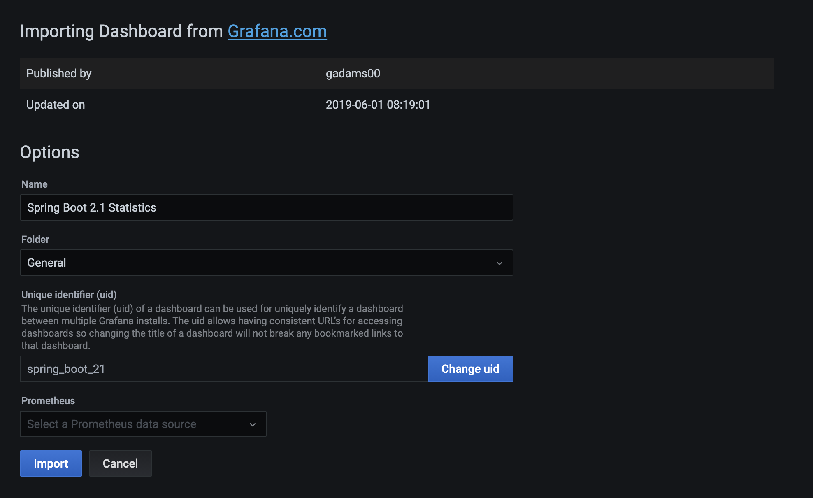
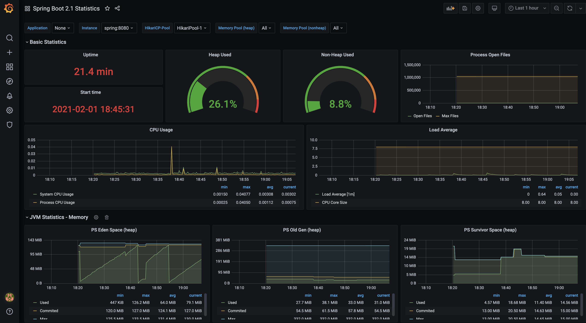

# Spring Boot Actuator

* Actuator 는 외부 모니터링 시스템과 함께 사용할 수 있다.
  * [Prometheus](https://prometheus.io/), [Graphite](https://graphiteapp.org/), [DataDog](https://www.datadoghq.com/), [Influx](https://www.influxdata.com/), [Wavefront](https://www.wavefront.com/), [New Relic](https://newrelic.com/) 등등
* Actuator uses [Micrometer](http://micrometer.io/), an application metrics facade to integrate with these external application monitoring systems. This makes it super easy to plug-in any application monitoring system with very little configuration.


## 의존성 추가하기

```
<dependencies>
	<dependency>
		<groupId>org.springframework.boot</groupId>
		<artifactId>spring-boot-starter-actuator</artifactId>
	</dependency>
</dependencies>
```

```
dependencies {
	compile("org.springframework.boot:spring-boot-starter-actuator")
}
```


## Actuator Endpoints로 어플리케이션 모니터링 하기

* /health
  * 어플리케이션에 대한 기본적인 정보를 제공한다.
  * Status가  `UP` 인 경우 어플리케이션이 건강하다는 뜻이다
  * `DOWN` 인경우  디비와 연결 문제가 있거나 디스크 공간이 부족하거나 등등의 문제가 있다는 것이다.
* /metrics
  * JVM memory 사용률
  * CPU usage
* /loggers
  * 어플리케이션의 로그를 보여준다
  * 로그 설정을 바꿔 런타임에 로그 레벨을 바꿀 수 있다.
* http://localhost:8080/actuator

  


## Endpoints 활성화(비활성화)하기

> 기본적으로 모든 endpoint은 활성화 되어 있다. (shutdown 빼고) properties파일을 통해 endpoint를 활성화하고 비활성화 할 수 있다.
>
> * `management.endpoint.<id>.enabled = true`
>
> ```properties
> management.endpoint.shutdown.enabled=true //false
> ```
>
> 


## Endpoints 공개하기

> HTTP상에서 `health` 와 `info` 만 공개되어 있다.
>
> * Http 상에서 endpoint 공개하기
>
> ```properties
> management.endpoints.web.exposure.include=health,info 
> management.endpoints.web.exposure.exclude=health,info
> ```

___


## endpoints

### /health endpoint

* 세부 정보 표시하기

  * ```properties
    management.endpoint.health.show-details=always
    ```

  * ```json
    // http://localhost:8080/actuator/health
    
    {
      "status": "UP",
      "details": {
        "diskSpace": {
          "status": "UP",
          "details": {
            "total": 1000240963584,
            "free": 890297954304,
            "threshold": 10485760
          }
        },
        "db": {
          "status": "UP",
          "details": {
            "database": "MySQL",
            "hello": 1
          }
        }
      }
    }
    ```

    

#### 커스텀 helth indicator 만들기

> `HealthIndicator` 를 구현하거나 `AbstractHealthIndicator` 를 상속받아 커스텀한 인디케이터를 만들 수 있다.

```java
package com.example.actuatordemo.health;

import org.springframework.boot.actuate.health.AbstractHealthIndicator;
import org.springframework.boot.actuate.health.Health;
import org.springframework.stereotype.Component;

@Component
public class CustomHealthIndicator extends AbstractHealthIndicator {

    @Override
    protected void doHealthCheck(Health.Builder builder) throws Exception {
        // Use the builder to build the health status details that should be reported.
        // If you throw an exception, the status will be DOWN with the exception message.
        
        builder.up()
                .withDetail("app", "Alive and Kicking")
                .withDetail("error", "Nothing! I'm good.");
    }
}
```


### /metrics endpoint

* `http://localhost:8080/actuator/metrics/{MetricName}`

  * 예시 `http://localhost:8080/actuator/metrics/system.cpu.usage`

  * ```json
    {
       "name":"system.cpu.usage",
       "measurements":[
          {
             "statistic":"VALUE",
             "value":0.11774479321066383
          }
       ],
       "availableTags":[
    
       ]
    }
    ```

    

### /loggers endpoint

* `http://localhost:8080/actuator/loggers`

  * 설정된 로거들의 목록을 보여준다

* `http://localhost:8080/actuator/loggers/{name}`

  * 해당 로거의 세부 사항을 보여준다

  * ```json
    // http://localhost:8080/actuator/loggers/root
    
    {
      "configuredLevel": "INFO",
      "effectiveLevel": "INFO"
    }
    ```

* 런타임에 로그 레벨 변경하기

  * Root 로거의 로그 레벨을 변경하려면 http://localhost:8080/actuator/loggers/root 로 아래의 페이로드와 같이 POST요청을 보내면 된다.

    * ```json
      {
         "configuredLevel": "DEBUG"
      }
      ```

  * 다음과 같이 POST로 요청을 보내면 아래와 같이 로그 레벨이 변경된다.

  * ```
    // http://localhost:8080/actuator/loggers/root
    
    {
      "configuredLevel": "DEBUG",
      "effectiveLevel": "DEBUG"
    }
    ```

    

### /info endpoint

> `info` 엔드포인트는 어플리케이션의 정보를 보여준다. 빌드 정보는 `META-INF/build-info.properties` 에서 가져오고 , 깃 정보는 `git.properties` 에서 가져온다 또한 `info` 로 시작하는 모든 property도 보여준다 아래는 예시이다.

```properties
# INFO ENDPOINT CONFIGURATION
info.app.name=@project.name@
info.app.description=@project.description@
info.app.version=@project.version@
info.app.encoding=@project.build.sourceEncoding@
info.app.java.version=@java.version@
```

```json
// http://localhost:8080/actuator/info

{
  "app": {
    "name": "@project.name@",
    "description": "@project.description@",
    "version": "@project.version@",
    "encoding": "@project.build.sourceEncoding@",
    "java": {
      "version": "@java.version@"
    }
  }
}
```

___


### 스프링 스큐리티와 함께 쓰기

> endpoints에는 민감한 정보가 있기에 보호되어야한다. 

```java
import org.springframework.boot.actuate.autoconfigure.security.servlet.EndpointRequest;
import org.springframework.boot.actuate.context.ShutdownEndpoint;
import org.springframework.boot.autoconfigure.security.servlet.PathRequest;
import org.springframework.context.annotation.Configuration;
import org.springframework.security.config.annotation.web.builders.HttpSecurity;
import org.springframework.security.config.annotation.web.configuration.WebSecurityConfigurerAdapter;

@Configuration
public class ActuatorSecurityConfig extends WebSecurityConfigurerAdapter {

    /*
        This spring security configuration does the following

        1. Restrict access to the Shutdown endpoint to the ACTUATOR_ADMIN role.
        2. Allow access to all other actuator endpoints.
        3. Allow access to static resources.
        4. Allow access to the home page (/).
        5. All other requests need to be authenticated.
        5. Enable http basic authentication to make the configuration complete.
           You are free to use any other form of authentication.
     */

    @Override
    protected void configure(HttpSecurity http) throws Exception {
        http
                .authorizeRequests()
                    .requestMatchers(EndpointRequest.to(ShutdownEndpoint.class))
                        .hasRole("ACTUATOR_ADMIN")
                    .requestMatchers(EndpointRequest.toAnyEndpoint())
                        .permitAll()
                    .requestMatchers(PathRequest.toStaticResources().atCommonLocations())
                        .permitAll()
                    .antMatchers("/")
                        .permitAll()
                    .antMatchers("/**")
                        .authenticated()
                .and()
                .httpBasic();
    }
}
```

# Spring Boot Actuator with Prometheus and Grafana


## Prometheus

> 이벤트를 모니터링하고 알림을 주기위해 사용되는 소프트웨어이다.  `exporter`의 엔드포인트로 HTTP GET 요청을 날려 매트릭 정보를 수집(`Pull`)한다.


## Grafana

> Elasticsearch, Prometheus, Graphite, InfluxDB 등에서 데이터를 가져와 시각화하여 보여준다.

* 알림을 설정해서 email, slack 등 다양한 채널로 알림을 받을 수 있다.
* Prometheus 대시보드 또한 그래프를 제공하지만 단순해서 Grafana를 쓰는 편이 좋다.


## 의존성 추가

* actuator 와 Prometheus를 통합하기 위해서 해당 의존성이 필요하다.
* 해당 의존성을 추가하면 스프링 부트가 자동적으로 metrics을 수집하고 Prometheus server가 수집해 갈 수 있도록 metrics을 export할 것이다.
* 모든 애플리케이션의 metrics actuator의 엔드포인트인 `/prometheus` 를 통해 접근이 가능하다.

```
<!-- Micrometer Prometheus registry  -->
<dependency>
	<groupId>io.micrometer</groupId>
	<artifactId>micrometer-registry-prometheus</artifactId>
</dependency>
```


## /prometheus Endpoint

* http://localhost:8080/actuator/prometheus
* Prometheus가 긁어갈 수 있는 metrics가 노출되어 있다.

```
# HELP jvm_buffer_memory_used_bytes An estimate of the memory that the Java virtual machine is using for this buffer pool
# TYPE jvm_buffer_memory_used_bytes gauge
jvm_buffer_memory_used_bytes{id="direct",} 81920.0
jvm_buffer_memory_used_bytes{id="mapped",} 0.0
# HELP jvm_threads_live The current number of live threads including both daemon and non-daemon threads
# TYPE jvm_threads_live gauge
jvm_threads_live 23.0
# HELP tomcat_global_received_bytes_total  
# TYPE tomcat_global_received_bytes_total counter
tomcat_global_received_bytes_total{name="http-nio-8080",} 0.0
# HELP jvm_gc_pause_seconds Time spent in GC pause
# TYPE jvm_gc_pause_seconds summary
jvm_gc_pause_seconds_count{action="end of minor GC",cause="Allocation Failure",} 7.0
jvm_gc_pause_seconds_sum{action="end of minor GC",cause="Allocation Failure",} 0.232
jvm_gc_pause_seconds_count{action="end of minor GC",cause="Metadata GC Threshold",} 1.0
jvm_gc_pause_seconds_sum{action="end of minor GC",cause="Metadata GC Threshold",} 0.01
jvm_gc_pause_seconds_count{action="end of major GC",cause="Metadata GC Threshold",} 1.0
jvm_gc_pause_seconds_sum{action="end of major GC",cause="Metadata GC Threshold",} 0.302
# HELP jvm_gc_pause_seconds_max Time spent in GC pause
# TYPE jvm_gc_pause_seconds_max gauge
jvm_gc_pause_seconds_max{action="end of minor GC",cause="Allocation Failure",} 0.0
jvm_gc_pause_seconds_max{action="end of minor GC",cause="Metadata GC Threshold",} 0.0
jvm_gc_pause_seconds_max{action="end of major GC",cause="Metadata GC Threshold",} 0.0
# HELP jvm_gc_live_data_size_bytes Size of old generation memory pool after a full GC
# TYPE jvm_gc_live_data_size_bytes gauge
jvm_gc_live_data_size_bytes 5.0657472E7

## More data ...... (Omitted for brevity)
```


 ## Prometheus 설치하기 with docker-compose


### prometheus.yml 작성하기

* Prometheus 서버는 prometheus.yml 설정파일 통해 기본적인 설정과  어떤 exporter로부터 매트릭 정보를 수집할 것인지 결정한다.

```yaml
# 전역 설정
global:
  scrape_interval:     15s # Set the scrape interval to every 15 seconds. Default is every 1 minute.
  evaluation_interval: 15s # Evaluate rules every 15 seconds. The default is every 1 minute.
  # scrape_timeout is set to the global default (10s).

# 규칙을 처음 한번 로딩하고 'evaluation_interval'설정에 따라 정기적으로 규칙을 평가한다.
  # - "first_rules.yml"
  # - "second_rules.yml"

# A scrape configuration containing exactly one endpoint to scrape:
# Here it's Prometheus itself.
scrape_configs:
  # The job name is added as a label `job=<job_name>` to any timeseries scraped from this config.
  - job_name: 'prometheus'
    # metrics_path defaults to '/metrics'
    # scheme defaults to 'http'.
    static_configs:
    - targets: ['127.0.0.1:9090']

  - job_name: 'spring-actuator'
    metrics_path: '/actuator/prometheus'
    scrape_interval: 5s
    static_configs:
    #- targets: ['HOST_IP:8080']
    - targets: ['spring:8080']
    
```

> Please make sure to replace the `HOST_IP` with the IP address of the machine where your Spring Boot application is running. Note that, `localhost` won’t work here because we’ll be connecting to the HOST machine from the docker container. You must specify the network IP address.


### Docker-compose 로 prometheus 실행하기

* 볼륨을 이용해 앞서 작성한 설정 파일을 컨테이너의 `/etc/prometheus/prometheus.yml` 로 바인드 마운트 시킨다. 
* docker-compose.yaml

```yaml
version: "3.8"
services:
  spring:
    container_name: spring
    image: "neptunes032/momelet_spring"
    env_file:
      - ./env/spring.env
    ports:
    - 8080:8080
  prometheus:
    container_name: prometheus
    image: prom/prometheus
    volumes:
      - ./prometheus/prometheus.yml:/etc/prometheus/prometheus.yml
      - prometheus_data:/prometheus
    ports:
      - 9090:9090
    restart: always
volumes:
  prometheus_data:
```

```bash
docker-compose up --build -d
```


### 결과 확인

* http://<Prometheus를 띄운 서버의 public ip>:9090로 접속!




## Grafana 설치하고 실행하기 with docker-compose

**도커 컴포즈 수정**

* Grafana 서비스 추가

```yaml
version: "3.8"
services:
  spring:
    container_name: spring
    image: "neptunes032/momelet_spring"
    env_file:
      - ./env/spring.env
    ports:
    - 8080:8080
  prometheus:
    container_name: prometheus
    image: prom/prometheus
    volumes:
      - ./prometheus/prometheus.yml:/etc/prometheus/prometheus.yml
      - prometheus_data:/prometheus
    ports:
      - 9090:9090
  grafana:
    container_name: grafana
    image: grafana/grafana
    volumes:
      - grafana_data:/var/lib/grafana
    ports:
      - 3030:3000
    depends_on:
      - prometheus
volumes:
  prometheus_data:
  grafana_data:
```


**docker-compose 실행**

```bash
docker-compose up --build -d
Creating spring     ... done
Creating prometheus ... done
Creating grafana    ... done

docker ps
CONTAINER ID   IMAGE                        COMMAND                  CREATED              STATUS              PORTS                    NAMES
a5daa23dd1d6   grafana/grafana              "/run.sh"                About a minute ago   Up About a minute   0.0.0.0:3030->3000/tcp   grafana
647950701f59   prom/prometheus              "/bin/prometheus --c…"   About a minute ago   Up About a minute   0.0.0.0:9090->9090/tcp   prometheus
224f66b47ffb   neptunes032/momelet_spring   "java -cp app:app/li…"   About a minute ago   Up About a minute   0.0.0.0:8080->8080/tcp   spring

```


**동작 확인하기**

* `http://localhost:3030` 으로 접속하자!
* 기본 유저네임 : admin, 
* 기본 비밀번호: admin







## Grafana 설정하기

* Prometheus로 부터 metrics을 가져와 시각화 하기위해 설정을 해보자

**데이터 소스에 Prometheus 추가하기**



* docker-compose 컨테이너를 띄우기 때문에 프로메테우스와 그라파나는 같은 네트워크 따라서 컨테이너 이름을 사용해 통신한다.



**그라파나 대시보드 설정하기**

* https://grafana.com/grafana/dashboards 에서 유저가 만들어 놓은 대시보드를 가져올 수 있다.
* 원하는 대시보드의 ID를 복사한다.

 

* 대시보드 manage에서 import 클릭



* 앞서 복사한 아이디 붙여넣고 load



* 대시보드

