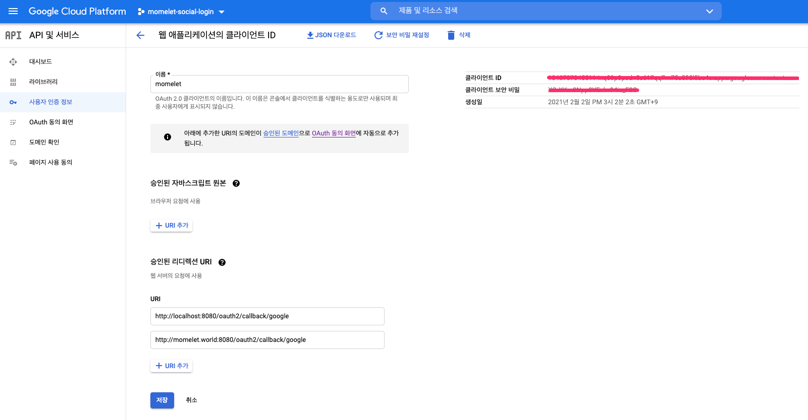

## 스프링 시큐리티를 이용한 소셜 로그인 구현하기 

* 스프링 시큐리티의 OAuth2 기능을 이용해 구글 로그인을 구현해보자


### 의존성 추가

```xml
<!-- OAuth2 Client -->
<dependency>
    <groupId>org.springframework.security</groupId>
    <artifactId>spring-security-oauth2-client</artifactId>
</dependency>

<!-- JWT library -->
<dependency>
  <groupId>io.jsonwebtoken</groupId>
  <artifactId>jjwt</artifactId>
  <version>0.5.1</version>
</dependency>
```


### 애플리케이션 등록하기

* 소셜 로그인을 하기 위해선 구글과 같은 `Resource Server` 에 앱을 등록해야 한다.

  * 구글:  [Google Developer Console](https://console.developers.google.com/)
  * [네이버](https://developers.naver.com/products/login/api/)
  * 
* 앱을 등록하면 `Client ID` ,  `Client Secret` 등을 얻을 수 있다.

네이버 콘솔에서 `Client ID` ,  `Client Secret`


* 앱을 등록할 때 `Authorized redirect URIs` 와 `Scope`  등을 설정한다.

  * `Authorized redirect URIs` : 엔드 유저가 애플리케이션에게 권한을 주었을 때 엔드 유저가 리디렉션 되는 주소

  * 예시: `http://localhost:8080/oauth2/callback/google`.


구글 콘솔에서 `Authorized redirect URIs` 설정



네이버 콘솔에서 `Authorized redirect URIs` 설정


### 스프링부트 환경 설정

* src/main/resource/application.yaml 에 다음과 같이 추가
* `app.auth` 로 시작하는 설정은 JWT token을 만들 때 사용된다.
* `redirectUri` 은 앱 등록시 설정했던 `Authorized redirect URIs` 와 일치해야 된다.

```yaml
security:
      oauth2:
        client:
          registration:
            google:
              clientId: 등록한앱의 클라이언트 아이디
              clientSecret: 클라이언트 보안 비밀
              redirectUri: "{baseUrl}/oauth2/callback/{registrationId}"
              scope:
                - email
                - profile
app:
  auth:
    tokenSecret: 926D96C90030DD58429D2751AC1BDBBC
    tokenExpirationMsec: 864000000
  oauth2:
    # After successfully authenticating with the OAuth2 Provider,
    # we'll be generating an auth token for the user and sending the token to the
    # redirectUri mentioned by the frontend client in the /oauth2/authorize request.
    # We're not using cookies because they won't work well in mobile clients.
    authorizedRedirectUris:
      - http://localhost:3000/oauth2/redirect
      - myandroidapp://oauth2/redirect
      - myiosapp://oauth2/redirect
```


### 앱 프로퍼티 바인딩하기

* `@ConfigurationProperties` 을 사용해 `app` 으로 시작하는 프로퍼티를 POJO class로 바인딩 하자

```java
@ConfigurationProperties(prefix = "app")
public class AppProperties {
    private final Auth auth = new Auth();
    private final OAuth2 oauth2 = new OAuth2();

    public static class Auth {
        private String tokenSecret;
        private long tokenExpirationMsec;

        public String getTokenSecret() {
            return tokenSecret;
        }

        public void setTokenSecret(String tokenSecret) {
            this.tokenSecret = tokenSecret;
        }

        public long getTokenExpirationMsec() {
            return tokenExpirationMsec;
        }

        public void setTokenExpirationMsec(long tokenExpirationMsec) {
            this.tokenExpirationMsec = tokenExpirationMsec;
        }
    }

    public static final class OAuth2 {
        private List<String> authorizedRedirectUris = new ArrayList<>();

        public List<String> getAuthorizedRedirectUris() {
            return authorizedRedirectUris;
        }

        public OAuth2 authorizedRedirectUris(List<String> authorizedRedirectUris) {
            this.authorizedRedirectUris = authorizedRedirectUris;
            return this;
        }
    }

    public Auth getAuth() {
        return auth;
    }

    public OAuth2 getOauth2() {
        return oauth2;
    }
}
```


## CORS 활성화 하기

* frontend client가 우리의 어플리케이션에 접근 할 수 있도록 CORS을 활성화 한다.
* 아래의 설정은 모든 오리진을 활성화하므로 상용 레벨에선 수정해서 쓰자

```java
@Configuration
public class WebMvcConfig implements WebMvcConfigurer {

    private final long MAX_AGE_SECS = 3600;

    @Override
    public void addCorsMappings(CorsRegistry registry) {
        registry.addMapping("/**")
        .allowedOrigins("*")
        .allowedMethods("GET", "POST", "PUT", "PATCH", "DELETE", "OPTIONS")
        .allowedHeaders("*")
        .allowCredentials(true)
        .maxAge(MAX_AGE_SECS);
    }
}
```


## Security 설정

```java
import com.example.springsocial.security.*;
import com.example.springsocial.security.oauth2.CustomOAuth2UserService;
import com.example.springsocial.security.oauth2.HttpCookieOAuth2AuthorizationRequestRepository;
import com.example.springsocial.security.oauth2.OAuth2AuthenticationFailureHandler;
import com.example.springsocial.security.oauth2.OAuth2AuthenticationSuccessHandler;
import org.springframework.beans.factory.annotation.Autowired;
import org.springframework.context.annotation.Bean;
import org.springframework.context.annotation.Configuration;
import org.springframework.security.authentication.AuthenticationManager;
import org.springframework.security.config.BeanIds;
import org.springframework.security.config.annotation.authentication.builders.AuthenticationManagerBuilder;
import org.springframework.security.config.annotation.method.configuration.EnableGlobalMethodSecurity;
import org.springframework.security.config.annotation.web.builders.HttpSecurity;
import org.springframework.security.config.annotation.web.configuration.EnableWebSecurity;
import org.springframework.security.config.annotation.web.configuration.WebSecurityConfigurerAdapter;
import org.springframework.security.config.http.SessionCreationPolicy;
import org.springframework.security.crypto.bcrypt.BCryptPasswordEncoder;
import org.springframework.security.crypto.password.PasswordEncoder;
import org.springframework.security.oauth2.client.web.AuthorizationRequestRepository;
import org.springframework.security.oauth2.core.endpoint.OAuth2AuthorizationRequest;
import org.springframework.security.web.authentication.UsernamePasswordAuthenticationFilter;

@Configuration
@EnableWebSecurity
@EnableGlobalMethodSecurity(
        securedEnabled = true,
        jsr250Enabled = true,
        prePostEnabled = true
)
public class SecurityConfig extends WebSecurityConfigurerAdapter {

    @Autowired
    private CustomUserDetailsService customUserDetailsService;

    @Autowired
    private CustomOAuth2UserService customOAuth2UserService;

    @Autowired
    private OAuth2AuthenticationSuccessHandler oAuth2AuthenticationSuccessHandler;

    @Autowired
    private OAuth2AuthenticationFailureHandler oAuth2AuthenticationFailureHandler;
    
    @Autowired
    private HttpCookieOAuth2AuthorizationRequestRepository httpCookieOAuth2AuthorizationRequestRepository;

    @Bean
    public TokenAuthenticationFilter tokenAuthenticationFilter() {
        return new TokenAuthenticationFilter();
    }

    /*
      By default, Spring OAuth2 uses HttpSessionOAuth2AuthorizationRequestRepository to save
      the authorization request. But, since our service is stateless, we can't save it in
      the session. We'll save the request in a Base64 encoded cookie instead.
    */
    @Bean
    public HttpCookieOAuth2AuthorizationRequestRepository cookieAuthorizationRequestRepository() {
        return new HttpCookieOAuth2AuthorizationRequestRepository();
    }
    
    @Override
    public void configure(AuthenticationManagerBuilder authenticationManagerBuilder) throws Exception {
        authenticationManagerBuilder
                .userDetailsService(customUserDetailsService)
                .passwordEncoder(passwordEncoder());
    }

    @Bean
    public PasswordEncoder passwordEncoder() {
        return new BCryptPasswordEncoder();
    }


    @Bean(BeanIds.AUTHENTICATION_MANAGER)
    @Override
    public AuthenticationManager authenticationManagerBean() throws Exception {
        return super.authenticationManagerBean();
    }

    @Override
    protected void configure(HttpSecurity http) throws Exception {
        http
                .cors()
                    .and()
                .sessionManagement()
                    .sessionCreationPolicy(SessionCreationPolicy.STATELESS)
                    .and()
                .csrf()
                    .disable()
                .formLogin()
                    .disable()
                .httpBasic()
                    .disable()
                .exceptionHandling()
                    .authenticationEntryPoint(new RestAuthenticationEntryPoint())
                    .and()
                .authorizeRequests()
                    .antMatchers("/",
                        "/error",
                        "/favicon.ico",
                        "/**/*.png",
                        "/**/*.gif",
                        "/**/*.svg",
                        "/**/*.jpg",
                        "/**/*.html",
                        "/**/*.css",
                        "/**/*.js")
                        .permitAll()
                    .antMatchers("/auth/**", "/oauth2/**")
                        .permitAll()
                    .anyRequest()
                        .authenticated()
                    .and()
                .oauth2Login()
                    .authorizationEndpoint()
                        .baseUri("/oauth2/authorize")
                        .authorizationRequestRepository(cookieAuthorizationRequestRepository())
                        .and()
                    .redirectionEndpoint()
                        .baseUri("/oauth2/callback/*")
                        .and()
                    .userInfoEndpoint()
                        .userService(customOAuth2UserService)
                        .and()
                    .successHandler(oAuth2AuthenticationSuccessHandler)
                    .failureHandler(oAuth2AuthenticationFailureHandler);

        // Add our custom Token based authentication filter
        http.addFilterBefore(tokenAuthenticationFilter(), UsernamePasswordAuthenticationFilter.class);
    }
}
```


## OAuth2 Login 흐름

* Front end client 가 유저를 특정 스프링 서버의 엔드포인트로 보내면서 시작된다.
  * 엔드포인트 예시 
    * `http://localhost:8080/oauth2/authorize/{provider}?redirect_uri=<redirect_uri_after_login>`.
    * `provider` 는 `google`, `facebook` 등이 될 수 있다.
    * 여기서의 redirect_uri는 인증이 끝나고 리다이렉트 될 주소이며 앞서 언급한 OAuth2의 `Authorized redirect URIs` 와는 다른 것이다.
* 요청을 받은 Spring Security’s OAuth2 client는 유저를`Authorization Server`의 `Authorization Endpoint` 로 리다이렉트 시킨다.
  * `authorizationRequestRepository` 를 이용해 `state` 를 저장한다.
  * `provider` 의 페이지에서 유저는 앱의 접근 권한을 허가하거나 거부한다.
* 유저가 허가하면 `Authorization Server`  는 유저를 앱을 등록할 때 설정한 `Authorized redirect URIs` 로 리다이렉트 시킨다.
  * `authorization code` 를 포함하고 있다.
* 유저가 거절하면 `error` 를 가지고 `Authorized redirect URIs` 로 리다이렉트 된다.
  * OAuth2 callback이 실패하면 스프링 스큐리티는 `oAuth2AuthenticationFailureHandler` 을 호출한다.
* OAuth2 callback이 성공하면 스프링 스큐리티는 `authorization code` 를 `Access Token` 으로 교환하고 `customOAuth2UserService` 를 호출한다.
* `customOAuth2UserService` 은 `Access Token` 을 이용해 유저의 정보를 가져오고 회원가입을 하거나 로그인을 한다.
* 마지막으로 `oAuth2AuthenticationSuccessHandler` 가 호출되고 jwt 인증 토큰을 만들고 유저를 ( `redirect_uri_after_login` +  jwt 인증 토큰)로 리다이렉트 시킨다.


## 커스텀 클래스

### HttpCookieOAuth2AuthorizationRequestRepository

* OAuth2 프로토콜은 CSRF 공격을 방지하기 위해 `state` 를 사용하는 것을 권장한다.

* `state` 는 `client` 가 `Authorization Endpoint` 요청할 때 쿼리스트링에 포함된다.

* 요청예시

  * Request URL

    * ```
      https://accounts.google.com/o/oauth2/v2/auth?response_type=code&client_id=CLIENT_ID&scope=profile%20email&state=xyz1234&redirect_uri=http://client.com/oauth2/callback/google
      ```

  * Query String Parameters

    * type: code
    * client_id: CLIENT_ID
    * scope: profile email
    * state: xyz1234
    * http://client.com/oauth2/callback/google

* 그리고 `Authorization Server` 가 유저를 `Redirection Endpoint` 리다이렉션 할 때 쿼리스트링으로 `state` 를 보낸다.

* 예시

  * Request URL

    * ```
      http://client.com/oauth2/callback/google?state=xyz1234&code=4%2F0AY0e-g7j0uypvLUkRYMx1Z7GoanH1auNNk2AwKOLj0QOxUXdxkdnhYB5g0DCQvyeBpu2iw
      ```

  * Query String Parameters

    * state: xyz1234
    * code

* 여기서 `client` 는 자신이 보낸  `state` 의 값과 받은  `state` 의 값을 비교하여 다르다면 authorization 요청을 무시한다.

* 이를 위해 `client` 는 `state` 를 잠시 저장하고 비교해야한다.

* 아래의 클래스는 authorization 요청을 쿠키에 저장하고 다시 꺼낼 수 있는 기능을 한다.

```java
package com.example.springsocial.security.oauth2;

import com.example.springsocial.util.CookieUtils;
import com.nimbusds.oauth2.sdk.util.StringUtils;
import org.springframework.security.oauth2.client.web.AuthorizationRequestRepository;
import org.springframework.security.oauth2.core.endpoint.OAuth2AuthorizationRequest;
import org.springframework.stereotype.Component;

import javax.servlet.http.HttpServletRequest;
import javax.servlet.http.HttpServletResponse;

@Component
public class HttpCookieOAuth2AuthorizationRequestRepository implements AuthorizationRequestRepository<OAuth2AuthorizationRequest> {
    public static final String OAUTH2_AUTHORIZATION_REQUEST_COOKIE_NAME = "oauth2_auth_request";
    public static final String REDIRECT_URI_PARAM_COOKIE_NAME = "redirect_uri";
    private static final int cookieExpireSeconds = 180;

    @Override
    public OAuth2AuthorizationRequest loadAuthorizationRequest(HttpServletRequest request) {
        return CookieUtils.getCookie(request, OAUTH2_AUTHORIZATION_REQUEST_COOKIE_NAME)
                .map(cookie -> CookieUtils.deserialize(cookie, OAuth2AuthorizationRequest.class))
                .orElse(null);
    }

    @Override
    public void saveAuthorizationRequest(OAuth2AuthorizationRequest authorizationRequest, HttpServletRequest request, HttpServletResponse response) {
        if (authorizationRequest == null) {
            CookieUtils.deleteCookie(request, response, OAUTH2_AUTHORIZATION_REQUEST_COOKIE_NAME);
            CookieUtils.deleteCookie(request, response, REDIRECT_URI_PARAM_COOKIE_NAME);
            return;
        }

        CookieUtils.addCookie(response, OAUTH2_AUTHORIZATION_REQUEST_COOKIE_NAME, CookieUtils.serialize(authorizationRequest), cookieExpireSeconds);
        String redirectUriAfterLogin = request.getParameter(REDIRECT_URI_PARAM_COOKIE_NAME);
        if (StringUtils.isNotBlank(redirectUriAfterLogin)) {
            CookieUtils.addCookie(response, REDIRECT_URI_PARAM_COOKIE_NAME, redirectUriAfterLogin, cookieExpireSeconds);
        }
    }

    @Override
    public OAuth2AuthorizationRequest removeAuthorizationRequest(HttpServletRequest request) {
        return this.loadAuthorizationRequest(request);
    }

    public void removeAuthorizationRequestCookies(HttpServletRequest request, HttpServletResponse response) {
        CookieUtils.deleteCookie(request, response, OAUTH2_AUTHORIZATION_REQUEST_COOKIE_NAME);
        CookieUtils.deleteCookie(request, response, REDIRECT_URI_PARAM_COOKIE_NAME);
    }
}
```


### CustomOAuth2UserService

* `CustomOAuth2UserService` 는 스프링 시큐리티의 `DefaultOAuth2UserService` 를 상속 받는다.
* `loadUser()` 메서드를 구현한다.
  *  `Authorization Server`로 부터 `Access Token` 을 얻게 되면 호출되는 메서드이다.
  * 유저의 정보를 `Resource Server` 로 부터 가져온다
  * 유저를 회원가입/로그인 시킨다.

```java
package com.swm.sprint1.security.oauth2;


import com.swm.sprint1.config.AppProperties;
import com.swm.sprint1.domain.AuthProvider;
import com.swm.sprint1.domain.Category;
import com.swm.sprint1.domain.User;
import com.swm.sprint1.repository.category.CategoryRepository;
import com.swm.sprint1.repository.user.UserRepository;
import com.swm.sprint1.security.UserPrincipal;
import com.swm.sprint1.security.oauth2.user.OAuth2UserInfo;
import com.swm.sprint1.security.oauth2.user.OAuth2UserInfoFactory;
import lombok.RequiredArgsConstructor;
import org.springframework.security.authentication.InternalAuthenticationServiceException;
import org.springframework.security.core.AuthenticationException;
import org.springframework.security.oauth2.client.userinfo.DefaultOAuth2UserService;
import org.springframework.security.oauth2.client.userinfo.OAuth2UserRequest;
import org.springframework.security.oauth2.core.OAuth2AuthenticationException;
import org.springframework.security.oauth2.core.user.OAuth2User;
import org.springframework.stereotype.Service;

import java.util.List;
import java.util.Optional;

@RequiredArgsConstructor
@Service
public class CustomOAuth2UserService extends DefaultOAuth2UserService {

    private final UserRepository userRepository;
    private final CategoryRepository categoryRepository;
    private final AppProperties appProperties;

    @Override
    public OAuth2User loadUser(OAuth2UserRequest oAuth2UserRequest) throws OAuth2AuthenticationException {
        OAuth2User oAuth2User = super.loadUser(oAuth2UserRequest);

        try {
            return processOAuth2User(oAuth2UserRequest, oAuth2User);
        } catch (AuthenticationException ex) {
            throw ex;
        } catch (Exception ex) {
            // Throwing an instance of AuthenticationException will trigger the OAuth2AuthenticationFailureHandler
            throw new InternalAuthenticationServiceException(ex.getMessage(), ex.getCause());
        }
    }

    private OAuth2User processOAuth2User(OAuth2UserRequest oAuth2UserRequest, OAuth2User oAuth2User) {
        OAuth2UserInfo oAuth2UserInfo = OAuth2UserInfoFactory.getOAuth2UserInfo(oAuth2UserRequest.getClientRegistration().getRegistrationId(), oAuth2User.getAttributes());
        Optional<User> userOptional = userRepository.findByProviderAndProviderId(
                AuthProvider.valueOf(oAuth2UserRequest.getClientRegistration().getRegistrationId()),oAuth2UserInfo.getId());
        User user;
        if(userOptional.isPresent()) {
            user = userOptional.get();
        } else {
            user = registerNewUser(oAuth2UserRequest, oAuth2UserInfo);
        }
        return UserPrincipal.create(user, oAuth2User.getAttributes());
    }

    private User registerNewUser(OAuth2UserRequest oAuth2UserRequest, OAuth2UserInfo oAuth2UserInfo) {
        AuthProvider provider =AuthProvider.valueOf(oAuth2UserRequest.getClientRegistration().getRegistrationId());
        String providerId = oAuth2UserInfo.getId();
        String name = oAuth2UserInfo.getName();
        String email = oAuth2UserInfo.getEmail();
        String imageUrl = oAuth2UserInfo.getImageUrl();
        if(imageUrl == null)
            imageUrl = appProperties.getS3().getDefaultImageUri() + appProperties.getS3().getDefaultNumber() +appProperties.getS3().getDefaultExtension();
        List<Category> categories = categoryRepository.findAll();
        User user = new User(name, email, imageUrl, provider, providerId, categories);
        return userRepository.save(user);
    }

}
```


### OAuth2AuthenticationSuccessHandler

* 성공적으로 인증하면 스프링 시큐리티는 `OAuth2AuthenticationSuccessHandler` 의 `onAuthenticationSuccess()` 메서드를 호출한다.
* `onAuthenticationSuccess()`
  * JWT token과 재발급을 위한 리프레시 토큰을 생성한다.
  * 유저가 명시한 `redirect_uri` 로 유저를 리다이렉트 시키며 쿼리 스트링으로  `JWT token` 을 더한다.

```java
RequiredArgsConstructor
@Component
public class OAuth2AuthenticationSuccessHandler extends SimpleUrlAuthenticationSuccessHandler {

    private final AuthService authService;
    private final HttpCookieOAuth2AuthorizationRequestRepository httpCookieOAuth2AuthorizationRequestRepository;

    private final Logger logger = LoggerFactory.getLogger(OAuth2AuthenticationSuccessHandler.class);

    @Override
    public void onAuthenticationSuccess(HttpServletRequest request, HttpServletResponse response, Authentication authentication) throws IOException, ServletException {
        logger.debug("OAuth2AuthenticationSuccessHandler 호출 됨");
        String targetUrl = determineTargetUrl(request, response, authentication);

        if (response.isCommitted()) {
            logger.debug("Response has already been committed. Unable to redirect to " + targetUrl);
            return;
        }

        clearAuthenticationAttributes(request, response);
        getRedirectStrategy().sendRedirect(request, response, targetUrl);
    }

    protected String determineTargetUrl(HttpServletRequest request, HttpServletResponse response, Authentication authentication) {
        SimpleDateFormat formatter = new SimpleDateFormat ( "yyyy/MM/dd HH:mm:ss", Locale.KOREA );

        Optional<String> redirectUri = CookieUtils.getCookie(request, REDIRECT_URI_PARAM_COOKIE_NAME)
                .map(Cookie::getValue);

        if(!redirectUri.isPresent()) {
            throw new BadRequestException("Sorry! We've got an Unauthorized Redirect URI and can't proceed with the authentication");
        }

        String targetUrl = redirectUri.orElse(getDefaultTargetUrl());

        UserPrincipal userPrincipal = (UserPrincipal) authentication.getPrincipal();
        AuthResponse accessAndRefreshToken = authService.createAccessAndRefreshToken(userPrincipal.getId());
        Token accessToken = accessAndRefreshToken.getAccessToken();
        Token refreshToken = accessAndRefreshToken.getRefreshToken();

        return UriComponentsBuilder.fromUriString(targetUrl)
                .queryParam("accessToken",accessToken.getJwtToken())
                .queryParam("accessTokenExpiryDate", formatter.format(accessToken.getExpiryDate()))
                .queryParam("refreshToken", refreshToken.getJwtToken())
                .queryParam("refreshTokenExpiryDate", formatter.format(refreshToken.getExpiryDate()))
                .build().toUriString();
    }

    protected void clearAuthenticationAttributes(HttpServletRequest request, HttpServletResponse response) {
        super.clearAuthenticationAttributes(request);
        httpCookieOAuth2AuthorizationRequestRepository.removeAuthorizationRequestCookies(request, response);
    }

}
```


