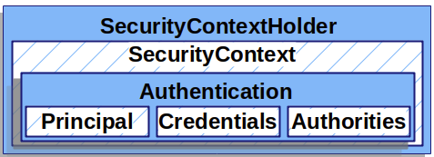
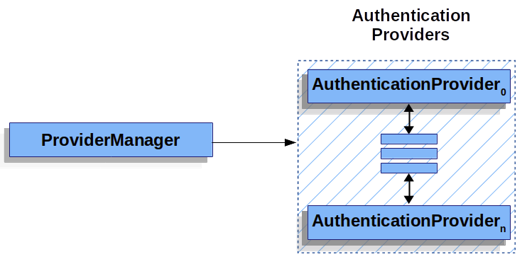

## Servlet Security: The Big Picture

### Filters

> 클라이언트가 요청을 하면, 컨테이너는 `FilterChain` 을 만든다. `FilterChain` 은 `Filter` 와 `Servlet` 을 포함하고 있다. Spring MVC application에서  `Servlet` 은 `DispatcherServlet` 의 인스턴스이다.

* 특정 `Filter` 에서  `Filter` 또는 `Servlet` 이 호출되는 것을 방지할 수 있다.
  * 이 경우 특정 `Filter` 에서 HttpServletResponse 보낸다
* HttpServletRequest 또는 HttpServletResponse 을 수정해서 다음  `Filter` 또는 `Servlet`으로 전달할 수 있다.
* 따라서 `Filter` 는 이후  `Filter` 또는 `Servlet` 에 영향을 미치며 순서가 중요하다.


### DelegatingFilterProxy

### FilterChainProxy

### SecurityFilterChain

> 클라이언트에서 요청이 들어오면 `FilterChainProxy` 은 `SecurityFilterChain` 을 사용해서 어떤 필터를 호출해야 할지 결정한다. 


___


## Authentication


### SecurityContextHolder

> Spring Security’s authentication의 핵심이라 할 수 있으며 `SecurityContext` 을 가지고 있다.




### SecurityContext

> `SecurityContext` 는 `SecurityContextHolder` 로 부터 얻을 수 있으며 `Authentication` 객체를 가지고 있다.


### Authentication

> `Authentication` 은 주로 두가지 용도로 쓰인다.
>
> 1. 현재 인증된 유저를 나타낸다. 현재 `Authentication` 은 `SecurityContext` 에서 얻을 수 있다. 
> 2. `AuthenticationManager` 의 인풋으로 사용된다. 
>
> `Authentication` 은 다음을 포함한다.
>
> * principal
>   * 유저의 신원을 나타낸다.
>   * username/password를 가지고 인증을 하는 경우 UserDetails의 인스턴스이다.
> * credentials
>   * 주로 비밀번호
>   * 인증후 유출 방지를 위해 많은 경우 비어있다
> * authorities


### AuthenticationManager

> `AuthenticationManager` 는 스프링 시큐리티 필터가 어떻게 인증을 하는지 정의한 API이다. 반환된 `Authentication` 은`AuthenticationManager` 를 호출한  controller(Security Filters)에서 `SecurityContextHolder` 에 저장된다.  `AuthenticationManager` 의 구현체는 많지만 가장 많이 사용되는 구현체는 `ProviderManager` 이다.


### ProviderManager

> `ProviderManager` 는 `AuthenticationManager` 의 가장 흔히 사용되는 구현체이다. `ProviderManager` 여러 `AuthenticationProvider` 에게 작업을 위임한다. 여러개의 `AuthenticationProvider` 중 가장 적합한 `AuthenticationProvider` 가 인증을 처리하고 적합한 `AuthenticationProvider` 가 없을 경우 `ProviderNotFoundException` 과 함께 인증은 실패한다. 




### AuthenticationProvider

> 여러개의 `AuthenticationProvider` 가 `ProviderManager` 에 주입될 수 있다. 각각의  `AuthenticationProvider` 는 구체적인 형태의 인증을 수행한다. 예를 들면 `DaoAuthenticationProvider` 는 유저네임과 패스워드를 기반으로하는 인증을 수행하고 `JwtAuthenticationProvider` 는 JWT token 인증을 수행한다. 


### Username/Password Authentication

#### UserDetails

> `UserDetails` 은 `UserDetailsService` 의 반환 값이다.  `DaoAuthenticationProvider` 는 `UserDetails` 을 인증하고 `Authentication` 을 반환한다. 

#### UserDetailsService

> `DaoAuthenticationProvider` 는 username, password를 가지고 인증을 하기위해 `UserDetailsService` 를 사용해서 username, password 등을 조회한다. 

#### DaoAuthenticationProvider

> `AuthenticationProvider` 구현체이다. `UserDetailsService` 와 `PasswordEncoder` 를 이용하여  username 과 password를 인증한다.


1. `UsernamePasswordAuthenticationToken` 을 `AuthenticationManager` 에게 건내준다.
2. ``AuthenticationManager` 의 구현체인 ProviderManager` 는 `DaoAuthenticationProvider` 타입의 `AuthenticationProvider` 를 사용하도록 설정되어 있다.
3. `DaoAuthenticationProvider` 는 `UserDetailsService` 를 사용해 `UserDetails` 을 찾는다.
4. `DaoAuthenticationProvider` 는 `PasswordEncoder` 를 사용해 `UserDetails` 의 password를 검증한다.
5. 검증이 성공적으로 완료되면 `UsernamePasswordAuthenticationToken` 타입의 `Authentication` 이 반환된다.
6. 최종적으로 `SecurityContextHolder` 에 `UsernamePasswordAuthenticationToken` 이 설정된다.


## AuthenticationManagerBuilder

* 사용자를 생성하고 권한을 부여한다.

```java
public class SecurityConfig extends WebSecurityConfigurerAdapter {
    
    	@Override
    	public void configure(AuthenticationManagerBuilder authenticationManagerBuilder) throws Exception {
      	  authenticationManagerBuilder
        	        .userDetailsService(customUserDetailsService)
          	      .passwordEncoder(passwordEncoder());
    	}
    }
```

