참고

* https://whitepaek.tistory.com/60
* https://hwannny.tistory.com/71
* https://medium.com/jeff-tech/sign-in-with-apple-id-backend-part-java-70dc9aa2c9a
* https://developer.okta.com/blog/2019/06/04/what-the-heck-is-sign-in-with-apple


# 앱 등록 과정 3단계

## 1단계 App ID 생성

* [Account - Apple Developer](https://developer.apple.com/account/)

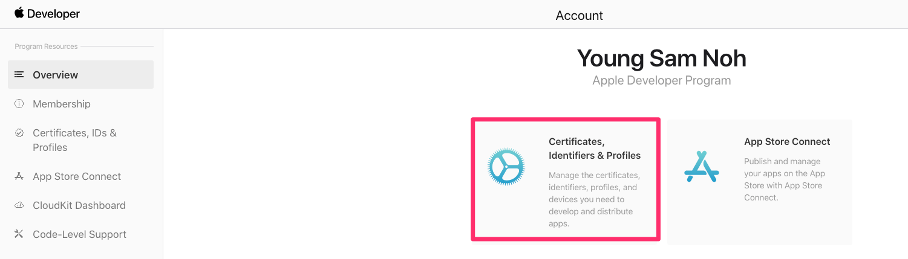

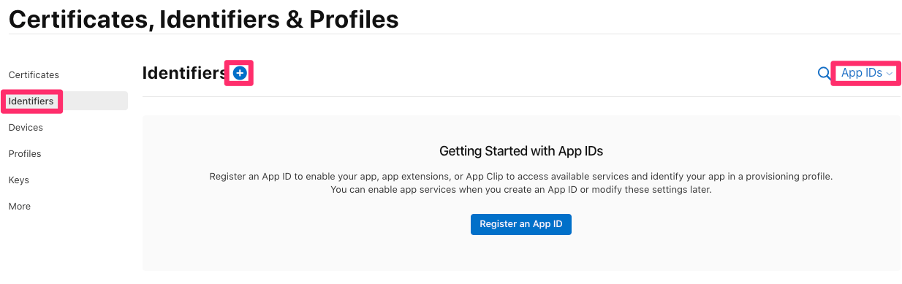

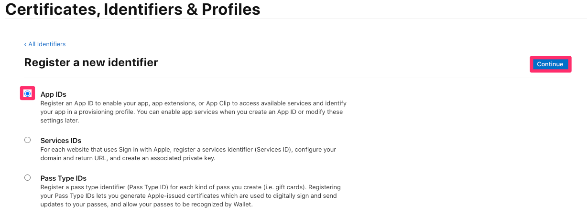

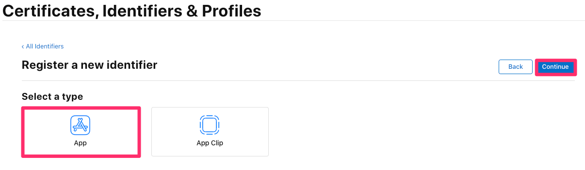

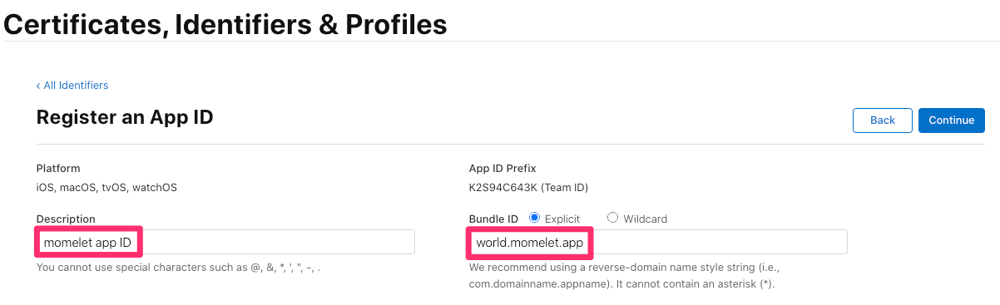

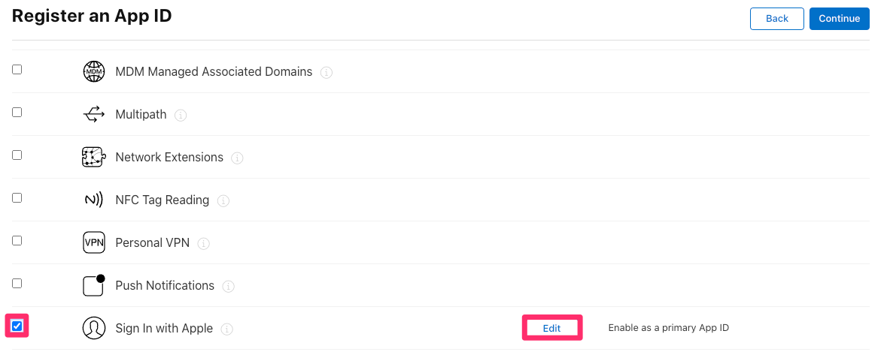

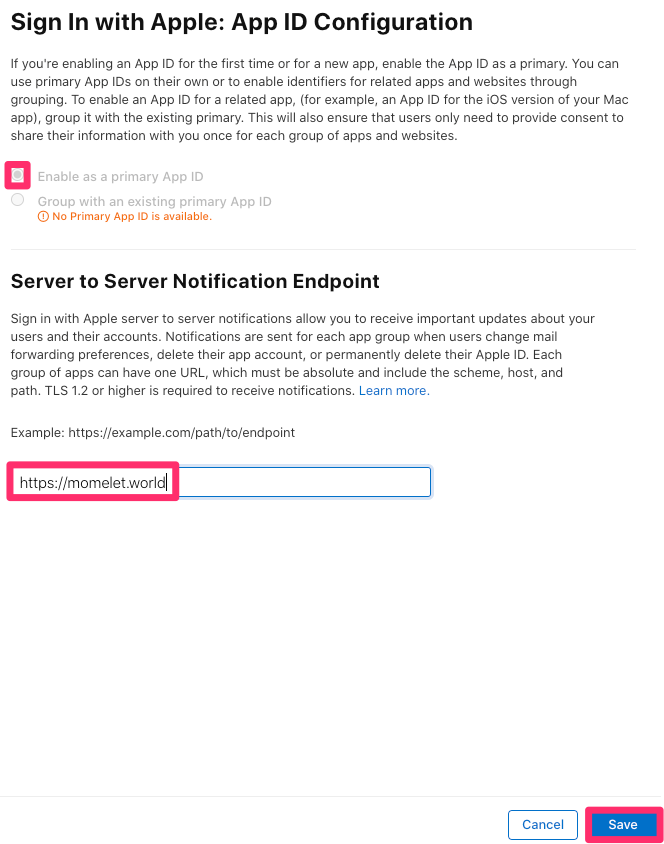

생성 왼료 후 App ID 확인하기


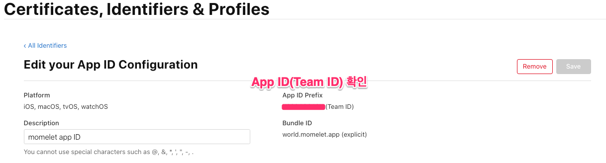

Team ID

* client secret을 생성할 때 필요


## 2단계 Servises ID 생성

* [Account - Apple Developer](https://developer.apple.com/account/)


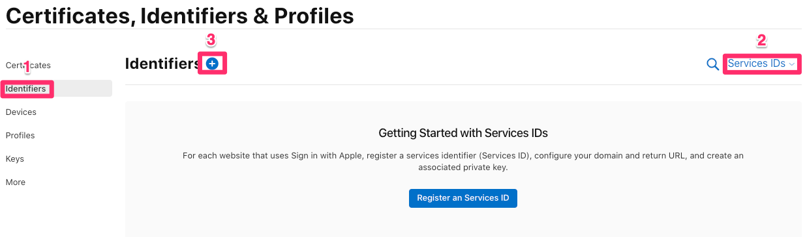

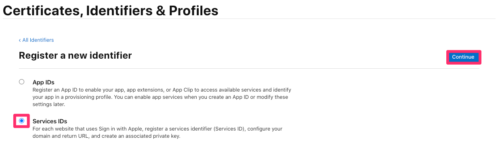

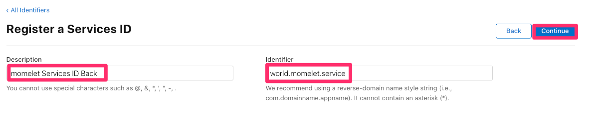

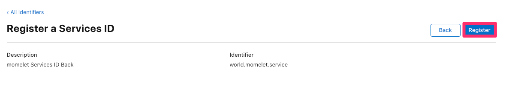

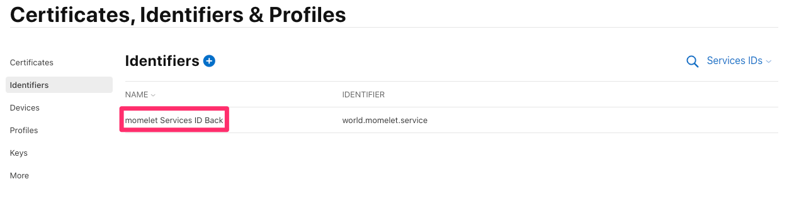

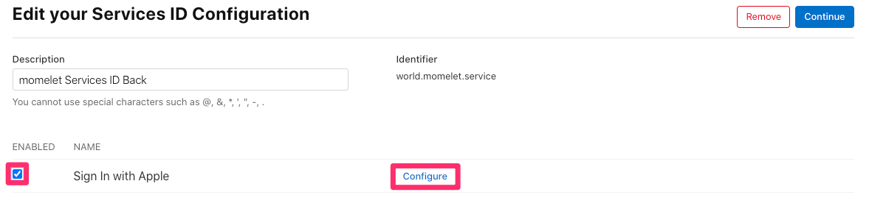

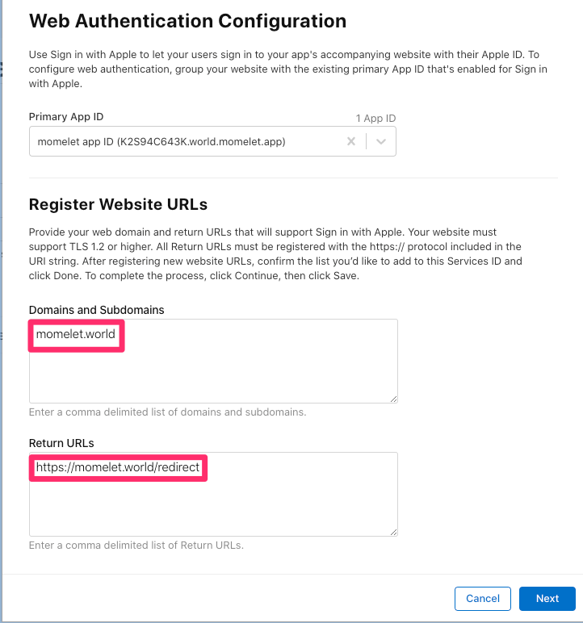

Website URLs

* Return URLs로 애플 로그인을 진행한 유저의 정보가 전달됩니다.

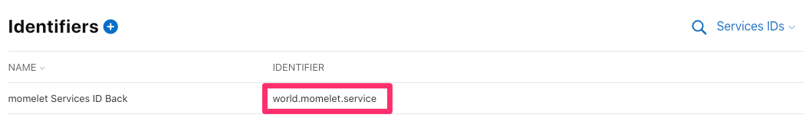

Identifier

* Service의 ID는 client_id, aud의 값으로 사용됩니다.


## 3단계 Private Key 만들기

* Client Secret을 생성할 때 사용할 비밀 키(private key)를 생성

## 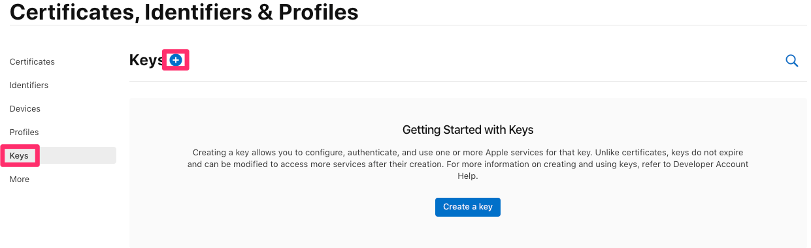

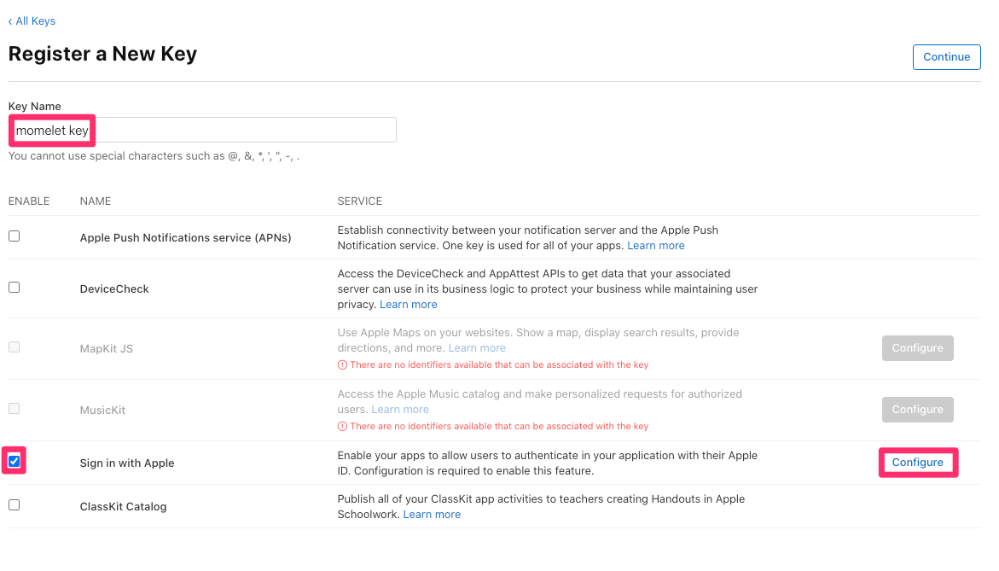

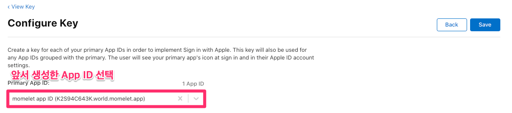

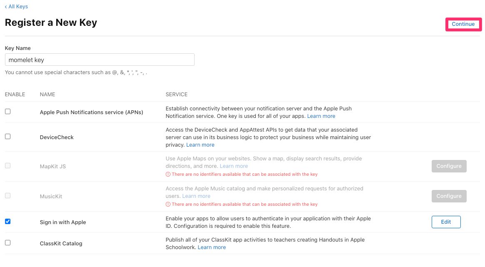


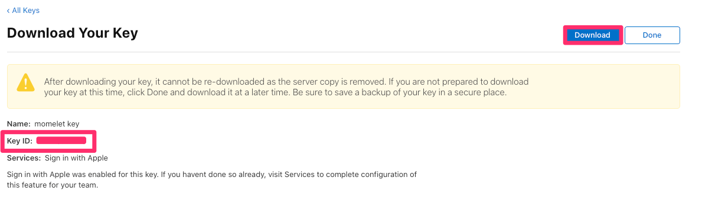

* Key ID
  * Client Secret을 생성할 때 사용됨
* 단순히 OAuth client String을 쓰는 것 대신 애플은 public/private key pair을 사용한다.
* 다운로드가 한번만 가능하므로 잘 저장해두자.
  * 다운 받은 키는 아래와 같은 프로젝트 위치에 옮긴다.


# 스프링

## 프로퍼티 설정

* application.properties 에 다음과 같이 추가

```properties
APPLE.TEAM.ID=[Team ID]
APPLE.WEBSITE.URL=[Website URLs]
APPLE.AUD=[Client ID / Service ID]
APPLE.KEY.ID=[Key ID]
APPLE.KEY.PATH=static/AuthKey_[KeyID].p8
```


## Client Secret 만들기

* JWT

1. Create the JWT header.
   * alg : ES256
   * kid : 앞선 생성한 Private Key의 Key ID
2. Create the JWT payload.
   * iss : Team ID
   * iat : 생성 시간
   * exp : 만료 시간(최대 6개월)
   * aud : `https://appleid.apple.com`.
   * sub : client_id(Service ID)
3. Sign the JWT.
   * 앞서 다운로드한 Private Key로 서명한다.


## OAuth 2.0 Flow

### sign in request


### request user information

* 유저가 성공적으로 인증하면 ` identity token`, `authorization code`를 반환한다.
* identity token 검증하기
  * iss : `https://appleid.apple.com`.인지 검증한다.   
  * aud : `client_id` 인지 검증한다.
  * exp : 현재 시간보다 큰지 검증한다.
  * sub : unique identifier for the user. 
    * DB에 저장해서 처음인지 아닌지 판별한다.
  * email : 유저의 실제 email 혹은 프록시 email
* `authorization code`
  * 생성 후 5분 뒤 만료


### verify user and get token

* token을 얻기위해 앞서 반환 받은  `authorization code` 을 검증하고 token을 생성한다.

```bash
keytool -genkey -alias tomcat -storetype PKCS12 -keyalg RSA -keysize 2048 -keystore keystore.p12 -validity 3650
```