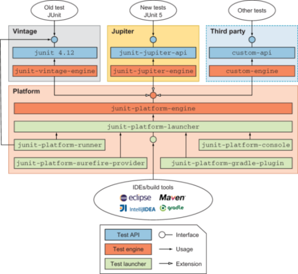

# 1 JUnit5

* 자바 개발자가 가장 많이 사용하는 테스팅 프레임워크입니다.
- JUnit5는 자바 8 이상 버전을 필요로 합니다.
- JUnit 이외에도 TestNG, Spock 등의 대체 프레임워크가 존재합니다.
<br>

## 1.1 build

**gradle**

```groovy
test {
    useJUnitPlatform()
}

dependencies {
    testImplementation("org.junit.jupiter:junit-jupiter:5.8.2")
}
```

<br>

# 2 구성요소



* JUnit5는 크게 세 개의 요소로 구성되어 있습니다.
- `JUnit 5 = JUnit Platform + JUnit Jupiter + JUnit Vintage`

<br>

## 2.1 JUnit Platform

* JUnit Platform은 테스팅 프레임워크를 구동하기 위한 런처(Launcher)와 테스트 엔진을 위한 API를 제공합니다.
- 런처: `junit-platform-launcher` 모듈에서 제공됩니다.
- 테스트 엔진 API: `junit-platform-engine` 모듈에서 제공됩니다.

<br>

## 2.2 Jupiter

* JUnit Jupiter는 JUnit 5에서 제공하는 TestEngine API의 구현체입니다.
- JUnit 5의 새로운 프로그래밍 모델과 확장 모델을 제공합니다.

<br>

## 2.3 Vintage

* JUnit Vintage는 JUnit 3와 JUnit 4를 지원하기 위한 TestEngine API의 구현체입니다.
- 이를 통해 이전 버전의 JUnit으로 작성된 테스트를 JUnit 5 플랫폼에서 실행할 수 있습니다.

<br>

## 1.2 Junit5 시작하기

- 스프링 부트 2.2 버전 이상의 프로젝트를 생성하면 기본적으로 JUnit 5의 의존성이 추가됩니다.
- 만약 수동으로 의존성을 추가하려면 다음과 같이 설정할 수 있습니다.


```xml
<dependency> 
  <groupId>org.junit.jupiter</groupId> 
  <artifactId>junit-jupiter-engine</artifactId> 
  <version>5.5.2</version> 
  <scope>test</scope>
</dependency>
```

<br>

# 2 [애노테이션](https://junit.org/junit5/docs/current/user-guide/#writing-tests-annotations)

- JUnit 5에서 제공하는 주요 애노테이션은 다음과 같습니다.

## 2.1 @Test

- `@Test` 애노테이션은 메서드가 테스트 메서드임을 나타냅니다.
- JUnit 4의 `@Test` 애노테이션과 달리 JUnit Jupiter의 `@Test` 애노테이션에는 속성이 없습니다.
- 리플렉션을 사용하므로 메서드의 접근 제어자가 `public`일 필요는 없지만, `private`은 안됩니다.

<br>

## 2.2 @BeforeAll / @AfterAll

- `@BeforeAll` 주석이 달린 메서드가 모든`@Test`, `@RepeatedTest`, `@ParameterizedTest`, `@TestFactory` 보다 먼저 실행되어야 함을 나타냄
- 한 클래스의 모든 테스트 메서드가 실행되기 전에 특정작업을 수행해야할 때 @BeforeAll 애노테이션 사용
- 한 클래스의 모든 테스트 메서드가 실행한 뒤에 특정작업을 수행해야할 때 @AfterAll 애노테이션 사용
- 두 애노테이션 모두 정적 메서드에 적용가능
	- @BeforeAll : 모든 테스트 메서드를 실행하기 전에 한 번 실행된다
	- @AfterAll : 모든 테스트 메서드를 실행한 뒤에 한 번 실행된다
- JUNit 4의 `@BeforeClass`와 유사합니다.

```java
@AfterAll
static void afterAll(){
	...
}
```

<br>

## 2.3 @BeforeEach / @AfterEach

- `@BeforeEach`주석이 달린 메서드가 각 `@Test`, `@RepeatedTest`, `@ParameterizedTest`, `@TestFactory` 전에 실행되어야 함을 나타냅니다.
- JUNit 4의 `@Before`와 유사합니다.

```java
@AfterEach
void afterEach(){
	...
}
```

<br>

**라이프사이클**

1. 테스트 메소드를 포함한 객체 생성
2. @BeforeEach 애노테이션이 붙은 메서드 실행
3. @Test 애노테이션 붙은 메서드 실행
4. @AfterEach 애노테이션이 붙은 메서드 실행

<br>

## 2.4 @Disabled

- 테스트 클래스 또는 테스트 메서드를 비활성화하는 데 사용됩니다. 
- JUNIT 4의 `@Ignore`와 유사하다 

```java
@Disabled
@Test
void test(){
	...
}	
```

<br>

## 2.5 @DisplayNameGeneration

* `@DisplayNameGeneration` 애노테이션은 테스트 이름을 표기하는 방법을 설정합니다.
- 기본 구현체로 `ReplaceUnderscores`가 제공됩니다.

<br>

## 2.6 @DisplayName

* `@DisplayName`은 테스트에 이름을 부여할 때 사용되는 애노테이션입니다.
- `@DisplayNameGeneration` 보다 우선 순위가 높습니다.

```java
@DisplayName("메뉴 추가")
@Test
void createMenu() throws Exception {
	...
}
```

<br>

# 3 [Assertions](https://junit.org/junit5/docs/current/user-guide/#writing-tests-assertions)

* `org.junit.jupiter.api.Assertions.*`
* AssertJ, Hemcrest, Truth 등의 Third-party Assertion 라이브러리를 사용할 수도 있다.
* JUnit의 Assertions 클래스는 값을 검증하기 위한 목적의 다양한 정적 메서드를 제공한다

<br>

## 3.1 제공되는 메소드

`assertEqulas(expected, actual)`

* 실제 값이 기대한 값과 같은지 확인

`assertNotNull(actual)`

* 값이 null이 아닌지 확인

`assertTrue(boolean)`

* 다음 조건이 참(true)인지 확인

`assertAll(executables...)`

* 모든 확인 구문 확인

`assertThrows(expectedType, executable)`

* 예외 발생 확인

`assertTimeout(duration, executable)`

* 특정 시간 안에 실행이 완료되는지 확인

<br>

# 4 [JUnit5 테스트 순서](https://junit.org/junit5/docs/current/user-guide/#writing-tests-test-execution-order)

* JUnit은 각 테스트 클래스의 새로운 인스턴스를 만들어 테스트 메서드를 실행합니다.
- 이는 테스트 메서드의 독립성을 유지하고, 테스트 간의 예기치 않은 부작용을 방지하기 위함입니다.
* 순서대로 테스트를 실행하고 싶은 경우
	* `@TestMethodOrder`를 사용해 테스트 메소드의 순서를 정할 수 있다. 
	* `@TestInstance(Lifecycle.PER_CLASS)`와 함께 사용하여 유즈 케이스나 시나리오 테스트를 하는데 용이하다.

<br>

# 5 JUnit 5 테스트 인스턴스

- [레퍼런스](https://junit.org/junit5/docs/current/user-guide/#writing-tests-test-instance-lifecycle)
- JUnit에서는 개별 테스트 메서드를 독립적으로 실행하고 변경 가능한 테스트 인스턴스 상태로 인한 예기치 않은 부작용을 방지하기 위해, 각 **테스트 메서드(정의 참조)를 실행하기 전에 각 테스트 클래스의 새 인스턴스를 생성**합니다.
- "메서드별" 테스트 인스턴스 수명 주기는 JUnit Jupiter의 기본 동작이며 이전 버전의 JUnit과 유사합니다.
- 만약 JUnit Jupiter가 모든 테스트 메서드를 동일한 테스트 인스턴스에서 실행하기를 원한다면, 테스트 클래스에 @TestInstance(Lifecycle.PER_CLASS) 어노테이션을 붙이면 됩니다

<br>

**@TestInstance(Lifecycle.PER_CLASS)**

* 이 모드를 사용하면 테스트 클래스당 한 번 새 테스트 인스턴스가 생성됩니다.
- 따라서 테스트 메서드가 인스턴스 변수에 저장된 상태에 의존하는 경우, @BeforeEach 또는 @AfterEach 메서드에서 해당 상태를 재설정해야 할 수도 있습니다.
- "클래스별" 모드는 기본 "메서드별" 모드에 비해 몇 가지 추가적인 이점이 있습니다.
- 특히 "클래스별" 모드에서는 정적이 아닌 메서드와 인터페이스 기본 메서드에서 @BeforeAll과 @AfterAll을 선언할 수 있습니다.

<br>

# 6 [JUnit4 -> JUnit5 마이그레이션](https://junit.org/junit5/docs/current/user-guide/#migrating-from-junit4)

* junit-vintage-engine을 의존성으로 추가하면, JUnit 5의 junit-platform으로 JUnit 3과 4로 작성된 테스트를 실행할 수 있다.
* 스프링 부트 버전을 2.2.X대로 올린다. 
* 더 이상 @RunWith을 쓰지 않는다.

| JUnit 4                                    | JUnit 5                                        |
| ------------------------------------------ | ---------------------------------------------- |
| @Category(Class)                           | @Tag(String)                                   |
| @RunWith, @Rule, @ClassRule                | @ExtendWith, @RegisterExtension                |
| @Ignore                                    | @Disabled                                      |
| @Before, @After, @BeforeClass, @AfterClass | @BeforeEach, @AfterEach, @BeforeAll, @AfterAll |

<br>

# 7 [Extension Model](https://junit.org/junit5/docs/current/user-guide/#extensions)

* JUnit 4의 확장 모델은 @RunWith(Runner), TestRule, MethodRule.
* JUnit 5의 확장 모델은 단 하나, Extension.
* 확장 모델 등록 방법
  1. 선언적인 등록 `@ExtendWith`
  2. 프로그래밍 등록 `@RegisterExtension`
  3. 자동 등록 자바 `ServiceLoader` 이용

<br>

참고

* https://junit.org/junit5/docs/current/user-guide/#overview-what-is-junit-5