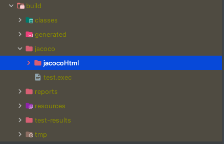

# 1 Jacoco

* JaCoCo는 Java 코드의 커버리지를 체크하는 라이브러리입니다.
* 테스트코드를 돌리고 그 커버리지 결과를 눈으로 보기 좋도록 html이나 xml, csv 같은 리포트로 생성합니다


# 2 플러그인 추가

```groovy
plugins {
  id 'jacoco'
}
```


# 3 플러그인 설정

* jacoco 플러그인을 추가하고 플러그인 설정하기
* `toolVersion`: 사용할 JaCoCo의 jar 버전 지정
* `reportsDir`: 테스트 리포트가 저장될 경로를 지정
  * 기본적으로 `$buildDir/reports/jacoco` 위치에 저장
  * `$buildDir`를 기준으로 상대경로 지정

```groovy
jacoco {
	toolVersion = "0.8.7"
	reportsDirectory = layout.buildDirectory.dir('jacoco')
}
```




# 4 task 설정

* JaCoCo Gradle 플러그인에는 `jacocoTestReport`와 `jacocoTestCoverageVerification` task가 있습니다.


## 4.1 jacocoTestReport

* 바이너리 커버리지 결과를 사람이 읽기 좋은 형태의 리포트로 저장합니다. 
  * 리포드의 형식은 html, csv, xml을 지원함
* html 파일: 사람이 쉽게 눈으로 확인할 수도 있다
* xml, csv 파일: SonarQube 등으로 연동하기 위해 xml, csv 형태로 리포트 생성
* 기본적으로 html 리포드가 `$buildDir/reports/jacoco/test` 위치에 생성됨
* jacocoTestReport 태스크는 기본적으로 test 태스크 실행 후에 실행되어야 하지만 기본적으로 이런 의존관계가 설정되어 있지 않다
  * 따라서 명시적으로 test 태스크 실행 후에 jacocoTestReport 태스크가 실행될 수 있도록 설정을 직접 해야한다


**build.gradle**

```groovy
test {
  // test 태스크 종류 후 jacocoTestReport 태스크 실행
  finalizedBy jacocoTestReport
}

jacocoTestReport {
  reports {
    // 원하는 리포트를 켜고 끌 수 있다
    html.required = true
    xml.required = false
    csv.required = false
    
    //  각 리포트 타입 마다 리포트 저장 경로를 설정할 수 있다 buildDir를 기준으로 상대경로 지정
    html.outputLocation = layout.buildDirectory.dir('jacoco/jacocoHtml')
  }
  
  // jacocoTestReport 태스크는 test 태스크에 의존한다
  // 즉 test 태스크 실행 후 jacocoTestReport가 실행된다
  dependsOn test
  
  // jacocoTestReport 태스크 실행 후 jacocoTestCoverageVerification 태스크가 시행된다
  finalizedBy 'jacocoTestCoverageVerification'
}
```

아래와 같은 경로 `buildDir/jacoco/jacocoHtml`에 html 형태의 리포트가 만들어진다


## 4.2 jacocoTestCoverageVerification

* 내가 원하는 커버리지 기준을 만족하는지 확인해 주는 task입니다. 
* 예를 들어, 브랜치 커버리지를 최소한 80% 이상으로 유지하고 싶다면, 이 task에 설정하면 됩니다.
*  `test` task처럼 Gradle 빌드의 성공/실패로 결과를 보여줍니다.


**build.gradle**

```groovy
jacocoTestCoverageVerification {
  violationRules {
    rule {
      enabled = true
      element = 'CLASS'
      limit {
        counter = 'LINE'
        value = 'COVEREDRATIO'
        minimum = 0.30
      }
    }
  }
}
```


### 4.2.1 rule 속성

**enable**

* 해당하는 rule의 활성화 여부를 boolean으로 나타냅니다. 
* 기본 값은 true

**element**

* 커버리지를 체크할 단위를 지정한다
* 총 6가지의 단위가 있다
  * BUNDLE : 패키지 번들(프로젝트 모든 파일을 합친 것)
  * CLASS : 클래스
  * GROUP : 논리적 번들 그룹
  * METHOD : 메서드
  * PACKAGE : 패키지
  * SOURCEFILE : 소스 파일
* 기본 값은 BUNDLE

**includes**

* 해당하는 `rule` 을 적용 대상을 package 수준으로 지정한다
* 기본 값은 전체 package

**excludes**

* 커버리지를 측정할 때 제외할 클래스를 지정할 수 있습니다. 
* 패키지 레벨의 경로로 지정하여야 하고 경로에는 * 와 ? 를 사용할 수 있습니다.


### 4.2.2 limit 속성

**counter**

* `counter` 는 `limit` 메서드를 통해 지정할 수 있다
* 커버리지 측정의 최소 단위를 지정한다
* 측정은 java byte code가 실행된 것을 기준으로 측정되고, 총 6개의 단위가 존재합니다.
  * BRANCH : 조건문 등의 분기 수
  * CLASS : 클래스 수, 내부 메서드가 한 번이라도 실행된다면 실행된 것으로 간주한다.
  * COMPLEXITY : 복잡도
  * INSTRUCTION : Java 바이트코드 명령 수
  * METHOD : 메서드 수, 메서드가 한 번이라도 실행된다면 실행된 것으로 간주한다.
  * LINE : 빈 줄을 제외한 실제 코드의 라인 수, 라인이 한 번이라도 실행되면 실행된 것으로 간주한다.
* 기본 값은 INSTRUCTION

**value**

* value 는 limit 메서드를 통해 지정할 수 있으며 측정한 커버리지를 어떠한 방식으로 보여줄 것인지를 말합니다. 
* 총 5개의 방식이 존재합니다.
  * COVEREDCOUNT : 커버된 개수
  * COVEREDRATIO : 커버된 비율, 0부터 1사이의 숫자로 1이 100%이다.
  * MISSEDCOUNT : 커버되지 않은 개수
  * MISSEDRATIO : 커버되지 않은 비율, 0부터 1사이의 숫자로 1이 100%이다.
  * TOTALCOUNT : 전체 개수
* 기본 값은 COVEREDRATIO

**minimum**

* `minimum` 은 `limit` 메서드를 통해 지정할 수 있다
* `counter` 값을 `value` 에 맞게 표현했을 때 최솟값을 말합니다. 
* 이 값을 통해 `jacocoTestCoverageVerification` 의 성공 여부가 결정됩니다.
* 기본 값 없음

# 5 커버리지에서 제외할 클래스 설정


## 5.1  Lombok 테스트 커버리지에서 제외하기

* Lombok에 의해 생성된 Getter, Builder 등을 테스트 커버리지에서 제외하려면 프로젝트 루트 디렉토리 아래와 같이 lombok.config 파일을 작성

**lombok.config**

```
lombok.addLombokGeneratedAnnotation = true
```


## 5.2 QueryDSL의 Qdomain 클래스를 커버리지 측정 대상에서 제외하기

**build.gradle**

```groovy
jacocoTestCoverageVerification {
        def Qdomains = []

        for (qPattern in '*.QA'..'*.QZ') { // qPattern = '*.QA', '*.QB', ... '*.QZ'
            Qdomains.add(qPattern + '*')
        }

        violationRules {
            rule {
                enabled = true
                element = 'CLASS'

                limit {
                    counter = 'LINE'
                    value = 'COVEREDRATIO'
                    minimum = 0.80
                }

                limit {
                    counter = 'BRANCH'
                    value = 'COVEREDRATIO'
                    minimum = 0.80
                }

                excludes = [] + Qdomains // 제외할 Qdomains 패턴 추가
            }
        }
    }
}
```


# 6 느려지는 테스트 시간

* 테스트 케이스가 늘어남에 따라 테스트 시간이 증가한다
* 스프링 애플리케이션이라면 대부분의 원인이 스프링 애플리케이션 컨텍스트 로딩에 있다
* 스프링 애플리케이션 컨텍스트 로딩을 단축해도 느리다면 프로파일링을 통해 원인을 찾고 해결해야한다


# 7 테스트하기 어려운 코드


참고

* https://docs.gradle.org/current/userguide/jacoco_plugin.html#header
* [Gradle 프로젝트에 JaCoCo 설정하기](https://techblog.woowahan.com/2661/)
* [코드 분석 도구 적용기 - 2편, JaCoCo 적용하기](https://velog.io/@lxxjn0/%EC%BD%94%EB%93%9C-%EB%B6%84%EC%84%9D-%EB%8F%84%EA%B5%AC-%EC%A0%81%EC%9A%A9%EA%B8%B0-2%ED%8E%B8-JaCoCo-%EC%A0%81%EC%9A%A9%ED%95%98%EA%B8%B0)
* [토스 SLASH 21 테스트 커버리지 100%](https://medium.com/byungkyu-ju/toss-slash21-%ED%85%8C%EC%8A%A4%ED%8A%B8%EC%BB%A4%EB%B2%84%EB%A6%AC%EC%A7%80-100-%EC%9A%94%EC%95%BD-demo-2fb8b52cf2a9)