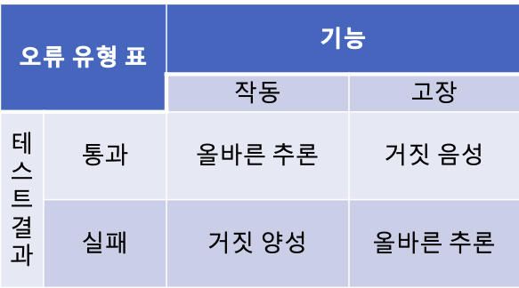

# 1 좋은 단위 테스트의 4대 요소


## 1.1 좋은 단위 테스트 스위트의 특성

* **개발 주기에 통합돼 있다.** 
  * 실제로 사용하는 테스트만 가치가 있다. 그렇지 않으면 작성해도 의미가 없다
* **코드베이스에서 가장 중요한 부분만을 대상으로 한다.** 
  * 모든 실행 코드에 똑같이 신경 쓸 필요가 없다.
  * 애플리케이션의 핵심(도메인 모델)을 다른 것과 구별하는 것이 중요하다
* **최소한의 유지비로 최대 가치를 끌어낸다**
  * 가치 있는 테스트를 식별할 줄 알아야한다
  * 기치 있는 테스트를 작성해야한다


## 1.2 가치 있는 테스트

* 앞에 좋은 단위 테스트 스위트의 특성 중에서 가치 있는 테스트를 식별하고 작성해야 한다고 했다. 그렇다면 가치 있는 테스트란 무엇일까?
* 가치있는 테스트를 식별하기 위해 사용되는 네 가지 특성이 있다
  * **회귀 방지**
  * **리팩터링 내성**
  * **빠른 피드백**
  * **유지 보수성**
* 이 네가지 특성이 기본이며 이러한 특성으로 어떤 테스트(단위 테스트, 통합 테스트, 엔드 투 엔드 테스트)도 분석할 수 있다


# 2 회귀 방지

* **회귀 방지는 테스트가 얼마나 버그(회귀)의 존재를 잘 나타내는지에 대한 척도다**
  * 회귀는 소프트웨어 버그를 의미한다
* 코드를 수정한 후 기능이 의도한 대로 작동하지 않는 경우다
* 회귀 방지 지표를 극대화하려면 테스트가 가능한 많은 코드를 실행하는 것을 목표로 해야 한다
  * 테스트가 코드를 더 많이 실행할 수록 테스트에서 버그가 드러날 확률이 더 높아진다
  * 직접 작성한 코드와 프로젝트에서 사용한 라이브러리 및 프레임워크 코드 모두 포함


## 2.1 회귀 방지 평가 지표

* 테스트 중에 실행되는 코드의 양
* 코드 복잡도
* 코드의 도메인 유의성

**테스트 중에 실행되는 코드의 양**

* 일반적으로 실행되는 코드가 많을수록 테스트에서 회귀(버그)가 나타날 가능성이 높다
* **회귀 방지 지표를 극대화하려면 테스트가 가능한 많은 코드를 실행하는 것을 목표로 하라**

**코드 복잡도와 코드의 도메인 유의성**

* 복잡한 비즈니스 로직을 나타내는 코드가 보일러플레이트 코드 보다 훨씬 중요하다
* 비즈니스에 중요한 기능에서 발생한 버그가 가증 큰 피해를 입히기 때문이다
* 반면 단순한 코드를 테스트하는 것은 거의 가치가 없다


# 3 리팩터링 내성

* **리팩터링 내성은 테스트를 실패로 바꾸지 않고 기본 애플리케이션 코드를 리팩터링할 수 있는지**에 대한 척도다
* **리팩터링 후 기능은 예전과 같이 완벽하게 작동하는데 테스트는 실패할 때 리팩터링 내성이 없다고 한다**
* 이러한 상황을 **거짓 양성**이라고 한다
  * 거짓 양성은 허위 경보이다
  * 실제로 기능이 의도한 대로 작동하지만 테스는 실패를 나타낸다


> **리팩터링**
>
> **리팩터링은 식별할수 있는 동작을 수정하지 않고 기존 코드를 변경하는 것을 의미한다**. 그 의도는 코드의 비기능적 특징을 개선하는 것으로 가독성을 높이고 복잡도를 낮추는 것이다. 몇 가지 예를 들자면, 메서드 이름을 바꾸는 것이나 코드 조각을 새로운 클래스로 추출하는 것을 생각해 볼 수 있다


## 3.1 거짓 양성의 좋지 않은 영향

* 테스트가 타당한 이유 없이 실패하면, 코드 문제에 대응하는 능력과 의지가 희석된다
* 이내 타당한 실패도 무시하기 시작해 기능이 고장 나도 운영 환경에 들어가게 된다
* **거짓 양성이 빈번하면 테스트 스위트에 대한 신뢰가 떨어지기 시작하며 더 이상 안전망으로 인식하지 않는다**
* 이렇게 되면 리팩터링이 줄어든다
  * 회귀를 피할려고 코드 변경을 최소화하기 때문


## 3.2 거짓 양성의 원인

* 리팩터링 과정은 애플리케이션의 식별 가능한 동작에 영향을 주지 않으면서 구현을 변경하는 것이다
* 따라서 리팩터링 후 테스트가 실패하는 것의 **원인은 테스트가 구현 세부 사항과 결합되었기 때문이다**
* **테스트와 SUT(테스트 대상 시스템)의 구현 세부 사항이 많이 결합할수록 거짓 양성(허위 경보)가 더 많이 생긴다**


## 3.3 거짓 양성 해결

* **거짓 양성을 줄이기 위해 구현 세부 사항에서 테스트를 분리하는 것뿐이다**
* 구현 세부 사항에서 테스트를 분리하고 SUT가 제공하는 **최종 결과를 검증**하는지를 확인하자
* 테스트는 **최종 사용자 관점**에서 SUT를 검증해야 하고 의미 있는 결과만 확인해야 한다
* SUT의 메서드를 진입점으로 하고 최종 결과만 검증하는 블랙박스 테스트를 해야한다


# 4 회귀 방지와 리팩터링 내성

* 둘 다 정반대의 관점에서도 테스트 스위트의 정확도에 기여한다
* 프로젝트가 시작한 직후에는 회귀 방지를 훌륭히 갖추는 것이 중요한데 반해 리팩터링 내성은 바로 필요하지 않다
* 그러나 리팩터링 내성은 프로젝트가 성장함에 따라 점점 더 중요해진다


**오류 유형 표**



* 테스트가 통과되고 기능이 의도한 대로 작동하는 상황은 올바른 추론이다
* 기능이 고장나서 테스트가 실패해도 올바른 추론이다
* 기능이 고장났는데 테스트에서 오류가 발생하지 않으면 문제가 되는데 이는 오른쪽 상단의 **거짓 음성**이다
  * 거짓 음성은 알려지지 않은 버그이다
  * 거짓 음성을 피하는데 좋은 특성은 바로 회귀 방지다
  * **회귀 방지가 훌륭한 테스트는 거짓 음성의 수를 최소화** 하는데 도움이 된다
  
* 반면에 기능은 올바르지만 테스트가 실패하는 것은 **거짓 양성**이라 한다
  * **거짓 양성을 피하는데 좋은 특성은 리팩터링 내성이다**


# 5 빠른 피드백

* **테스트가 얼마나 빨리 실행되는지에 대한 척도다**
* 빠른 피드백은 단위 테스트의 필수 속성이다
* 테스트가 빠르게 실행되면 코드에 결함이 생기자마자 버그에 대해 경고하기 시작할 정도로 피드백 루프를 대폭 줄여 버그 수정 비용을 0까지 줄일 수 있다
* 느린 테스트는 피드백을 느리게 하고 잠재적으로 버그를 뒤늦게 눈에 띄게 해서 버그 수정 비용이 증가한다


# 6 유지 보수성

* 유지 보수성은 두 가지 요소로 구성된다
  * 테스트가 얼마나 이해하기 어려운가
  * 테스트가 얼마나 실행하기 어려운가

**테스트가 얼마나 이해하기 어려운가**

* 이는 테스트의 크기와 관련있다
* 테스트 코드 라인이 적을수록 더 읽기 쉽다
* 작은 코드는 변경도 쉽다
* 테스트 코드의 품질은 제품 코드만큼 중요하다
* 테스트를 작성할 때 절차를 생략하지 말자

**테스트가 얼마나 실행하기 어려운가**

* 테스트가 프로세스 외부 종속성으로 작동하면 데이터베이스 서버를 재부팅하고 네트워크 연결 문제를 해결하는 들 의존성을 상시 운영하는데 시간이 들어간다
* 테스트에 관련된 프로세스 외부 의존성은 적을수록 쉽게 운영할 수 있다


# 7 이상적인 테스트

* 좋은 단위 테스트의 가치는 네 가지 특성에서 각각 얻은 점수의 곱이다
  * 즉 어떤 특성이라도 0이되면 전체는 0이 되는 것이다
  * 따라서 테스트가 가치가 있으려면 네 가지 범주 모두에서 점수를 내야한다


## 7.1 이상적인 테스트를 만들 수 있는가?

* 이상적인 테스트는 네 가지 특성 모두에서 최대 점수를 받는 테스트이다
  * 각 특성마다 점수의 범위가 0-1이면 모두 1점을 얻어야한다
* 안타깝지만 이상적인 테스트를 만드는 것은 불가능하다
  * **회귀 방지, 리팩터링 내성, 빠른 피드백은 서로 배타적이기 때문**
  * **셋 중 하나를 희생해야 나머지 둘을 최대로 할 수 있다.**
  * 그러나 하나의 특성을 그냥 버릴 수 없다 앞서 언급했듯 한 특성이 0이 되면 점수는 곱이기 때문에 테스트가 의미없어 진다


### 7.1.1 극단적인 사례1: 엔드 투 엔드 테스트

* 엔드 투 엔드 테스트는 최종 사용자 관점에서 시스템을 테스트한다
* UI, 데이터베이스, 외부 애플리케이션을 포함한 모든 시스템 구성요소를 테스트한다
* 엔드 투 엔드는 테스트는 많은 코드를 테스트하므로 **회귀 방지** 특성에서 높은 점수를 얻는다
  * 직접 작성한 코드 뿐만 아니라 외부 라이브러리, 프레임워크, 서드파티 애플리케이션 등과 같이 직접 작성하지 않은 코드를 가장 많이 수행한다
* 엔드 투 엔드 테스트는 거짓 양성에 면역이 돼 **리팩터링 내성**이 훌륭하다
  * 어떤 특정 구현을 강요하지 않고 최종 사용자 입장에서 기능이 어떻게 동작하는지 테스트하기 때문
* 그러나 **느린 속도**라는 큰 담점이 있다
  * 모든 시스템 구성요소로 부터 피드백을 빨리 받기가 어렵다
* 따라서 엔드 투 엔드 테스트만으로 코드베이스를 다루는 것은 불가능하다


### 7.1.2 극단적인 사례2: 간단한 테스트

* 회귀 방지 특성을 희생에 나머지 속성을 극대화하는 예로 간단한 테스트가 있다
* 간단한 테스트란 너무나도 단순해서 고장이 없을 것 같은 작은 코드 조각을 테스트하는 것이다
* 간단한 테스트는 빠르게 실행되고 빠른 피드백을 제공한다
* 거짓 양성이 생길 가능성이 낮아 리팩터링 내성도 우수하다
* 그러나 기반 코드에 실수할 여지가 많지 않기 때문에 회기 방지가 없다 

**User.java**

```java
public class User {
  private String name;

  public User(String name) {
    this.name = name;
  }

  public String getName() {
    return name;
  }
}
```

```java
class UserTest {

  @Test
  void test() {
    // Arrange
    User sut = new User("YoungThree");

    // Act
    String result = sut.getName();

    // Assert
    Assertions.assertThat(result).isEqualTo("YoungThree");
  }
}
```


### 7.1.3 극단적 사례3: 깨지기 쉬운 테스트

* 실행이 빠르고 회귀를 잡을 가능성은 높지만 리팩터링 내성이 없는 테스트를 깨지기 쉬운 테스트라고 한다
* 기능이 무엇을 하는지가 아니라 어떻게 작동하는지에 중점을 두고 있기 때문에 SUT 내부 구현과 결합되어 리팩터링을 막는다

**UserRepository.java**

* `조회 SQL A` 외에도 id를 이용해 User를 조회하난 SQL은 얼마든지 있다
* 후에 기존 SQL을 같은 기능을 하는 더 좋은 SQL로 수정하면 테스트가 깨지게된다

```java
@Setter
@Getter
public class UserRepository {
  private String lastExecutedSqlStatement;

  public User getById(long id) {
    // id로 User를 조회하는 SQL을 실행하고 SQL을 lastExecutedSqlStatement에 저장 
  }
}
```

```java
@Test
void getById_execute_correct_SQl_code() {
  UserRepository sut = new UserRepository();

  User user = sut.getById(5);

  Assertions.assertThat(sut.getLastExecutedSqlStatement()).isEqualTo("조회 SQL A");
}
```


## 7.2 이상적인 테스트 결론

* 회귀 방지, 리펙터링 내성, 빠른 피드백 세가지 특성 모두 완벽한 점수를 얻어 이상적인 테스트를 만드는 것은 불가능하다
* 네 번째 특성인 유지보수성을 엔드 투 엔드 테스트르 제외하면 모든 테스트에서 처음 세가지 특성과 상관관계가 없다
  * 엔드 투 엔트 테스트는 유지비 측명에서 더 비싸다
* 그렇다면 도대체 어떤 특성을 희생시켜야 할까?
* **리팩터링 내성은 희생시킬 수 없다.**
  * 왜냐면 리팩터링 내성은 0점 아니면 1점이다. 중간 점수는 없다
  * **따라서 우리는 회귀 방지와 빠른 피드백 사이에서 절충해야 한다** 


# 8 테스트 피라미드

* 테스트 피라미드는 테스트 스위트에서 테스트 유형 간의 일정한 비율을 일컫는 개념이다

![[Enable Images]](./images/test-pyramid.png)

[출처](https://khorikov.org/posts/2021-01-04-unit-testing-vs-bdd/)

* 테스트 피라미드는 종종 세 가지 유형의 테스가 있는 피라미드로 표현한다
  * 엔드 투 엔드, 통합 테스트, 단위 테스트
* 피라미드의 너비는 테스트의 수를 나타내고 층의 높이는 최종 사용자의 동작을 얼마나 유사하게 흉내내는지 나타내는 척도다
* 피라미드 내 테스트 유형에 따라 빠른 피드백과 회귀 방지 사이에서 선택을 한다
  * 피라미드 상단으로 갈 수록 회귀 방지에 유리한 반면 실행 속도는 떨어진다
  * 어느 계층도 리팩터링 내성을 포기하지 않는다
  * 단위 테스트조차도 리팩터링 내성을 포기하지 않는다
* 팀과 프로젝트마다 테스트 유형간의 비율이 다르겠지만 일반적으로 피라미드 형태를 유지해야 한다
  * 즉 엔트 투 엔트가 가장 적고 유닛 테스트가 가장 많으며 통합 테스트는 중간에 있어야 한다
  * 애플리케이션이 비즈니스 규칙이나 기타 복잡도가 거의 없는 CRUD 작업이라면 피라미드가 아니라 직사각형 형태가 될 수 있다
    * 단위 테스트와 통합 테스트가 같고 엔드 투 엔드 테스트는 없는 경우
* 엔트 투 엔트가 가장 적은 이유는 빠른 피드백 지표에서 낮은 점수를 받기 때문이다
  * 따라서 엔트 투 엔드는 가장 중요한 기능(버그를 내고 싶지 않은 기능)에만 적용하자


# 9 블랙박스 테스트와 화이트박스 테스트


## 9.1 블랙박스 테스트

* **시스템의 내부 구조를 몰라도 시스템의 기능을 검사할 수 있는 소트트웨어 테스트 방법이다**
* 일반적으로 명세와 요구 사항을 중심으로 구축된다
* 즉 애플리케이션이 어떻게 해야 하는지가 아니라 무엇을 해야하는지를 중심으로 테스트


## 9.2 화이트박스 테스트

* 화이트박스 테스트는 블랙박스 테스트와 정반대다
* **애플리케이션의 내부 작업을 검증하는 테스트 방식이며 테스트 요구 사항이나 명세가 아닌 소스 코드에서 파생된다**


## 9.3 블랙/화이트박스 테스트 장단점

* 두 가지 방법 모두 장단점이 있다

**화이트박스 테스트**

* 화이트박스 코드는 테스트가 더 철저해 소스 코드를 분석하면 **외부 명세에만 의존할 때 놓칠 수 있는 많은 오류를 발견할 수 있다**
* 반면에 화이트박스 테스트 코드는 SUT의 특정 구현과 결합돼 있기 때문에 **깨지기 쉬운 테스트**이다
* 이러한 테스트는 거짓 양성을 많이 발생시켜 **리팩터링 내성이 없다**
* 또한 비즈니스 담당자에게 의미 있는 동작으로 유추할 수 없다


**블랙박스 테스트**

* 블랙박스 테스트는 `어떻게` 가 아니라 `무엇을` 에 초점을 둔 테스트로 SUT의 구현 세부 사항과 결합되지 않아 **리팩터링 내성이 있다**


## 9.4 결론

* **리팩터링 내성을 희생할 수 없는 특성이므로 화이트박스 테스트 대신 블랙박스 테스트를 기본으로 선택하라**
* 테스트를 작성할 때 블랙박스 테스트가 바람직하지만 **테스트를 분석할 때는 화이트박스 방법을 사용**할 수 있다
* **코드 커버리지 툴을 사용해서 어떤 코드 분기를 실행하지 않았는지를 확인하고 코드 내구 구조에 대해 전혀 모르는 것처럼 테스트하라**
* 이렇게 화이트박스 방법과 블랙박스 방법의 조합이 가장 효과적이다


참고

* [단위 테스트](http://www.kyobobook.co.kr/product/detailViewKor.laf?mallGb=KOR&ejkGb=KOR&barcode=9791161755748)
