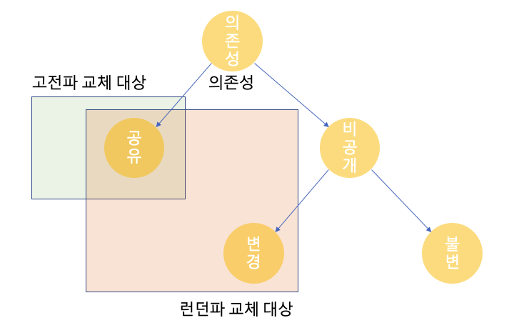

# 1 단위 테스트란 무엇인가?

* 단위 테스트의 정의에는 많은 미묘한 차이들이 있다
* 해석에 차이에 따라 고전파와 런던파로 두 가지로 나뉜다


## 1.1 단위 테스트 정의

* 단위 테스트에는 많은 정의가 있지만 중요한 것만 추리면 아래와 같다
  * **작은 코드 조각을 검증하고**
  * **빠르게 수행하고**
  * **격리된 방식으로 처리하는 자동화된 테스트다**
* 첫 번째 속성은 논란의 여지가 없다지만 정확히 빠르다는 것은 주관적인 척도이므로 논쟁이 있을 수 있지만 그리 중요하지 않다
  * 테스트 스위트의 실행 시간이 충분하다면 테스트가 충분히 빠르다는 의미다
* 대중의 의견이 갈리는 것은 세 번째 속성이다. 
  * 고전파와 런던파의 견해가 이 속성에서 갈린다


## 1.2 고전파와 런던파 

* 단위 테스트의 세 번째 속성에서 **격리가 정확히 무엇인지에 대한 의견 차이로 고전파와 런던파로 나누어진다**


## 1.3 런던파의 단위 테스트 정의

**런던파의 단위 테스트는**

* 단일 클래스 내의 메서드를 검증하며
* 빠르게 수행하고
* 테스트 대상을 협력자로부터 격리하는 자동화된 테스트


## 1.4 고전파의 단위 테스트 정의

**고전파의 단위 테스트는**

* 단일 동작 단위를 검증하며
* 빠르게 수행하고
* 다른 테스트와 별도로(격리하여) 처리하는 자동화된 테스트


# 2 런던파의 단위 테스트


## 2.1 격리 문제에 대한 런던파 접근

* 런던파가 생각하는 격리란 아래와 같다
* **테스트 대상 시스템(SUT)을 협력자에게서 격리하는 것**
  * [협력자란?](#4.3-협력자)

* **즉 하나의 클래스가 다른 클래스 또는 여러 클래스에 의존하면 이 모든 의존성을 테스트 대역으로 대체해야 한다**
  * 불변 의존성은 제외한 모든 의존성을 대체함
  * 그래서 런던파를 목 추종자라고 부른다
  * 테스트 대역은 [Test-Double.md](../../Test-Double/Test-Double.md) 참고


## 2.2 런던파 접근의 장점

**테스트가 실패하면 코드베이스의 어느 부분이 고장 났는지 확실히 알 수 있다**

* 테스트가 실패하면 테스트 대상 시스템이 고장난 것이다
* 테스트 대상 시스템 클래스의 모든 의존성은 테스트 대역으로 대체됐기 때문에 의심할 여지가 없다


**객체 그래프를 분할할 수 있어 서로 연결된 클래스의 그래프가 커져도 테스트하기 쉽다**

* 실제 협력자 대신해 목을 사용하면 클래스를 쉽게 테스트할 수 있다
* 특히 SUT 클래스에 의존성이 있고 이 의존성에 다시 각각의 의존성이 있는 복잡한 객체 그래프가 있을 때 쉽게 테스트할 수 있다
  * 객체 그래프: 같은 문제를 해결하는 클래스의 통신망

* 테스트 대역을 쓰면 클래스의 직접적인 의존성을 대체해 객체 그래프를 나눌 수 있다
  * 단위 테스트에서 준비해야 할 작업량을 크게 줄일 수 있다
  * 고전파의 단위 테스트는 SUT를 설정하려면 전체 공유 의존성을 제외한 전체 객체 그래프를 다시 생성해야 한다
  * 고전파의 설정이 많은 작업량을 가지고 있어 위는 사실이지만 **복잡한 객체 클래스를 설정해 테스트할 방법을 찾는 대신 근본적으로 복잡한 클래스 그래프를 갖지 않는 데 집중해야 한다**
  * 대게 클래스 그래프가 커진 것은 코드 설계의 문제다 


**간단한 테스트 스위트 구조**

* 프로젝트 전반적으로 한 번에 한 클래스만 테스트하라는 지침을 도입하면 전체 단위 테스트 스위트를 간단한 구조로 할 수 있다
* 더 이상 코드베이스를 테스트하는 방법을 고민할 필요가 없다
* 클래스가 있다면 클래스에 해당하는 단위 테스트 클래스를 생성하면 된다


## 2.3 런던파 접근의 단점

**과도한 명세 문제**

* 런던 스타일이 고전 스타일 테스트보다 테스트가 구현에 더 자주 결합되는 편이다
* 테스트는 단일 동작 단위를 검증해야 한다
  * 이보다 작은 단위로 검증하게 되면 이 테스트가 무엇을 검증하는지 정확히 이해하기가 어려워 진다
* 단일 동작 단위를 더 작은 단위로 검증하는 것의 차이는 비유하자면 `우리집 강아지를 부르면, 바로 나에게 온다` 와 `우리집 강아지를 부르면 먼저 왼쪽 앞다리를 움직이고, 이어서 오른쪽 앞다리를 움직이고, 머리를 돌리고, 꼬리를 흔들기 시작한다` 의 차이와 같다
* 실제 동작(개가 주인에게 오는 것) 대신 개별 클래스(다리, 머리, 꼬리)를 목표로 테스트하면 실제 동작을 테스트 하는 건지 이해하기 힘들다
  * 개별 클래스를 목표로 테스트 하면 강아지가 나에게 오고 있는가? 아니면 도망을 가고 있는가? 알 수 없는 테스트가 된다

> **테스트는 단일 동작 단위를 검증해야 한다**
>
>  테스트는 코드의 단위를 검증해서는 안 된다. 오히려 동작의 단위, 즉 문제 영역에 의미가 있는 것, 이상적으로 비즈니스 담당자가 유용하다고 인식할 수 있는 것을 검증해야한다. 동작 단위를 구현하는 데 클래스가 얼마나 필요한지는 상관없다. 단위는 여러 클래스에 걸쳐 있거나 한 클래스에만 있을 수 있고, 심지어 아주 작은 메서드가 될 수 있다


## 2.4 런던파 테스트 예시

* 온라인 상점을 운영한다고 가정하고 상점에 재고가 충분하면 구매는 성공으로, 구매 수량만큼 제품 수량이 줄어든다
* 제품이 충분하지 않으면 구매는 성공하지 못하며 상점에는 아무 일도 일어나지 않는다


**AAA Pattern 런던파 테스트 코드**

* AAA Pattern은 [The-Anatomy-Of-A-Unit-Test.md](../The-Anatomy-Of-A-Unit-Test/The-Anatomy-Of-A-Unit-Test.md)를 참고
* 준비 단계
  * 테스트는 Store의 실제 인스턴스를 생성하지 않고 Mock 객체를 대신 사용한다
  * 샴푸 재고를 추가해 Stroe의 상태를 수정하는 대신 hasEnoughInventory() 메서드를 호출에 어떻게 응답하는지 목에 직접 정의한다
  
* 검증 단계
  * Customer의 purchase 호출 결과를 검증한다
  * 추가적으로 지금은 Customer와 Stroe 간의 상호 작용을 검사한다
  * 즉 Customer가 Stroe를 올바르게 호출했는지 검증한다


```java
@Test
void purchase_succeeds_when_enough_inventory_mock() {
  // Arrange
  Store storeMock = mock(Store.class);
  given(storeMock.hasEnoughInventory(Product.Shampoo, 5))
    .willReturn(true);
  Customer customer = new Customer();

  // Act
  boolean success = customer.purchase(storeMock, Product.Shampoo, 5);

  // Assert
  assertThat(success).isTrue();
  verify(storeMock, times(1)).hasEnoughInventory(Product.Shampoo, 5);
}
```


# 3 고전파의 단위 테스트


## 3.1 격리 문제에 대한 고전파 접근

* 고전파가 생각하는 격리란 **단위 테스트를 서로 격리하는 것**이다
* 단위 테스트를 서로 격리한다는 의미는 **단위 테스트가 서로 병렬로 실행될 수 있음**을 의미한다
* 여러 클래스가 모두 메모리에 상주하고 **공유 상태**에 도달하지 않는 한 여러 클래스를 한 번에 테스트해도 괞찮다


### 3.1.1 공유 상태

* 여러 테스트가 **공유 의존성**을 가지고 있는 상태를 말한다
* 데이터베이스, 파일 시스템 등 프로세스 외부 의존성이 공유 상태의 대표적인 예다
* 예를 들어 어떤 테스트가 준비 단계에서 데이터베이스에 고객을 생성할 수 있고, 이 테스트가 실행되기 전에 다른 테스트의 준비 단계에서 고객을 삭제할 수 있다 이 두가지 테스트를 병렬로 실행하면 첫 번째 테스트가 실패하는데 이는 제품 코드의 문제가 아니라 두 번째 테스트의 간섭 떄문이다


### 3.1.2 공유 의존성

* **공유 의존성은 테스트간에 공유되고 서로의 결과에 영향을 미칠 수 있는 수단을 제공하는 의존성이다**

* 공유 의존성은 프로세스 내부 또는 외부에 존재 할 수 있다

**프로내스 내부 공유 의존성**

* 프로세스 내부 공유 의존성의 전형적인 예는 **정적 가변 필드**와 **싱글턴**이 있다

* 필드의 변경 사항을 동일한 프로세스 내에서 실행되는 모든 단위 테스트에서 볼 수 있다
* 공유 의존성이 프로세스 내부에 있으면 **각 테스트에서 별도의 인스턴스를 공급**할 수 있으므로 테스트 간에 공유할 필요가 없다

**프로세스 외부 공유 의존성**

* 데이터베이스는 프로세스 외부 공유 의존성의 전형적인 예

**공유 의존성을 대체하는 이유**

1. 공유 상태에 도달하지 않기 위해서
2. 테스트 실행 속도를 높이기 위해서

**테스트 실행 속도와 공유 의존성**

* 공유 의존성을 테스트 대역으로 대체하는 이유는 **공유 의존성은 거의 항상 실행 프로세스 외부**에 있다
* 이에 반해 **비공개 의존성은 보통 프로세스 내부**에 있다
* 따라서 데이터베이스나 파일 시스템 등의 공유 의존성에 대한 호출이 비공개 의존성에 대한 호출보다 더 오래 걸린다
* 단위 테스트의 두 번재 속성을 만족시키려면 빠르게 실행되야 하기 때문에  공유 의존성을 테스트 대역으로 대체하는 것이다


### 3.1.3 프로세스 외부 의존성

* 프로세스 외부 의존성은 애플리케이션 실행 프로세스 외부에서 실행되는 의존성이며 아직 메모리에 없는 데이터에 대한 프록시다
* 프로세스 외부 의존성은 대부분 공유 의존성이지만 모두 그런것은 아니다
  * 대표적인 프로세스 외부 공유 의존성은 데이터베이스
  * 읽기 전용 API의 경우 프로세스 외부이면서 비공개 의존성이다.
  * 읽기 전용이기 때문에 수정할 수 없고 테스트 간의 결과에 영향을 줄 수 없다


### 3.1.4 비공개 의존성

* 비공개 의존성은 공유되지 않은 의존성이다
* 데이터베이스는 프로세스 외부이면 공유 의존성이나 각 테스트 실행전에 도커 컨테이너로 데이터베이스를 시작하면테스트가 더 이상 동일한 인스턴스로 작동하지 않기 때문에 프로세스 외부이면서 공유하지 않는 비공개 의존성이 된다


## 3.2 고전파 접근의 장점

* 런던파 스타일의 테스트보다 고전파 스타일의 테스트가 구현과 덜 겹합되는 편이다
* 고전파 스타일의 테스트를 작성하면 리팩터링 내성이 있는 테스트를 작성할 수 있다


## 3.3 고전파 접근의 단점

**테스트 대상 시스템을 설정하려면 (공유 의존성은 제외하고)전체 객체 그래프를 다시 생성해야 하는데 작업이 많을 수 있다**

* 하지만 크고 복잡한 그래프를 테스트할 방법을 찾는 대신 먼저 이러한 클래스 그래프를 갖지 않는데 집중해야 한다
* 대게 클래스 그래프가 커진 것은 코드 설계 문제의 결과다


**하나의 버그가 전체 시스템에 걸쳐 테스트를 실패하게 한다**

* 런던파 스타일의 테스트가 있는 시스템이 버그가 생기면 보통 SUT에 버그가 포함된 테스트만 실패한다
* 고전파에서는 오작동 하는 클래스를 참조하는 클라이언트를 대상으로 하는 테스트도 실패할 수 있다
* 마지막으로 한 수정이 무엇인지 알기 때문에 문제를 찾는 것이 그리 어렵지 않다 따라서 큰 단점은 아니다


## 3.4 고전파 테스트 예시

* 온라인 상점을 운영한다고 가정하고 상점에 재고가 충분하면 구매는 성공으로, 구매 수량만큼 제품 수량이 줄어든다
* 제품이 충분하지 않으면 구매는 성공하지 못하며 상점에는 아무 일도 일어나지 않는다
* 테스트는 고전적인 스타일로 작성됐으며 일반적인 3단 구성인 준비, 실행, 검증 패턴(AAA Pattern)을 사용한다


**AAA Pattern 고전파 테스트 코드**

* 준비(Arrange) 단계 
  * 의존성과 테스트 대상 시스템 모두 준비하는 부분이다
  * 테스트 대상 시스템(System Under Test)인 SUT와 하나의 협력자를 준비한다
  * SUT: 고객(Customer)
  * 협력자: 상점(Store)
  
* 실행(Act) 단계
  * customer.purchase() 검증하고자 하는 동작을 수행한다

* 검증(Assert) 단계
  * 동작이 예상 결과로 이어지는지 확인한다
  * 아래 코드는 고전 스타일로 협력자를 대체하지 않고 운영용 인스턴스를 사용한다
  * 따라서 Customer와 Store를 둘 다 효과적으로 검증한다
  * 그러나 Customer가 올바르게 작동하더라도 Store 내부에 버그가 있다면 단위 테스트에 실패할 수 있다
  * 즉 테스트에서 SUT와 협력자가 서로 격리돼 있지 않기 때문에 발생하는 문제다


```java
@Test
void purchase_succeeds_when_enough_inventory(){
  // Arrange
  Store store = new Store();
  store.addInventory(Product.Shampoo, 10);
  Customer customer = new Customer();

  // Act
  boolean success = customer.purchase(store, Product.Shampoo, 5);

  // Assert
  Assertions.assertThat(success).isTrue();
  Assertions.assertThat(store.getInventory(Product.Shampoo)).isEqualTo(5);
}
```


# 4 런던파 고전파 비교


## 4.1 단위 테스트

* 런던파는 테스트 대상 시스템에서 협력자를 격리하는 것으로 보는 반면, 고전파는 단위 테스트끼리 격리하는 것으로 본다

|        | 격리 주체   | 단위의 크기                  | 테스트 대역 사용 대상      |
| ------ | ----------- | ---------------------------- | -------------------------- |
| 런던파 | 단위        | 단일 클래스                  | 불변 의존성 외 모든 의존성 |
| 고전파 | 단위 테스트 | 단일 클래스 또는 클래스 세트 | 공유 의존성                |


## 4.2 의존성을 다루는 법

* 두 학파가 의존성을 어떻게 대체하는지 알아보자



**런던파**

* 절대 변하지 않는 객체, 즉 불변 객체는 교체하지 않아도 된다
  * 런던파 테스트 예시에서 Product 인스턴스와 숫자 `5` 가 여기에 해당된다
  * 따라서 목을 만들지 않고 실제 객체를 사용했다
  * 이러한 불변 객체를 값 객체 또는 값이라고 하는데 주요 특징으로 정체성이 없다는 것이다
  * 그 결과, 두 객체가 동일한 내용을 갖고 있다면 어떤 객체를 사용하든 상관없다
* 불변 의존성을 제외한 모든 의존성을 교체한다
  * 공유 의존성을 교체한다
  * 변경이 가능한 비공개 의존성(예시에서 Store에 해당된다)을 교체한다

**고전파**

* 공유 의존성만 테스트 대역으로 교체한다
* 변경이 가능한 비공개 의존성(예시에서 Store에 해당된다)을 교체하지 않는다
* 변하지 않는 불변 의존성(Product 인스턴스와 숫자 `5`)도 당연히 교체하지 않는다


## 4.3 협력자

**협력자**

* 협력자는 공유하거나 변경 가능한 의존성이다
* 데이터베이스는 공유 의존성이므로 데이터베이스에 접근 권한을 제공하는 클래스는 협력자다
* Store도 시간에 따라 상태가 변할 수 있기 때문에 협력자다

**의존성**

* `customer.purchase(store, Product.Shampoo, 5);`
* 위 코드에서 의존성은 store, Product.Shampoo, 숫자 5
* Store는 협력자에 해당함
* Product와 숫자 `5` 는 의존성이지만 협력자는 아니다. 값 또는 값 객체로 분류된다
* 일반적으로 클래스는 두가지 유형의 의존성으로 동작한다
  * 협력자
  * 값
