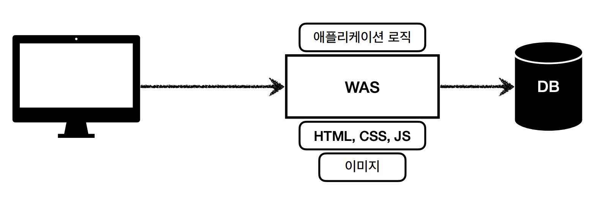
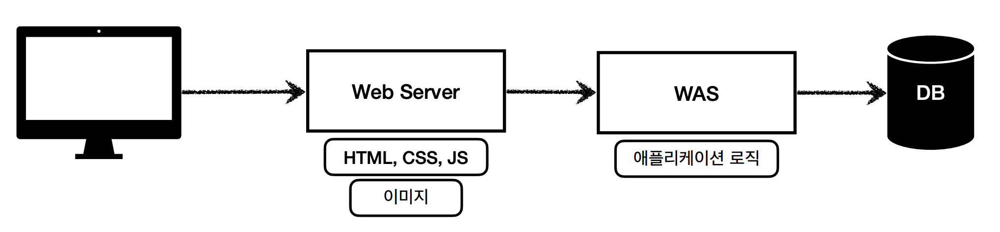
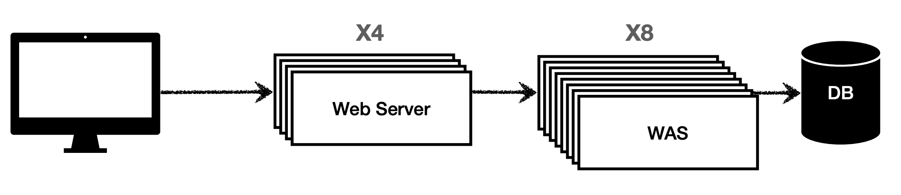

# 1. Web Application Server(WAS)

* HTTP를 기반으로 동작한다.
* 웹서버의 기능을 포함하고 있다.
  * 정적 컨텐츠 제공
* 프로그램 코드를 실행해서 애플리케이션 로직을 수행한다.
  * 동적인 컨텐츠 제공

## WAS의 주요 기능

1. 프로그램 실행 환경과 DB접속 기능을 제공한다.
2. 트랜잭션 관리 기능
3. 업무를 처리하는 비즈니스 로직 수행

**주요 WAS**

* Apache Tomcat
* Jetty
* Jeus

>  **Static web-page(정적 페이지)**
>
> * 정적 페이지(Static web-page)는 누가 언제 어디서 페이지를 요구하더라도 항상 같은 결과만을 응답하는 페이지이다.
> * 웹 서비스 제공자가 사전에 준비하여 서버에 Deploy한 컨텐츠이며, 주로 HTML, CSS, JavaScript 및 각종 미디어 파일이 해당된다
> * Web Server는 파일 경로 이름을 받아 경로와 일치하는 file contents를 반환한다.
>
> **Dynamic web-page(동적 웹 페이지)**
>
> * 클라이언트의 요구나 시간, 장소에 따라 그 결과를 다르게 반환하는 페이지이다

# 2. Web Server

* 웹 서버는 WAS의 부분 집합이다.
* 웹서버는 정적인 컨텐츠를 제공하는 역할을 한다.
  * 예) HTML pages, files, images, video
* 주로 웹 브라우저의 HTTP의 요청에 응답한다.
* 대부분의 웹 서버는 웹 서버가 동적 컨텐츠를 생성할 수 있는 스크립팅 언어용 플러그인을 지원한다.
  * 예: ASP, JSP, PHP, Perl

## Web Server가 필요한 이유

* 웹 서버는 정적 콘텐츠에 적합하고 동적 콘텐츠에 앱 서버에 적합하다.
* 대부분의 프로덕션 환경에서는 웹 서버가 WAS에 `Reverse Proxy`로 작동한다. 
* 페이지 요청을 받은 웹 서버가 정적 컨텐츠를 제공하고 필터링 기술을 상용하여 동적 콘텐츠 요청을 식별하고 WAS로 전달하여 처리 결과를 클라이언트에게 전달합니다.
* Web Server를 통해 정적인 파일들을 WAS까지 가지 않고 빠르게 응답을 줄 수 있다.
* Web Server가 정적 컨텐츠만 처리하도록 기능을 분배하여 WAS의 부담을 줄일 수 있다.
* 자원 이용의 효율성 및 장애 극복, 배포 및 유지보수의 편의성 을 위해 Web Server와 WAS를 분리한다.

# 3. WAS와 Web Server의 차이

* 둘의 경계가 모호하다.
* 주로 정적 리소스를 제공하는데 특화된 서버를 Web Server라고 한다
* 정적 리소스를 제공하는 기능에 추가적으로 비즈니스 로직을 수행하면 WAS라고 한다.
* 자바에서는 서블릿 컨테이너 기능을 제공하면 WAS라고 한다.

# 4. 웹 시스템 구성

**WAS 하나로 구성된 시스템**

* WAS가 너무 많은 일을 담당하여 서버가 과부하될 수 있다
* 정적 리소스 처리 때문에 중요한 비즈니스 로직 수행이 어려워질 수 있다. 
* WAS 장애시 오류 화면도 노출할 수 없다
* API 서버만 제공할 경우(화면이 없고 데이터만 제공)할 경우 웹 서버 없이 많이 사용한다.

**Web Server와 WAS 구성된 시스템**

* 정적 리소스는 웹 서버가 처리
* 웹 서버는 애플리케이션 로직같은 동적인 처리가 필요하면 WAS에 요청을 위임 • WAS는 
* 중요한 애플리케이션 로직 처리 전담

* 효율적인 리소스 관리
  * 정적 리소스가 많이 사용되면 Web 서버 증설
  * 애플리케이션 리소스가 많이 사용되면 WAS 증설
* 정적 리소스만 제공하는 웹 서버는 잘 죽지 않음
* 애플리케이션 로직이 동작하는 WAS 서버는 잘 죽음
* WAS, DB 장애시 WEB 서버가 오류 화면 제공 가능

참고

* https://www.ibm.com/cloud/learn/web-server-vs-application-server
* https://www.inflearn.com/course/%EC%8A%A4%ED%94%84%EB%A7%81-mvc-1/dashboard

