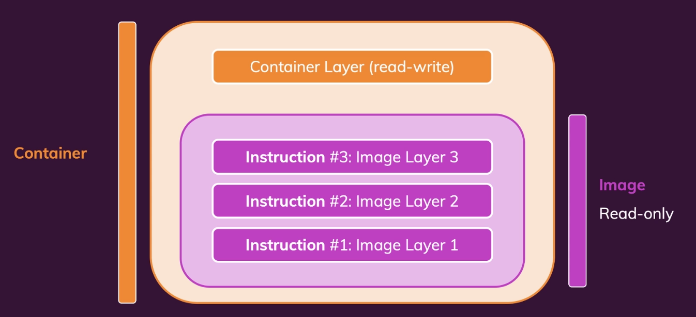
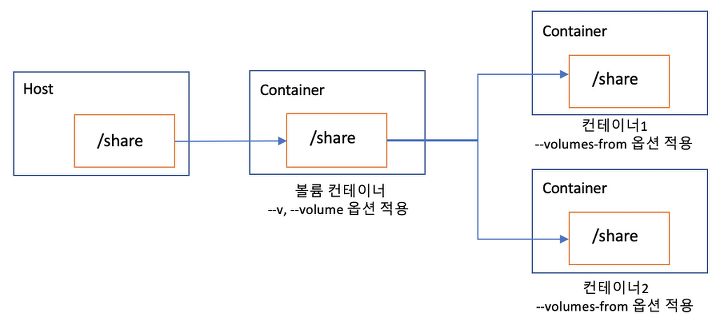

# 1. 도커 볼륨

* 쉽게 말하면 로컬 머신의 폴더이다. 볼륨은 이미지와 컨테이너 안에 있는 것이 아니고 호스트 머신에 존재한다.
* 볼륨은 호스트 머신에 존재하고 이를 컨테이너가 사용하거나 매핑시킨 것이다. 
* 한 곳의 변화는 다른 한 곳에 반영된다.
* 즉, 로컬 머신에 파일을. 추가하면 컨테이너 안에서 그 폴더를 접급할 수 있다
* 컨테이너 안에서 폴더를 추가하면 로컬 머신에서도 접근이 가능하다.

**이미지 레이어와 컨테이너 레이어**

* 도커 이미지로 컨테이너를 생성하면 이미지는 읽기 전용이 되며 컨테이너 변경 사항만 별도로 저장해서 각 컨테이너의 정보를 보존한다.
* 즉 **컨테이너 레이어**에 원래 이미지에서 변경된 파일시스템 등을 저장한다.
  * 그러나 컨테이너를 삭제하면 컨테이너 레이어에 저장된 정보도 삭제된다.
* 이를 방지하기 위해 **볼륨**을 사용해서 **데이터를 영속화**할 수 있다.
* 도커 볼륨의 종류로는 `Anonymous  Volume`, `Named Volume`, `Bind Mounts`가 있다.

# 2. Anonymous  Volume

* `docker run -v /app/data`
* `Dockerfile`에서 사용 가능
* 하나의 컨테이너의 종속적이다.

  * 컨테이너를 삭제하면 자동으로 삭제된다.

  * 컨테이너간 공유 할 수 없다.
* 매핑시킬  로컬 머신의 경로를 지정할 수 없다.

  * 호스트 머신의 경로는 도커가 관리한다.
* 데이터 영속화에 사용 할 수 없음

# 3. Named Volume

* `docker run -v data:/app/data`
* `Dokcerfile`에서 사용 불가
* 한 컨테이너의 종속적이지 않다.
  * 컨테이너를 삭제해도 볼륨은 삭제되자 않는다.
  * 컨테이너간 공유 가능
* 호스트 머신의 경로는 도커가 관리한다.
  * 파일이 실제로 어디에 저장되는지 사용자는 알 필요가 없다
  * `docker inspect --type volume {volumeName}` 명령어를 사용하면 볼륨이 실제 어디에 저장되는지 알 수 있다.
* 데이터 영속화에 사용 할 수 있음

  * 수정이 필요없는 데이터를 영속화 할 때 사용

# 4. Bind Mounts

* `docker run -v /path/to/code:/app/data`
* `Dokcerfile`에서 사용 불가
* 한 컨테이너의 종속적이지 않다.
  * 컨테이너를 삭제해도 볼륨은 삭제되지 않는다.
  * 컨테이너간 공유 가능
* 호스트 머신의 경로를 개발자가 직접 설정한다.
  * 호스트 머신의 경로는 절대경로를 사용한다.
* 데이터 영속화에 사용 할 수 있음
  * 수정이 필요한 데이터를 영속화 할 때 사용한다.
* 개발 단계에서 유용하다.
  * **개발 단계**에서 컨테이너는 실행환경을 캡슐화 해야하지만 코드는 필수가 아니다.
  * 이미지를 다시 빌드할 필요없이 컨테이너에 최신 코드를 반영할 수 있다.
  * **프로덕션 단계**에선 컨테이너는 독립적으로 동작해야된다. 따라서 Bind Mounts를 사용하지 않는다.
    * 대신 `dockerfile`에서 `COPY` 인스트럭션을 사용한다.
* 호스트에 디렉토리가 존재하지 않는 경우 컨테이너의 파일이 호스트로 복사된다.
* 호스트에 디렉토리가 이미 존재하는 경우 컨테이너의 파일을 호스트의 파일로 덮어씌운다.

# 5. 볼륨 컨테이너

* -v 옵션으로 볼륨을 사용하는 컨테이너를 다른 컨테이너와 공유할 수 있다.
* 컨테이너를 생성할 때 --volumes-from 옵션을 설정하면 볼륨을 설정한 컨테이너의 볼륨 디렉토리를 공유할 수 있다.
* 이를 활용하여 호스트에서 볼륨만 공유하고 별도의 역할을 담당하지 않는 `볼륨 컨테이너`로서 활용할 수 있다.