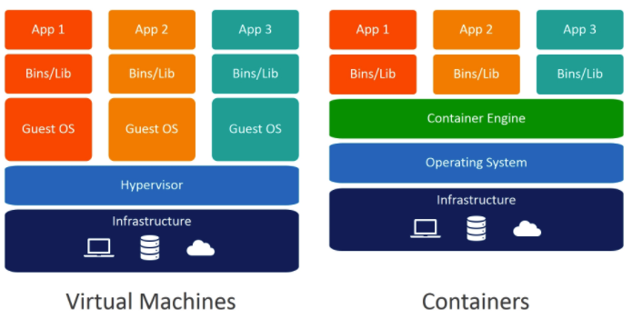

# 1. 도커

> 컨테이너를 사용하여 응용 프로그램을 더 쉽게 만들고 배포하고 실행할 수 있도록 설계된 도구 이며 컨테이너 기반의 오픈소스 가상화 플랫폼이며 생태계 입니다.


# 2.도커와 기존 가상화 기술



공통점

* 도커 컨테이너와 가상 머신은 기본 하드웨어에서 격리된 한경 내에 애플리케이션을 배치하는 방법입니다.

차이점

* 격리된 환경을 얼마나 격리 시킬 것인가.

도커

* 하이퍼 바이저와 게스트 OS가 필요하지 않으므로 더 가볍다.
* 어플리케이션을 실행할 때 호스트 OS위에 어플리케이션의 실행 패키지인 이미지를 배포하기만 하면 된다.
* 즉, 공유, re-building이 쉽다.
* 같은 호스트의 다른 컨테이너와 동일한 커널을 공유한다.
* 디스크 공간을 적게 차지한다.
* 리눅스의 자체 기능인 chroot, 네임스페이스, cgroup을 이용하여 프로세스 단위의 격리 환경을 만들기 때문에 성능 손실이 거의 없다.

VM 

* 어플리케이션을 실행 하기 위해서 VM을 띄우고 자원을 할당한 다음, 게스트 OS를 부팅하여 어플리케이션을 실행한다
* 가상머신을 추가할 때마다 가상 OS 또한 추가되므로 많은 자원이 낭비된다.(CPU, 메모리 등)
* 공유, re-building이 가능하지만 복잡하다.
* VM 내부에서 실행되는 모든 것은 호스트 운영체제와 하이퍼 바이저와 독립되어 있다.
* 디스크 공간을 많이 차지한다.


# 3.도커 설치

* 우분투 기준

```shell
#Uninstall old versions
sudo apt-get remove docker docker-engine docker.io containerd runc

#SET UP THE REPOSITORY
sudo apt-get update
sudo apt-get install \
    apt-transport-https \
    ca-certificates \
    curl \
    gnupg-agent \
    software-properties-common

#Add Docker’s official GPG key
curl -fsSL https://download.docker.com/linux/ubuntu/gpg | sudo apt-key add -

sudo add-apt-repository \
   "deb [arch=amd64] https://download.docker.com/linux/ubuntu \
   $(lsb_release -cs) \
   stable"
   
#INSTALL DOCKER ENGINE
sudo apt-get update
sudo apt-get install docker-ce docker-ce-cli containerd.io

#To run Docker without root privileges
sudo usermod -aG docker $USER
```

* 아마존 리눅스 기준

```bash
sudo yum update -y

# 최신 도커 엔진 패키지를 설치합니다.
sudo amazon-linux-extras install docker

sudo yum install docker

# 도커 서비스를 시작합니다.
sudo service docker start

# ec2-user를 사용하지 않고도 도커 명령을 실행할 수 있도록 docker 그룹에 sudo.를 추가합니다.
sudo usermod -a -G docker ec2-user

# 도커 컴포즈 설치
sudo curl -L "https://github.com/docker/compose/releases/download/1.28.2/docker-compose-$(uname -s)-$(uname -m)" -o /usr/local/bin/docker-compose

sudo chmod +x /usr/local/bin/docker-compose

#섪치 확인
docker-compose --version
```

* cent os

```bash
#Uninstall old versions
sudo yum remove docker \
                  docker-client \
                  docker-client-latest \
                  docker-common \
                  docker-latest \
                  docker-latest-logrotate \
                  docker-logrotate \
                  docker-engine
  
#Set up the repository
sudo yum install -y yum-utils
sudo yum-config-manager \
--add-repo \
https://download.docker.com/linux/centos/docker-ce.repo

#Install Docker Engine
sudo yum install docker-ce docker-ce-cli containerd.io

#Start Docker
sudo systemctl start docker
sudo usermod -a -G docker $USER

#docker-compose install
sudo curl -L "https://github.com/docker/compose/releases/download/1.29.2/docker-compose-$(uname -s)-$(uname -m)" -o /usr/local/bin/docker-compose
sudo chmod +x /usr/local/bin/docker-compose
```

