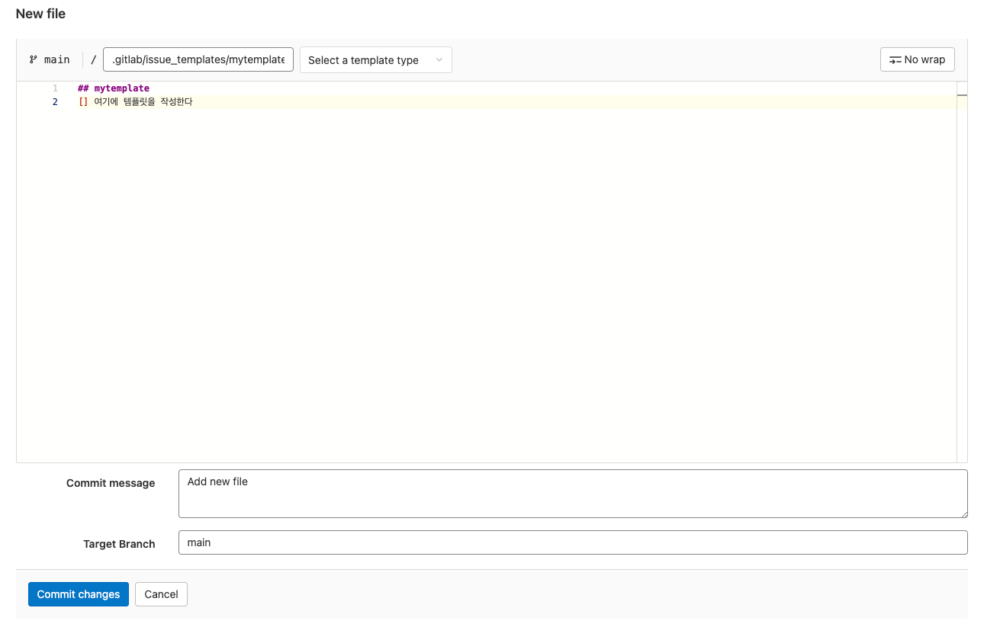
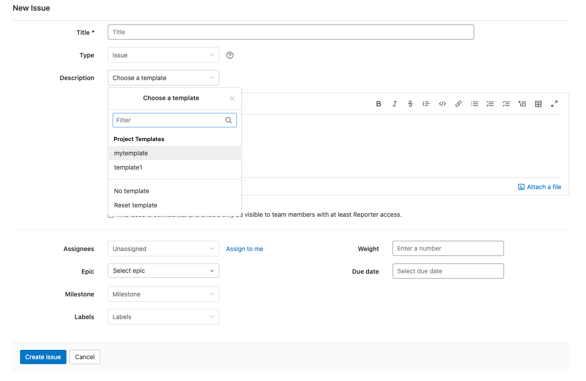
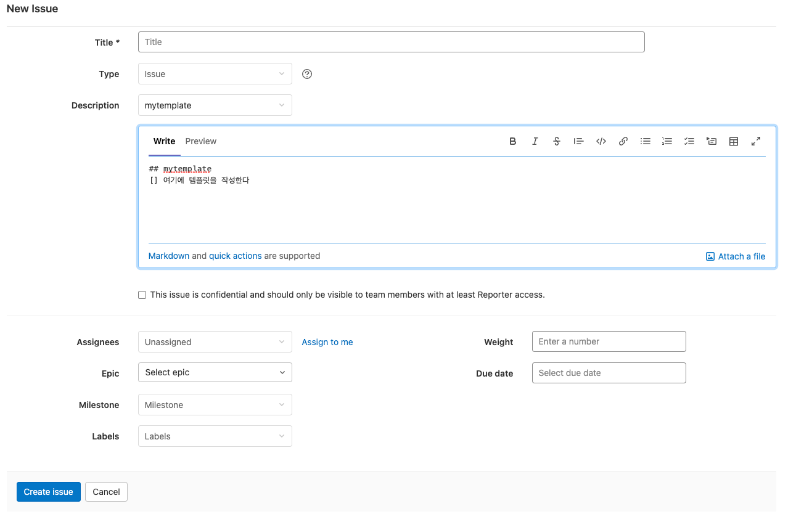

# 1 Description templates

* 이슈나 머지 리퀘스트를 등록할 때 편리하게 미리 템플릿을 만들 수 있다
* 템플릿을 프로젝트, 그룹, 인스턴스에 정의할 수 있다
  * 프로젝트는 상위 레벨에 정의된 템플릿을 그대로 쓴다
  * 그룹 레벨과 인스턴스 레벨은 프리미엄 이용자만 쓸 수 있다
* feature proposal, feature improvement, or a bug report 등 용도에 맞게 각각 템플릿을 만들어 사용해보자

# 2 issue template 만들기

1. 템플릿을 적용한 리포지토리에 들어간다
2. default branch 옆에 `+` 버튼을 누른다
3. New file 선택
4. default branch 옆 텍스트 박스에 `.gitlab/issue_templates/mytemplate.md` 과 같이 입력한다
   * 여기서 `mytemplate` 이 지금 만드는 템플릿의 이름이 된다
   * 아래 텍스트 박스에 원하는 템플릿을 작성한다
5. 커밋한다

# 3 merge request template 만들기

1. 템플릿을 적용한 리포지토리에 들어간다
2. default branch 옆에 `+` 버튼을 누른다
3. New file 선택
4. default branch 옆 텍스트 박스에 `.gitlab/merge_request_templates/mytemplate.md` 과 같이 입력한다
   * 여기서 `mytemplate` 이 지금 만드는 템플릿의 이름이 된다
   * 아래 텍스트 박스에 원하는 템플릿을 작성한다
5. 커밋한다

# 4 템플릿 사용하기

1. 새로운 이슈나 머지 리퀘스트를 만든다
2. **Choose a template** 드롭다운 리스트를 클릭한다
3. 만약 Description 텍스트 박스가 비어있다면 템플릿을 제대로 등록했는지 확인하자
4. 드롭다운 리스트에서 만들어 놓은 템플릿을 골라 사용한다

**템플릿 선택 후**

참고

* https://docs.gitlab.com/ee/user/project/description_templates.html