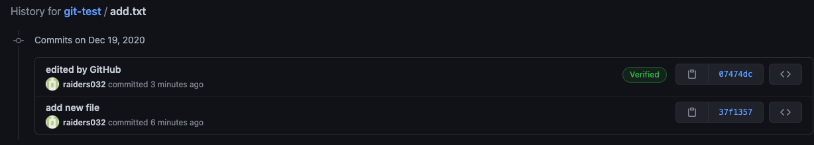
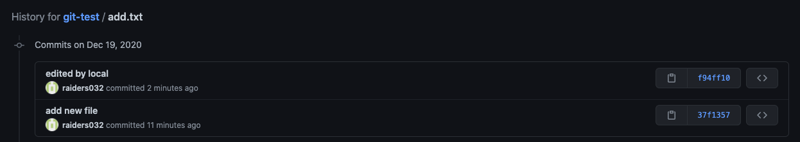
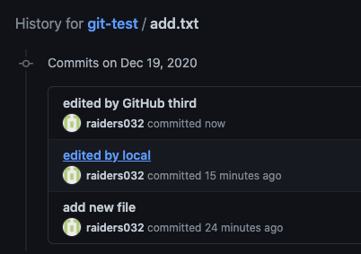
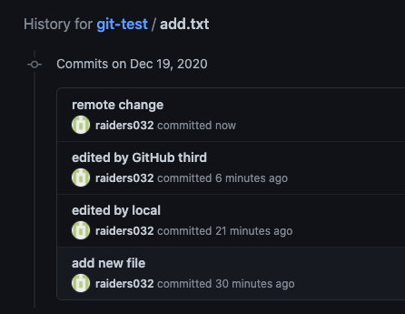

## 기본

### 3.1 깃의 중요한 컨셉 이해하기

* 깃 워크플로우
  * working directory
    * untracked
    * tracked
      * unmodified
      * modified
      * deleted
  * staging area(index)
    * new file
  * .git directory(git repository)
  * remote git repository

### 3.2 로컬 파일들 추가하기 add

* `git add <file>`
  * working directory -> staging area
* `git rm --cached  <file>`
  * staging area -> working directory

### 3.3 절대 추가 하면 안되는 아이들 ignore

* .gitignore

### 3.4 현재 상태 확인하기 status

* `git status`
* `git status -s`

### 3.5 파일 비교하기 diff

* `git diff`

* `git diff --staged` 

* `git config --global -e`

  * ```
    # 추가
    [diff]
        tool=vscode
    [difftool "vscode"]
        cmd = code --wait --diff $LOCAL $REMOTE
    ```

* `git difftool`
* `git difftool--staged`

### 3.6 버전 등록하기 commit

* `git commit`
* `git commit -m "message"`
* `git commit -am "message"`
  * working directory 와 staging area의 모든 변경사항을 커밋

3.7 커밋할때 팁 💯

3.8 소스트리로 커밋하기

### 3.9 파일 변경시 유용한 팁

* `git rm <file>`
* `git mv <file>`

### 3.10 버전들 목록 보기 log

* 실습: git-log
* `git log`
* `git log -p`
* `git log --oneline`
* `git log --reverse`
* HEAD

### 3.11 로그 이쁘게 만들기

* 실습: git-log

* `git log --online --graph --all`

* alias 만들기

  * `git hist`

  * ```bash
    git config --global alias.hist "log --graph --all --pretty=format:'%C(yellow)[%ad]%C(reset) %C(green)[%h]%C(reset) | %C(white)%s %C(bold red){{%an}}%C(reset) %C(blue)%d%C(reset)' --date=short"
    ```

### 3.12 로그 심화 내용

* `git log -3`
* `git log --author="nys"`
* `git log --before="2020-10-10"`
* `git log --grep="text"`
* `git log -S "about" -p`
* `git log -p <file>`
* `git log HEAD~1`
* `git show hash`
* `git show hash:filename`
* `git diff hash1 hash2`

3.13 소스트리로 로그보기

3.14 태그는 왜 필요할까? tag

### 3.15 태그 데모

* 실습: git-log
* `git tag tagname`
* `git tag tagname hash`
* `git tag tagname hash -am "Release note"`
* `git show tagname`
* `git tag`
* `git tag -l "1.0.*"`
* `git tag -d tagname`
* `git checkout tagname`
* `git chekcout -c branchname tagname`
* `git push origin tagname`
* `git push origin --tags`
* `git push origin --delete tagname`

## 브랜치

4.1 브랜치를 왜 꼭 써야 할까?

### 4.2 브랜치 기본 사용법

* 실습: git-branch
* `git branch`
* `git branch -v`
* `git branch --merged`
* `git bracn --no-merged`
* `git branch --all`
* `git branch branch name`
* `git branch --move oldname newname`
* `git branch -d branchname`
  * `git push origin --delete branchname`
* `git switch branchname`
* `git switch -C branchname`
* `git chekcout hash`
* `git chekcout branchname`
* `git chekcout -b branchname`
* `git log master..test`

### 4.3 머지란? fast-forward merge

* 실습 : git-merge
* `git merge branchname`
  * `git branch -d branchname`

### 4.4 머지 옵션 no-ff

* `git merge --no-ff branchname`
  * `git branch -d branchname`

### 4.5 머지의 중요한 컨셉, three-way merge

* `git merge feature-b`

* ```bash
  # git-merge 실습 최종 결과
  *   [2020-12-19] [6a1e1a3] | Merge branch 'feature-b' {{raiders032}}  (HEAD -> master)
  |\
  | * [2020-10-28] [7619c90] | h {{Ellie}}
  | * [2020-10-28] [769df87] | g {{Ellie}}
  * |   [2020-12-19] [851fe05] | Merge branch 'feature-c' {{raiders032}}
  |\ \
  | * | [2020-12-19] [e449b90] | feature c {{raiders032}}
  |/ /
  * | [2020-10-28] [aaf6522] | f {{Ellie}}
  * | [2020-10-28] [59127a9] | e {{Ellie}}
  |/
  * [2020-10-28] [2797019] | d {{Ellie}}
  * [2020-10-28] [e8515d8] | c {{Ellie}}
  * [2020-10-28] [d0d15b4] | b {{Ellie}}
  * [2020-10-28] [2c9e233] | a {{Ellie}}
  ```

### 4.6 Conflict 해결 방법

* 실습: git-conflict
* `git merge feature`
* `git merge --abort`
* `git add main.txt`
* `git merge --continue`

```bash
git merge feature
Auto-merging main.txt
CONFLICT (content): Merge conflict in main.txt
Automatic merge failed; fix conflicts and then commit the result.

git status
On branch master
You have unmerged paths.
  (fix conflicts and run "git commit")
  (use "git merge --abort" to abort the merge)

Unmerged paths:
  (use "git add <file>..." to mark resolution)
        both modified:   main.txt

no changes added to commit (use "git add" and/or "git commit -a")

cat main.txt
...
<<<<<<< HEAD
Oh.. Here!! From master branch!
=======
Oh.. Here!! From feature branch!
>>>>>>> feature
...

# 머지 취소
# git merge --abort
git status
On branch master
You have unmerged paths.
  (fix conflicts and run "git commit")
  (use "git merge --abort" to abort the merge)

Unmerged paths:
  (use "git add <file>..." to mark resolution)
        both modified:   main.txt

no changes added to commit (use "git add" and/or "git commit -a")
git add main.txt
git status
On branch master
All conflicts fixed but you are still merging.
  (use "git commit" to conclude merge)

Changes to be committed:
        modified:   main.txt
git merge --continue
```

### 4.7 VS Code로 Conflict 해결하기

* 실습: git-confilct

```bash
git config --global -e

# 다음과 같이 수정
[merge]
    tool = vscode
[mergetool]
        keepBackup = false
[mergetool "vscode"]
    cmd = code --wait $MERGED
    
git merge feature
git mergetool
# conflict 해결
git merge --continue
```

### 4.8 P4Merge로 Conflict 해결하기

* 실습: git-confilct

```bash
git config --global -e

# 다음과 같이 수정
[merge]
    tool = p4merge
[mergetool]
    keepBackup = false
[mergetool "p4merge"]
    path = "/Applications/p4merge.app/Contents/MacOS/p4merge"

git merge feature
git mergetool
# conflict 해결
git status
On branch master
All conflicts fixed but you are still merging.
  (use "git commit" to conclude merge)

Changes to be committed:
        modified:   main.txt
git merge --continue
```

### 4.9 Rebase란 무엇일까? 왜 꿀일까? 🐝

* 다른 개발자와 같은 브랜치에서 작업할 때는 사용하지 말자.
* 서버에 업데이트되지 않은 로컬의 커밋에만 사용하자.
* rebase를 통해 fast-forward merge를 해보자

```bash
git his
* [2020-10-28] [7619c90] | h {{Ellie}}  (feature-b)
* [2020-10-28] [769df87] | g {{Ellie}}
| * [2020-10-28] [aaf6522] | f {{Ellie}}  (HEAD -> master, feature-a)
| * [2020-10-28] [59127a9] | e {{Ellie}}
|/
* [2020-10-28] [2797019] | d {{Ellie}}
* [2020-10-28] [e8515d8] | c {{Ellie}}
* [2020-10-28] [d0d15b4] | b {{Ellie}}
* [2020-10-28] [2c9e233] | a {{Ellie}}
git checkout feature-b
git rebase master
git his
* [2020-10-28] [6e20c24] | h {{Ellie}}  (HEAD -> feature-b)
* [2020-10-28] [df285a7] | g {{Ellie}}
* [2020-10-28] [aaf6522] | f {{Ellie}}  (master, feature-a)
* [2020-10-28] [59127a9] | e {{Ellie}}
* [2020-10-28] [2797019] | d {{Ellie}}
* [2020-10-28] [e8515d8] | c {{Ellie}}
* [2020-10-28] [d0d15b4] | b {{Ellie}}
* [2020-10-28] [2c9e233] | a {{Ellie}}
git switch master
git merge feature-b
git branch -d feature-b
git his
* [2020-10-28] [3235f5e] | h {{Ellie}}  (HEAD -> master)
* [2020-10-28] [2838808] | g {{Ellie}}
* [2020-10-28] [aaf6522] | f {{Ellie}}  (feature-a)
* [2020-10-28] [59127a9] | e {{Ellie}}
* [2020-10-28] [2797019] | d {{Ellie}}
* [2020-10-28] [e8515d8] | c {{Ellie}}
* [2020-10-28] [d0d15b4] | b {{Ellie}}
* [2020-10-28] [2c9e233] | a {{Ellie}}
```

### 4.10 브랜치들 사이에서의 Rebase팁!

* 실습: git-rebase-onto

```bash
git his
* [2020-10-28] [f2b9178] | Add ProfileService Interface {{Ellie}}  (profile)
| * [2020-10-28] [5a090bf] | Add profile UI {{Ellie}}  (profile-ui)
|/
* [2020-10-28] [cd9c9e7] | Add tests for ProfileService {{Ellie}}
* [2020-10-28] [dc89240] | Add ProfileService {{Ellie}}
* [2020-10-28] [bbac9d0] | Add LoginService {{Ellie}}  (HEAD -> master)
git rebase --onto master profile profile-ui
First, rewinding head to replay your work on top of it...
Applying: Add profile UI
git his
* [2020-10-28] [184ca1d] | Add profile UI {{Ellie}}  (HEAD -> profile-ui)
| * [2020-10-28] [f2b9178] | Add ProfileService Interface {{Ellie}}  (profile)
| * [2020-10-28] [cd9c9e7] | Add tests for ProfileService {{Ellie}}
| * [2020-10-28] [dc89240] | Add ProfileService {{Ellie}}
|/
* [2020-10-28] [bbac9d0] | Add LoginService {{Ellie}}  (master)
git switch master
git merge profile-ui
git branch -d profile-ui
* [2020-10-28] [184ca1d] | Add profile UI {{Ellie}}  (HEAD -> master)
| * [2020-10-28] [f2b9178] | Add ProfileService Interface {{Ellie}}  (profile)
| * [2020-10-28] [cd9c9e7] | Add tests for ProfileService {{Ellie}}
| * [2020-10-28] [dc89240] | Add ProfileService {{Ellie}}
|/
* [2020-10-28] [bbac9d0] | Add LoginService {{Ellie}}
```

4.11 필요한 커밋만 쏘옥~! 🍒

```bash
git his
* [2020-10-28] [184ca1d] | Add profile UI {{Ellie}}  (HEAD -> master)
| * [2020-10-28] [f2b9178] | Add ProfileService Interface {{Ellie}}  (profile)
| * [2020-10-28] [cd9c9e7] | Add tests for ProfileService {{Ellie}}
| * [2020-10-28] [dc89240] | Add ProfileService {{Ellie}}
|/
* [2020-10-28] [bbac9d0] | Add LoginService {{Ellie}}
git cherry-pick f2b9178
git his
* [2020-10-28] [f4961c0] | Add ProfileService Interface {{Ellie}}  (HEAD -> master)
* [2020-10-28] [184ca1d] | Add profile UI {{Ellie}}
| * [2020-10-28] [f2b9178] | Add ProfileService Interface {{Ellie}}  (profile)
| * [2020-10-28] [cd9c9e7] | Add tests for ProfileService {{Ellie}}
| * [2020-10-28] [dc89240] | Add ProfileService {{Ellie}}
|/
* [2020-10-28] [bbac9d0] | Add LoginService {{Ellie}}
```

### 4.12 소스트리 활용


## 스태쉬

5.1 Stash란 무엇이고 왜 중요할까?

### 5.2 Stash 데모

* 실습: git-branch

```bash
echo add >> about.txt
git status
On branch master
Changes not staged for commit:
  (use "git add <file>..." to update what will be committed)
  (use "git restore <file>..." to discard changes in working directory)
        modified:   about.txt

no changes added to commit (use "git add" and/or "git commit -a")
git stash push -m "first try"
git status
On branch master
nothing to commit, working tree clean
echo add >> about.txt
git status -s
 M about.txt
git add .
git status
On branch master
Changes to be committed:
  (use "git restore --staged <file>..." to unstage)
        modified:   about.txt
git stash push -m "second try" --keep-index
git status
On branch master
Changes to be committed:
  (use "git restore --staged <file>..." to unstage)
        modified:   about.txt
echo new > new.txt
git status
On branch master
Changes to be committed:
  (use "git restore --staged <file>..." to unstage)
        modified:   about.txt

Untracked files:
  (use "git add <file>..." to include in what will be committed)
        new.txt
git stash
git status
On branch master
Untracked files:
  (use "git add <file>..." to include in what will be committed)
        new.txt

nothing added to commit but untracked files present (use "git add" to track)

git stash -u
git status
On branch master
nothing to commit, working tree clean

git stash list
git stash show stash@{1}
git stash show stash@{1} -p

git stash apply stash@{1}
git stash pop
git stash drop stash@{1}
git stash clear
git stash branch newBranch
```

5.3 소스트리로 Stash 활용하기


## undo

6.1 실수를 만회하는 방법들

6.1.1 데모 프로젝트 소개

### 6.2 커밋전 아이들 취소하기

* 실습: git-undo

```bash
echo add >> payment-ui.txt
git status
On branch master
Changes not staged for commit:
  (use "git add <file>..." to update what will be committed)
  (use "git restore <file>..." to discard changes in working directory)
        modified:   payment-ui.txt

no changes added to commit (use "git add" and/or "git commit -a")

git restore payment-ui.txt
git status
On branch master
nothing to commit, working tree clean

echo add >> payment-ui.txt
git add .
git status
On branch master
Changes to be committed:
  (use "git restore --staged <file>..." to unstage)
        modified:   payment-ui.txt

git restore --staged payment-ui.txt
git status
On branch master
Changes not staged for commit:
  (use "git add <file>..." to update what will be committed)
  (use "git restore <file>..." to discard changes in working directory)
        modified:   payment-ui.txt

no changes added to commit (use "git add" and/or "git commit -a")

git reset HEAD
Unstaged changes after reset:
M       payment-ui.txt

git add .
git status
On branch master
Changes to be committed:
  (use "git restore --staged <file>..." to unstage)
        modified:   payment-ui.txt
git restore --staged .
git restore .
git status
On branch master
nothing to commit, working tree clean

git restore --source=HEAD~2 payment-ui.txt
git status
On branch master
Changes not staged for commit:
  (use "git add/rm <file>..." to update what will be committed)
  (use "git restore <file>..." to discard changes in working directory)
        deleted:    payment-ui.txt

no changes added to commit (use "git add" and/or "git commit -a")
```

### 6.3 커밋을 수정하기

* 6.2 이어서 실습

```bash
git his
* [2020-11-01] [0ddd7ab] | Add payment UI {{Ellie}}  (HEAD -> master)
* [2020-11-01] [e94152f] | . {{Ellie}}
* [2020-11-01] [fa7bbd6] | Add payment client {{Ellie}}
* [2020-11-01] [1d11be8] | WIP {{Ellie}}
* [2020-11-01] [98955fc] | Add payment library and Add payment service {{Ellie}}
* [2020-11-01] [707de7d] | Setup Dependencies {{Ellie}}
* [2020-11-01] [20ee16f] | Initialise Project {{Ellie}}

echo add > add.txt
git add .
git commit -m "."
git his
* [2020-12-19] [d224a3f] | . {{raiders032}}  (HEAD -> master)
* [2020-11-01] [0ddd7ab] | Add payment UI {{Ellie}}
* [2020-11-01] [e94152f] | . {{Ellie}}
* [2020-11-01] [fa7bbd6] | Add payment client {{Ellie}}
* [2020-11-01] [1d11be8] | WIP {{Ellie}}
* [2020-11-01] [98955fc] | Add payment library and Add payment service {{Ellie}}
* [2020-11-01] [707de7d] | Setup Dependencies {{Ellie}}
* [2020-11-01] [20ee16f] | Initialise Project {{Ellie}}
# 커밋 메세지 변경하기
git commit --amend -m "add new file"
git his
* [2020-12-19] [1a707e9] | add new file {{raiders032}}  (HEAD -> master)
* [2020-11-01] [0ddd7ab] | Add payment UI {{Ellie}}
* [2020-11-01] [e94152f] | . {{Ellie}}
* [2020-11-01] [fa7bbd6] | Add payment client {{Ellie}}
* [2020-11-01] [1d11be8] | WIP {{Ellie}}
* [2020-11-01] [98955fc] | Add payment library and Add payment service {{Ellie}}
* [2020-11-01] [707de7d] | Setup Dependencies {{Ellie}}
* [2020-11-01] [20ee16f] | Initialise Project {{Ellie}}

# 커밋 파일 수정 전
cat add.txt
add
# 커밋 파일 수정 후
cat add.txt
fixed
git status
On branch master
Changes not staged for commit:
  (use "git add <file>..." to update what will be committed)
  (use "git restore <file>..." to discard changes in working directory)
        modified:   add.txt

no changes added to commit (use "git add" and/or "git commit -a")
git add .
git commit --amend
git show HEAD
commit 7bdd49a1232065333e3ed858fbe7154708543076 (HEAD -> master)
Author: raiders032 <nameks@naver.com>
Date:   Sat Dec 19 16:27:21 2020 +0900

    add new file

diff --git a/add.txt b/add.txt
new file mode 100644
index 0000000..eaaa2f8
--- /dev/null
+++ b/add.txt
@@ -0,0 +1 @@
+fixed
```

### 6.4 리셋 그리고 리셋

```bash
git his
* [2020-12-19] [7bdd49a] | add new file {{raiders032}}  (HEAD -> master)
* [2020-11-01] [0ddd7ab] | Add payment UI {{Ellie}}
* [2020-11-01] [e94152f] | . {{Ellie}}
* [2020-11-01] [fa7bbd6] | Add payment client {{Ellie}}
* [2020-11-01] [1d11be8] | WIP {{Ellie}}
* [2020-11-01] [98955fc] | Add payment library and Add payment service {{Ellie}}
* [2020-11-01] [707de7d] | Setup Dependencies {{Ellie}}
* [2020-11-01] [20ee16f] | Initialise Project {{Ellie}}

git reset HEAD~2
git his
* [2020-11-01] [e94152f] | . {{Ellie}}  (HEAD -> master)
* [2020-11-01] [fa7bbd6] | Add payment client {{Ellie}}
* [2020-11-01] [1d11be8] | WIP {{Ellie}}
* [2020-11-01] [98955fc] | Add payment library and Add payment service {{Ellie}}
* [2020-11-01] [707de7d] | Setup Dependencies {{Ellie}}
* [2020-11-01] [20ee16f] | Initialise Project {{Ellie}}

git status
On branch master
Changes not staged for commit:
  (use "git add <file>..." to update what will be committed)
  (use "git restore <file>..." to discard changes in working directory)
        modified:   payment-ui.txt

Untracked files:
  (use "git add <file>..." to include in what will be committed)
        add.txt

no changes added to commit (use "git add" and/or "git commit -a")

git restore .
git status
On branch master
Untracked files:
  (use "git add <file>..." to include in what will be committed)
        add.txt

nothing added to commit but untracked files present (use "git add" to track)
git clean -fd
git status
On branch master
nothing to commit, working tree clean

git reset --soft HEAD~1
git his
* [2020-11-01] [fa7bbd6] | Add payment client {{Ellie}}  (HEAD -> master)
* [2020-11-01] [1d11be8] | WIP {{Ellie}}
* [2020-11-01] [98955fc] | Add payment library and Add payment service {{Ellie}}
* [2020-11-01] [707de7d] | Setup Dependencies {{Ellie}}
* [2020-11-01] [20ee16f] | Initialise Project {{Ellie}}
git status
On branch master
Changes to be committed:
  (use "git restore --staged <file>..." to unstage)
        new file:   payment-ui.txt
        
git reset --hard HEAD
git his
* [2020-11-01] [fa7bbd6] | Add payment client {{Ellie}}  (HEAD -> master)
* [2020-11-01] [1d11be8] | WIP {{Ellie}}
* [2020-11-01] [98955fc] | Add payment library and Add payment service {{Ellie}}
* [2020-11-01] [707de7d] | Setup Dependencies {{Ellie}}
* [2020-11-01] [20ee16f] | Initialise Project {{Ellie}}
git status
On branch master
nothing to commit, working tree clean

git reset --hard HEAD~2
git his
* [2020-11-01] [98955fc] | Add payment library and Add payment service {{Ellie}}  (HEAD -> master)
* [2020-11-01] [707de7d] | Setup Dependencies {{Ellie}}
* [2020-11-01] [20ee16f] | Initialise Project {{Ellie}}
git status
On branch master
nothing to commit, working tree clean
```

### 6.5 실수를 만회하는 꿀팁 🍯

* 6.4 이어서 실습

```bash
git reflog
98955fc (HEAD -> master) HEAD@{0}: reset: moving to HEAD~2
fa7bbd6 HEAD@{1}: reset: moving to HEAD
fa7bbd6 HEAD@{2}: reset: moving to HEAD~1
e94152f HEAD@{3}: reset: moving to HEAD~2
7bdd49a HEAD@{4}: commit (amend): add new file
1a707e9 HEAD@{5}: commit (amend): add new file
d224a3f HEAD@{6}: commit: .

git reset --hard d224a3f
git his
* [2020-12-19] [d224a3f] | . {{raiders032}}  (HEAD -> master)
* [2020-11-01] [0ddd7ab] | Add payment UI {{Ellie}}
* [2020-11-01] [e94152f] | . {{Ellie}}
* [2020-11-01] [fa7bbd6] | Add payment client {{Ellie}}
* [2020-11-01] [1d11be8] | WIP {{Ellie}}
* [2020-11-01] [98955fc] | Add payment library and Add payment service {{Ellie}}
* [2020-11-01] [707de7d] | Setup Dependencies {{Ellie}}
* [2020-11-01] [20ee16f] | Initialise Project {{Ellie}}

git reflog
d224a3f (HEAD -> master) HEAD@{0}: reset: moving to d224a3f
98955fc HEAD@{1}: reset: moving to HEAD~2
fa7bbd6 HEAD@{2}: reset: moving to HEAD
fa7bbd6 HEAD@{3}: reset: moving to HEAD~1
e94152f HEAD@{4}: reset: moving to HEAD~2
7bdd49a HEAD@{5}: commit (amend): add new file
1a707e9 HEAD@{6}: commit (amend): add new file
d224a3f (HEAD -> master) HEAD@{7}: commit: .
0ddd7ab HEAD@{8}: commit: Add payment UI
e94152f HEAD@{9}: commit: .
```

6.6 삽질 방지 꿀팁 🍯

### 6.7 취소사항을 버전으로 남기기

* 실습: git-undo

```bash
git his
* [2020-11-01] [0ddd7ab] | Add payment UI {{Ellie}}  (HEAD -> master)
* [2020-11-01] [e94152f] | . {{Ellie}}
* [2020-11-01] [fa7bbd6] | Add payment client {{Ellie}}
* [2020-11-01] [1d11be8] | WIP {{Ellie}}
* [2020-11-01] [98955fc] | Add payment library and Add payment service {{Ellie}}
* [2020-11-01] [707de7d] | Setup Dependencies {{Ellie}}
* [2020-11-01] [20ee16f] | Initialise Project {{Ellie}}

git revert fa7bbd6
* [2020-12-19] [d2c8d86] | Revert "Add payment client" {{raiders032}}  (HEAD -> master)
* [2020-11-01] [0ddd7ab] | Add payment UI {{Ellie}}
* [2020-11-01] [e94152f] | . {{Ellie}}
* [2020-11-01] [fa7bbd6] | Add payment client {{Ellie}}
* [2020-11-01] [1d11be8] | WIP {{Ellie}}
* [2020-11-01] [98955fc] | Add payment library and Add payment service {{Ellie}}
* [2020-11-01] [707de7d] | Setup Dependencies {{Ellie}}
* [2020-11-01] [20ee16f] | Initialise Project {{Ellie}}

git show fa7bbd6
commit fa7bbd67db54237abe5782e9eefa10781d211fbe
Author: Ellie <dream.coder.ellie@gmail.com>
Date:   Sun Nov 1 11:14:38 2020 +0900

    Add payment client

diff 
--git a/payment-client.txt b/payment-client.txt
index 9c595a6..24e230f 100644
--- a/payment-client.txt
+++ b/payment-client.txt
@@ -1 +1 @@
-temp
+Implement Payment Client
\ No newline at end of file

git show HEAD
Author: raiders032 <nameks@naver.com>
Date:   Sat Dec 19 17:15:50 2020 +0900

    Revert "Add payment client"

    This reverts commit fa7bbd67db54237abe5782e9eefa10781d211fbe.

diff --git a/payment-client.txt b/payment-client.txt
index 24e230f..9c595a6 100644
--- a/payment-client.txt
+++ b/payment-client.txt
@@ -1 +1 @@
-Implement Payment Client
\ No newline at end of file
+temp

# 잘 사용하지 않는다.
git revert --no-commit 1d11be8
git status
On branch master
You are currently reverting commit 1d11be8.
  (all conflicts fixed: run "git revert --continue")
  (use "git revert --abort" to cancel the revert operation)

Changes to be committed:
  (use "git restore --staged <file>..." to unstage)
        deleted:    payment-client.txt
```

### 6.8 이전 커밋 수정하기

* 실습: git-undo

```bash
git his
* [2020-11-01] [0ddd7ab] | Add payment UI {{Ellie}}  (HEAD -> master)
* [2020-11-01] [e94152f] | . {{Ellie}}
* [2020-11-01] [fa7bbd6] | Add payment client {{Ellie}}
* [2020-11-01] [1d11be8] | WIP {{Ellie}}
* [2020-11-01] [98955fc] | Add payment library and Add payment service {{Ellie}}
* [2020-11-01] [707de7d] | Setup Dependencies {{Ellie}}
* [2020-11-01] [20ee16f] | Initialise Project {{Ellie}}

# WIP 커밋메세지를 수정하려한다.
git rebase -i 98955fc

pick 1d11be8 WIP
pick fa7bbd6 Add payment client
pick e94152f .
pick 0ddd7ab Add payment UI

# 다음과 같이 수정하고 저장
r 1d11be8 WIP
pick fa7bbd6 Add payment client
pick e94152f .
pick 0ddd7ab Add payment UI

git his
* [2020-11-01] [bb44bec] | Add payment UI {{Ellie}}  (HEAD -> master)
* [2020-11-01] [3c2c3c5] | . {{Ellie}}
* [2020-11-01] [2241a83] | Add payment client {{Ellie}}
* [2020-11-01] [d9d638c] | edit commit meassge {{Ellie}}
* [2020-11-01] [98955fc] | Add payment library and Add payment service {{Ellie}}
* [2020-11-01] [707de7d] | Setup Dependencies {{Ellie}}
* [2020-11-01] [20ee16f] | Initialise Project {{Ellie}}

```

### 6.9 필요없는 커밋 삭제하기 ❓💡

* 실습: git-undo

```bash
# 커밋 삭제하기
* [2020-11-01] [e94152f] | . {{Ellie}}
```

```bash
git his
* [2020-11-01] [0ddd7ab] | Add payment UI {{Ellie}}  (HEAD -> master)
* [2020-11-01] [e94152f] | . {{Ellie}}
* [2020-11-01] [fa7bbd6] | Add payment client {{Ellie}}
* [2020-11-01] [1d11be8] | WIP {{Ellie}}
* [2020-11-01] [98955fc] | Add payment library and Add payment service {{Ellie}}
* [2020-11-01] [707de7d] | Setup Dependencies {{Ellie}}
* [2020-11-01] [20ee16f] | Initialise Project {{Ellie}}

git rebase -i fa7bbd6

# 다음과 같이 수정하고 저장
drop e94152f .
pick 0ddd7ab Add payment UI

# CONFLICT 빌셍
CONFLICT (modify/delete): payment-ui.txt deleted in HEAD and modified in 0ddd7ab... Add payment UI. Version 0ddd7ab... Add payment UI of payment-ui.txt left in tree.
error: could not apply 0ddd7ab... Add payment UI
Resolve all conflicts manually, mark them as resolved with
"git add/rm <conflicted_files>", then run "git rebase --continue".
You can instead skip this commit: run "git rebase --skip".
To abort and get back to the state before "git rebase", run "git rebase --abort".
Could not apply 0ddd7ab... Add payment UI

git status
interactive rebase in progress; onto fa7bbd6
Last commands done (2 commands done):
   drop e94152f .
   pick 0ddd7ab Add payment UI
No commands remaining.
You are currently rebasing branch 'master' on 'fa7bbd6'.
  (fix conflicts and then run "git rebase --continue")
  (use "git rebase --skip" to skip this patch)
  (use "git rebase --abort" to check out the original branch)

Unmerged paths:
  (use "git restore --staged <file>..." to unstage)
  (use "git add/rm <file>..." as appropriate to mark resolution)
        deleted by us:   payment-ui.txt

no changes added to commit (use "git add" and/or "git commit -a")

git add .
git rebase --continue

git his
* [2020-11-01] [f0a0bc6] | Add payment UI {{Ellie}}  (HEAD -> master)
* [2020-11-01] [fa7bbd6] | Add payment client {{Ellie}}
* [2020-11-01] [1d11be8] | WIP {{Ellie}}
* [2020-11-01] [98955fc] | Add payment library and Add payment service {{Ellie}}
* [2020-11-01] [707de7d] | Setup Dependencies {{Ellie}}
* [2020-11-01] [20ee16f] | Initialise Project {{Ellie}}
```

### 6.11 🐘 코끼리 커밋을 분할하기 ❓ 💡

* 실습:git-undo

```bash
# 커밋 둘로 분할하기
* [2020-11-01] [98955fc] | Add payment library and Add payment service {{Ellie}}
```

```bash
git his
* [2020-11-01] [0ddd7ab] | Add payment UI {{Ellie}}  (HEAD -> master)
* [2020-11-01] [e94152f] | . {{Ellie}}
* [2020-11-01] [fa7bbd6] | Add payment client {{Ellie}}
* [2020-11-01] [1d11be8] | WIP {{Ellie}}
* [2020-11-01] [98955fc] | Add payment library and Add payment service {{Ellie}}
* [2020-11-01] [707de7d] | Setup Dependencies {{Ellie}}
* [2020-11-01] [20ee16f] | Initialise Project {{Ellie}}

git rebase -i 707de7d
# 다음과 같이 수정
edit 98955fc Add payment library and Add payment service
pick 1d11be8 WIP
pick fa7bbd6 Add payment client
pick e94152f .
pick 0ddd7ab Add payment UI

git reset HEAD~1
git status
interactive rebase in progress; onto 707de7d
Last command done (1 command done):
   edit 98955fc Add payment library and Add payment service
Next commands to do (4 remaining commands):
   pick 1d11be8 WIP
   pick fa7bbd6 Add payment client
  (use "git rebase --edit-todo" to view and edit)
You are currently splitting a commit while rebasing branch 'master' on '707de7d'.
  (Once your working directory is clean, run "git rebase --continue")

Changes not staged for commit:
  (use "git add <file>..." to update what will be committed)
  (use "git restore <file>..." to discard changes in working directory)
        modified:   package.json

Untracked files:
  (use "git add <file>..." to include in what will be committed)
        payment-service.txt

no changes added to commit (use "git add" and/or "git commit -a")

git add package.json
git commit -m "Add payment library"

git add payment-service.txt
git commit -m "Add payment"

git rebase --continue
git his
* [2020-11-01] [4b11dd0] | Add payment UI {{Ellie}}  (HEAD -> master)
* [2020-11-01] [3284973] | . {{Ellie}}
* [2020-11-01] [6abfbe4] | Add payment client {{Ellie}}
* [2020-11-01] [e859dbb] | WIP {{Ellie}}
* [2020-12-19] [6d735ff] | Add payment {{raiders032}}
* [2020-12-19] [baf1d33] | Add payment library {{raiders032}}
* [2020-11-01] [707de7d] | Setup Dependencies {{Ellie}}
* [2020-11-01] [20ee16f] | Initialise Project {{Ellie}}
```

### 

### 6.13 🐜 개미들을 모아서 ❓💡

* 실습: git-undo

```bash
# 4가지 커밋 합쳐보기
* [2020-11-01] [fa7bbd6] | Add payment client {{Ellie}}
* [2020-11-01] [1d11be8] | WIP {{Ellie}}
* [2020-11-01] [98955fc] | Add payment library and Add payment service {{Ellie}}
* [2020-11-01] [707de7d] | Setup Dependencies {{Ellie}}
```

```bash
git his
* [2020-11-01] [0ddd7ab] | Add payment UI {{Ellie}}  (HEAD -> master)
* [2020-11-01] [e94152f] | . {{Ellie}}
* [2020-11-01] [fa7bbd6] | Add payment client {{Ellie}}
* [2020-11-01] [1d11be8] | WIP {{Ellie}}
* [2020-11-01] [98955fc] | Add payment library and Add payment service {{Ellie}}
* [2020-11-01] [707de7d] | Setup Dependencies {{Ellie}}
* [2020-11-01] [20ee16f] | Initialise Project {{Ellie}}

git rebase -i 20ee16f
# 다음과 같이 수정하고 저장
pick 707de7d Setup Dependencies
s 98955fc Add payment library and Add payment service
s 1d11be8 WIP
s fa7bbd6 Add payment client
pick e94152f .
pick 0ddd7ab Add payment UI

git his
* [2020-11-01] [ca7d9e1] | Add payment UI {{Ellie}}  (HEAD -> master)
* [2020-11-01] [f14cdbf] | . {{Ellie}}
* [2020-11-01] [53da637] | add payment service {{Ellie}}
* [2020-11-01] [20ee16f] | Initialise Project {{Ellie}}
```

6.15 소스트리 활용


## 깃허브

7.1 깃허브의 필요성

7.2 오픈소스 프로젝트 참여하기 🚀

7.3 깃허브 계정 만들기

### 7-4 깃허브 프로젝트를 내 PC에 가지고 오기

* 깃허브에서 git-test 리포지토리 만들기
* `git clone`
* `git remote`

```bash
git clone git@github.com:raiders032/git-test.git
 
git remote
origin
 
git remote -v
origin	git@github.com:raiders032/git-test.git (fetch)
origin	git@github.com:raiders032/git-test.git (push)

git remote add server git@github.com:raiders032/git-test.git
git remote -v
origin	git@github.com:raiders032/git-test.git (fetch)
origin	git@github.com:raiders032/git-test.git (push)
server	git@github.com:raiders032/git-test.git (fetch)
server	git@github.com:raiders032/git-test.git (push)

git remote show origin
* remote origin
  Fetch URL: git@github.com:raiders032/git-test.git
  Push  URL: git@github.com:raiders032/git-test.git
  HEAD branch: master
  Remote branch:
    master tracked
  Local branch configured for 'git pull':
    master merges with remote master
  Local ref configured for 'git push':
    master pushes to master (up to date)
    
git remote show server
* remote server
  Fetch URL: git@github.com:raiders032/git-test.git
  Push  URL: git@github.com:raiders032/git-test.git
  HEAD branch: master
  Remote branch:
    master new (next fetch will store in remotes/server)
  Local ref configured for 'git push':
    master pushes to master (up to date)
```

### 7-5 나의 커밋을 서버에 저장하기

* git-test 리포지토리 사용
* `git push`

```bash
echo add > add.txt
git add .
git commit -m "add new file"

git his
* [2020-12-19] [37f1357] | add new file {{raiders032}}  (HEAD -> master)
* [2020-12-19] [83e377b] | Initial commit {{raiders032}}  (origin/master, origin/HEAD)

git push
git his
* [2020-12-19] [37f1357] | add new file {{raiders032}}  (HEAD -> master, origin/master, origin/HEAD)
* [2020-12-19] [83e377b] | Initial commit {{raiders032}}
```

7.6 푸쉬를 간편하게 하기 SSH

### 7.7 Push 심화 내용

* git-test 리포지토리 사용

1. Git Hub 에서 add.txt 수정하고 커밋하기



2. 로컬에서 파일 수정하기

```bash
echo edited by local >> add.txt
git commit -am "edited by local"

git his
* [2020-12-19] [f94ff10] | edited by local {{raiders032}}  (HEAD -> master)
* [2020-12-19] [37f1357] | add new file {{raiders032}}  (origin/master, origin/HEAD)
* [2020-12-19] [83e377b] | Initial commit {{raiders032}}

git push
 ! [rejected]        master -> master (fetch first)
error: failed to push some refs to 'git@github.com:raiders032/git-test.git'
hint: Updates were rejected because the remote contains work that you do
hint: not have locally. This is usually caused by another repository pushing
hint: to the same ref. You may want to first integrate the remote changes
hint: (e.g., 'git pull ...') before pushing again.
hint: See the 'Note about fast-forwards' in 'git push --help' for details.

git push -f
```



### 7.8 이미 만들어진 프로젝트 깃허브에 추가하기

* 실습: git-undo
* 깃허브에서 git-undo 리포지토리 만들기

```bash
git remote

git remote add origin git@github.com:raiders032/git-undo.git
git remote
origin

git his
* [2020-11-01] [0ddd7ab] | Add payment UI {{Ellie}}  (HEAD -> master)
* [2020-11-01] [e94152f] | . {{Ellie}}
* [2020-11-01] [fa7bbd6] | Add payment client {{Ellie}}
* [2020-11-01] [1d11be8] | WIP {{Ellie}}
* [2020-11-01] [98955fc] | Add payment library and Add payment service {{Ellie}}
* [2020-11-01] [707de7d] | Setup Dependencies {{Ellie}}
* [2020-11-01] [20ee16f] | Initialise Project {{Ellie}}

git push

git his
* [2020-11-01] [0ddd7ab] | Add payment UI {{Ellie}}  (HEAD -> master, origin/master)
* [2020-11-01] [e94152f] | . {{Ellie}}
* [2020-11-01] [fa7bbd6] | Add payment client {{Ellie}}
* [2020-11-01] [1d11be8] | WIP {{Ellie}}
* [2020-11-01] [98955fc] | Add payment library and Add payment service {{Ellie}}
* [2020-11-01] [707de7d] | Setup Dependencies {{Ellie}}
* [2020-11-01] [20ee16f] | Initialise Project {{Ellie}}
```


### 저장소 미러링하기

* gitlab 리포지토리를 github 리포지토리로 미러링 하기

```bash
#복사할 저장소를 bare clone 한다.
git clone --bare https://gitlab.com/nameks17/momelet_spring.git
 
#새로운 저장소로 mirror push 한다.
cd momelet_spring.git
git push --mirror git@github.com:raiders032/momelet_spring.git
```


7.9 fetch vs pull 차이점

### 7.10 fetch 심화

* 실습: git-test 리포지토리 사용

1. 깃허브에서 add.txt 수정해서 커밋 만들기



```bash
git his
* [2020-12-19] [f94ff10] | edited by local {{raiders032}}  (HEAD -> master, origin/master, origin/HEAD)
* [2020-12-19] [37f1357] | add new file {{raiders032}}
* [2020-12-19] [83e377b] | Initial commit {{raiders032}}

git fetch
git his
* [2020-12-19] [a1b75e9] | edited by GitHub third {{raiders032}}  (origin/master, origin/HEAD)
* [2020-12-19] [f94ff10] | edited by local {{raiders032}}  (HEAD -> master)
* [2020-12-19] [37f1357] | add new file {{raiders032}}
* [2020-12-19] [83e377b] | Initial commit {{raiders032}}
```

### 7.11 pull 심화

* 실습: git-test 리포지토리 사용

```bash
git his
* [2020-12-19] [a1b75e9] | edited by GitHub third {{raiders032}}  (origin/master, origin/HEAD)
* [2020-12-19] [f94ff10] | edited by local {{raiders032}}  (HEAD -> master)
* [2020-12-19] [37f1357] | add new file {{raiders032}}
* [2020-12-19] [83e377b] | Initial commit {{raiders032}}

git pull
Updating f94ff10..a1b75e9
Fast-forward
 add.txt | 1 +
 
git his
* [2020-12-19] [a1b75e9] | edited by GitHub third {{raiders032}}  (HEAD -> master, origin/master, origin/HEAD)
* [2020-12-19] [f94ff10] | edited by local {{raiders032}}
* [2020-12-19] [37f1357] | add new file {{raiders032}}
* [2020-12-19] [83e377b] | Initial commit {{raiders032}}

echo local >> add.txt
git commit -am "local change"

git his
* [2020-12-19] [3a949d8] | local change {{raiders032}}  (HEAD -> master)
* [2020-12-19] [a1b75e9] | edited by GitHub third {{raiders032}}  (origin/master, origin/HEAD)
* [2020-12-19] [f94ff10] | edited by local {{raiders032}}
* [2020-12-19] [37f1357] | add new file {{raiders032}}
* [2020-12-19] [83e377b] | Initial commit {{raiders032}}
```

2. 깃허브에서 add.txt 수정하고 커밋하기



```bash
git pull
remote: Enumerating objects: 5, done.
remote: Counting objects: 100% (5/5), done.
remote: Compressing objects: 100% (3/3), done.
remote: Total 3 (delta 0), reused 0 (delta 0), pack-reused 0
Unpacking objects: 100% (3/3), done.
From github.com:raiders032/git-test
   a1b75e9..5482e6b  master     -> origin/master
Auto-merging add.txt
CONFLICT (content): Merge conflict in add.txt
Automatic merge failed; fix conflicts and then commit the result.

git mergetool
# CONFLICT 해결

git add .
git merge --continue

git his
*   [2020-12-19] [de9198f] | Merge branch 'master' of github.com:raiders032/git-test {{raiders032}}  (HEAD -> master)
|\
| * [2020-12-19] [5482e6b] | remote change {{raiders032}}  (origin/master, origin/HEAD)
* | [2020-12-19] [3a949d8] | local change {{raiders032}}
|/
* [2020-12-19] [a1b75e9] | edited by GitHub third {{raiders032}}
* [2020-12-19] [f94ff10] | edited by local {{raiders032}}
* [2020-12-19] [37f1357] | add new file {{raiders032}}
* [2020-12-19] [83e377b] | Initial commit {{raiders032}}

git reflog
# 3a949d8 HEAD@{1}: commit: local change
git reset --hard 3a949d8
git his
* [2020-12-19] [5482e6b] | remote change {{raiders032}}  (origin/master, origin/HEAD)
| * [2020-12-19] [3a949d8] | local change {{raiders032}}  (HEAD -> master)
|/
* [2020-12-19] [a1b75e9] | edited by GitHub third {{raiders032}}
* [2020-12-19] [f94ff10] | edited by local {{raiders032}}
* [2020-12-19] [37f1357] | add new file {{raiders032}}
* [2020-12-19] [83e377b] | Initial commit {{raiders032}}

git pull --rebase
Auto-merging add.txt
CONFLICT (content): Merge conflict in add.txt
error: Failed to merge in the changes.
Patch failed at 0001 local change
hint: Use 'git am --show-current-patch' to see the failed patch
Resolve all conflicts manually, mark them as resolved with
"git add/rm <conflicted_files>", then run "git rebase --continue".
You can instead skip this commit: run "git rebase --skip".
To abort and get back to the state before "git rebase", run "git rebase --abort".
git mergetool
git rebase --continue
git his
* [2020-12-19] [e7e5cce] | local change {{raiders032}}  (HEAD -> master)
* [2020-12-19] [5482e6b] | remote change {{raiders032}}  (origin/master, origin/HEAD)
* [2020-12-19] [a1b75e9] | edited by GitHub third {{raiders032}}
* [2020-12-19] [f94ff10] | edited by local {{raiders032}}
* [2020-12-19] [37f1357] | add new file {{raiders032}}
* [2020-12-19] [83e377b] | Initial commit {{raiders032}}
```

7.12 오픈소스 프로젝트 참가법

7.13 UI 간단 사용법


### 이미 tracking된 원격 저장소에 .gitignore 적용

1. .gitignore 수정

2. ```bash
   $ git rm -r --cached .
   $ git add .
   $ git commit -m "Apply .gitignore"
   $ git push
   ```


## 팁

8.1 프로처럼 사용하기 시작!

### 8.2 디버깅을 빠르게 하는 방법

```bash
git blame filename
```

### 8.3 문제의 원인을 빠르게 찾는 법

```bash
# 프로그래 정상 작동하는 커밋으로 이동
git checkout hash
git bisect start
git bisect good

# 문제가 있는 커밋으로 이동
git checkout master
git bisect bad

# 중간지점 검사 
git bisect good

# 다음 중간지점 검사 
git bisect good

# 다음 중간지점 검사 
git bisect bad

# 이분 탐색해서 문제가 있는 커밋을 빠르게 찾을 수 있다.
```

8.4 터미널 UI 인터페이스 툴 ✨

8.5 엘리는 터미널 + UI 어떻게 이용하나?

8-6 엘리의 깃 설정 공유 ♥️

