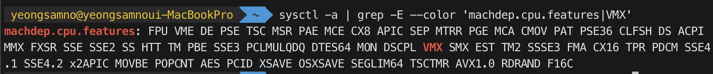
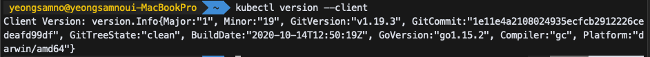
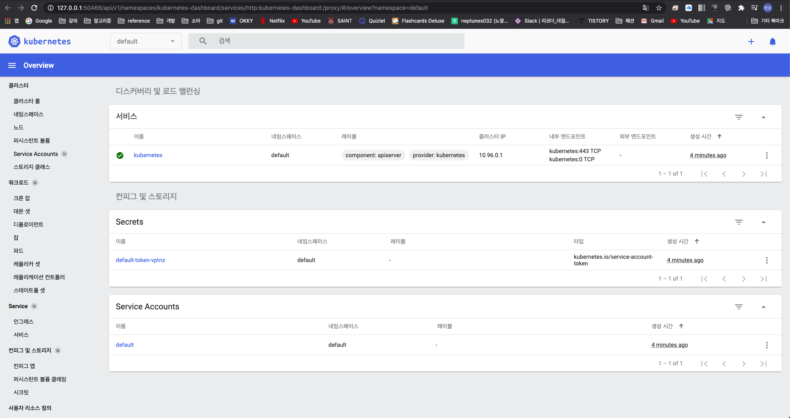

## 컨테이너 배포의 단점


## 쿠버네티스

> 쿠버네티스는 배포, 스케일링, 그리고 컨테이너화된 애플리케이션의 관리를 자동화 해주는 오픈 소스 컨테이너 오케스트레이션 엔진이다.

* 확장할 수 있는 표준화된 컨피그 파일을


## 왜 쿠버네티스가 필요한가?

* 컨테이너에 이상이 있거나 정지될 때 다시 시작시킬 필요가 있다.
  * 모니터링
  * 컨테이너 헬스 체크
  * 자동 재배포
* 트래픽이 많을 때 더 많은 컨테이너가 필요하다.
  * Autoscaling
* 트래픽을 분산시킬 필요가 있다.
  * Load Balancer


## 개발자가 할 일 / 쿠버네티스가 할 일

개발자

* 클러스터와 노드 인스턴스를 만든다.( master + worker node)
* API server, kubelet 등 필요한 서비스나 소프트웨어를 노드에 설치한다.
* Load Balancer, Filesystems 과 같이 추가적으로 필요한 리소스를 만든다.

쿠버네티스

* 오브젝트를 만들고 관리한다.
* pod을 모니터링하고 다시 만든다
* Pod을 scaling한다.


## pod

* 하나 이상의 어플리케이션 컨테이너와 그들의 리소스(volumes, IP, run config)를 가지고있다.

  * 하나의 container를 갖는 것이 권장된다.

* 쿠버네티스(Master Node)에 의해 생성되고 관리된다.

* 다른 pod와 리소스(volumes)를 공유 할 수 있다.

* Cluster-internal IP를 가지고 있다.

  * 클러스터 밖에서 접근 할 수 없다.
  * pod가 교체되면 IP 주소 또한 바뀐다.

* 한 pod에 포함된 container끼리  localhost를 통해 통신할 수 있다.

* pod는 수명이 짧다. 

  * 쿠버네티스는 필요에따라 pod를 시작하고 중지하고 교체한다.

  

## Worker Node

* docker
* kubelet
  * Master Node와 커뮤니케이션을 위해 필요함
* Kube-proxy
  * Node 와 Pod 의 네트워크 커뮤니케이션을 관리
* pod  


## Master Node

* Worker node 를 관리한다.
* API Server
  * Worker Node의 kubelet과 커뮤니케이션 한다.
* Scheduler
  * 새로운 pod을 어떤 Worker Node에서 실행시킬지 선택한다.
* Kube-Controller-Manager
  * Worker Node를 모니터링하고 제어한다.
  * pod의 수를 관리한다.


## Cluster

* 노드의 집합 
  * Worker Node : 컨테이너화된 애플리케이션을 실행한다.
  * Master Node: 다른 노드를 관리한다.


## Deployment(controller)

* pod들을 제어한다.  
  * 개발자가 직접 pod를 제어하지 않고 대신 Deployment를 사용해 원하는 상태를 유지시킨다.
* Deployment는 중지, 삭제, 롤백이 가능하다.
* Deployment는 스케일링 될 수 있다. 


## Services

* pod를 클러스터 또는 외부에서 접근할 수 있게 노출시켜준다.
* 변하지 않는 IP 주소를 가지고있다.


## kubectl

* 쿠버네티스 커맨드 라인 도구인 `kubectl` 사용하면 쿠버네티스 클러스터에 대해 명령을 실행할 수 있다.


## Imperative vs. Declarative

Imperative

* `kubectl create deployment`
* `docker run` 만 사용하는 것과 유사하다.

Declarative

* `kubectl apply -f config.yaml`

  * ```yaml
    #config.yaml
    apiVersion: apps/v1
    kind: Deployment
    metadata:
      name: second-app-deployment
    spec:
      replicas: 1
      selector:
        matchLabels:
          app: second-app
          tier: backend
      template:
        metadata:
          labels:
            app: second-app
            tier: backend
        spec:
          containers:
            - name: second-node
              image: neptunes032/kube-first-app:2
    
    ```

* `docker compose` 를 사용하는 것과 유사하다.


## 로컬에서 Minikube로 dummy cluster 만들기

Minikube

* vm을 활용해 로컬에서 kubenetes를 사용하고 테스트해 볼 수 있게 해주는 도구
* `minikube` 는 개인용 컴퓨터(윈도우, macOS 및 리눅스 PC 포함)에서 단일 노드 쿠버네티스 클러스터를 실행하여 쿠버네티스를 사용해보거나 일상적인 개발 작업을 수행할 수 있다.

1. 가상화가 가능한지 체크

```shell
sysctl -a | grep -E --color 'machdep.cpu.features|VMX'
```



2. install kubectl

```shell
brew install kubectl
# 설치 확인
kubectl version --client
```



3. virtualbox 설치

* https://www.virtualbox.org/wiki/Downloads

4. install minikube 및 cluster 구성
   * cluster를 구성해준다
   * Master node 와 worker node 를 만들어주고 필요한 소프트웨어도 설치된다.

```shell
brew install minikube
# cluster 만들기
minikube start --driver=virtualbox
minikube status
```

5. 대시보드 보기

```shell
# 대시보드 활설화
minikube dashboard
```



