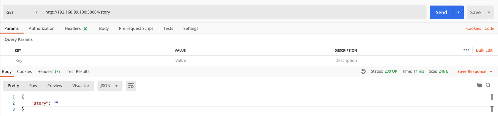
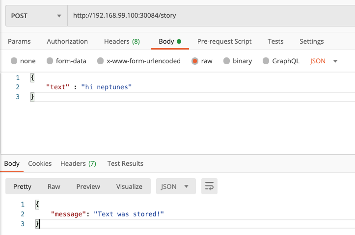
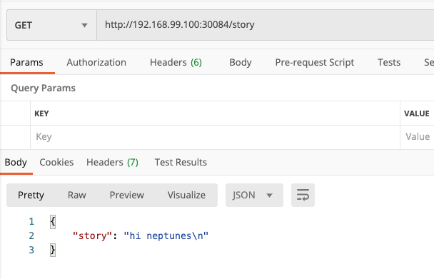
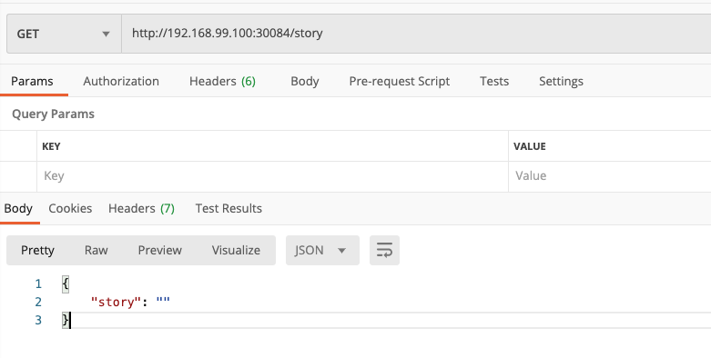
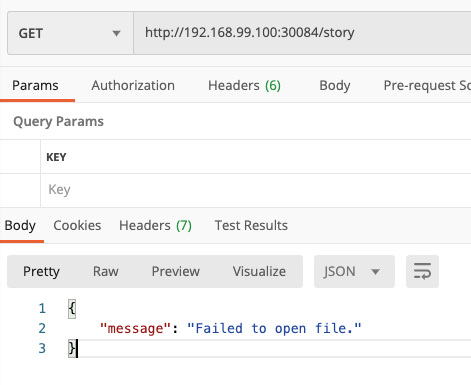
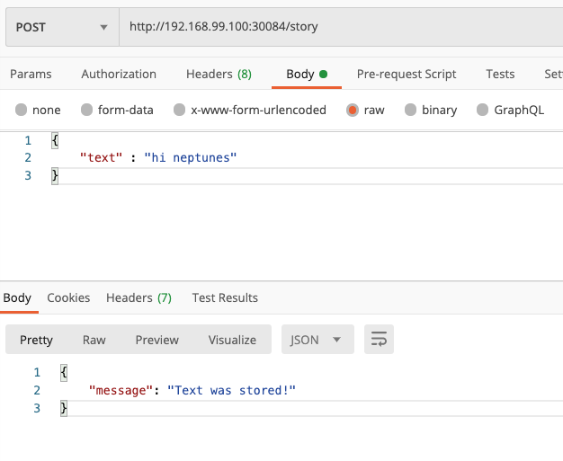
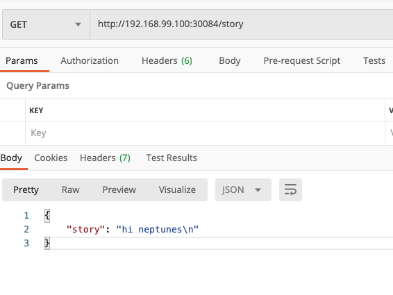

# kube-volume-starter

* 쿠버네티스 불륨 사용해보기
* 환경변수 사용해보기
* [깃허브 링크](https://github.com/raiders032/kube-volume-starter)


## Volume 적용 X

### Dockerfile로 이미지 빌드하기

1. `Dockerfile` 로 이미지 빌드

2. 도커 허브에 푸시

```dockerfile
#Dockerfile
FROM node:14-alpine

WORKDIR /app

COPY package.json .

RUN npm install

COPY . .

EXPOSE 3000

CMD [ "node", "app.js" ]
```

```shell
ls
Dockerfile          app.js              docker-compose.yaml service.yaml
README.md           deployment.yaml     package.json        story
# 도커 이미지 빌드
docker build -t neptunes032/kub-data-demo:1 .
# 도커 허브에 푸시
docker push neptunes032/kub-data-demo:1
```


### deployment.yaml 정의

```yaml
apiVersion: apps/v1
kind: Deployment
metadata:
  name: story-deployment
spec:
  replicas: 1
  selector:
    matchLabels:
      app: story
  template:
    metadata:
      labels:
        app: story
    spec:
      containers:
        - name: story
          image: neptunes032/kub-data-demo:1

```


### service.yaml 정의

```yaml
apiVersion: v1
kind: Service
metadata:
  name: story-service
spec:
  selector:
    app: story
  ports:
    - protocol: "TCP"
      port: 80
      targetPort: 3000
  type: LoadBalancer
 
```


### deployment 와 service 리소스 생성

```shell
# 리소스들 생성
kubectl apply -f deployment.yaml -f service.yaml

# 서비스 생성 확인
kubectl get service
NAME            TYPE           CLUSTER-IP       EXTERNAL-IP   PORT(S)        AGE
kubernetes      ClusterIP      10.96.0.1        <none>        443/TCP        4d1h
story-service   LoadBalancer   10.102.0.140     <pending>     80:30084/TCP   22h

minikube service story-service
|-----------|---------------|-------------|-----------------------------|
| NAMESPACE |     NAME      | TARGET PORT |             URL             |
|-----------|---------------|-------------|-----------------------------|
| default   | story-service |          80 | http://192.168.99.100:30084 |
|-----------|---------------|-------------|-----------------------------|
🎉  Opening service default/story-service in default browser...
```


### postman으로 동작 확인하기

1. GET http://192.168.99.100:30084/story




2. POST http://192.168.99.100:30084/story



3. GET http://192.168.99.100:30084/story



### 문제점

* 컨테이너를 재시작하면 데이터가 사라진다.

1. GET http://192.168.99.100:30084/story


2. GET http://192.168.99.100:30084/error

   * 앱을 종료시킨다
   * 쿠버네티스가 컨테이너 를 재시작한다.

   ```javascript
   app.get('/error', () =>{
     process.exit(1);
   })
   ```

   

3. GET http://192.168.99.100:30084/story

   * 컨테이너를 재시작하니 데이터가 사라졌다.




## emptyDir 적용하기

### emptyDir volume

* 해당 노드에서 실행중인 pod와 생명주기가 같다.
  * Pod가 제거되면 emptyDir volume 또한 영구적으로 제거된다.
* 초기에는 비어있다.
* 한 파드안에 있는 모든 컨테이너가 emptyDir volume의 같은 파일을 읽고 쓸 수 있다.

```yaml
apiVersion: apps/v1
kind: Deployment
metadata:
  name: story-deployment
spec:
  replicas: 1
  selector:
    matchLabels:
      app: story
  template:
    metadata:
      labels:
        app: story
    spec:
      containers:
        - name: story
          image: neptunes032/kub-data-demo:2
          volumeMounts:
            - mountPath: /app/story
              name: story-volume
      volumes:
        - name: story-volume
          emptyDir: {}
```

```shell
kubelctl apply
```


### postman으로 동작 확인하기

1. GET http://192.168.99.100:30084/story

   

2. POST http://192.168.99.100:30084/story

   

3. GET http://192.168.99.100:30084/story



4. GET http://192.168.99.100:30084/error

   * 컨테이너 재시작

5. GET http://192.168.99.100:30084/story

   * 컨터이너 재시작에도 데이터가 지워지지 않았다.

   

> **Note:** A container crashing does *not* remove a Pod from a node. The data in an `emptyDir` volume is safe across container crashes.

### emptyDir의 문제점

* pod에 종속적이다.
  * pod가 제거되면 emptyDir volume도 제거된다.

1. deployment.yaml 에서 repilcas를 2로 바꾼다.
2. GET http://192.168.99.100:30084/story
   * 정삭작동
3. GET http://192.168.99.100:30084/error
4. GET http://192.168.99.100:30084/story
   * 요청이 다른 pod으로 가기때문에 기존 데이터를 로드할 수 없다.


## hostPath 적용하기

### hostPath

* 호스트 노드의 파일이나 디렉토리를 `pod` 에 마운트 시킨다.

```yaml
apiVersion: apps/v1
kind: Deployment
metadata:
  name: story-deployment
spec:
  replicas: 2
  selector:
    matchLabels:
      app: story
  template:
    metadata:
      labels:
        app: story
    spec:
      containers:
        - name: story
          image: neptunes032/kub-data-demo:2
          volumeMounts:
            - mountPath: /app/story
              name: story-volume
      volumes:
        - name: story-volume
          hostPath:
            path: /data
            type: DirectoryOrCreate

```

```shell
kubectl apply -f deployment.yaml
```


### 동작 확인하기

1. GET http://192.168.99.100:30084/story
   * 정삭작동
2. GET http://192.168.99.100:30084/error
3. GET http://192.168.99.100:30084/story
   * 정상작동

```shell
$ minikube ssh
$ cat /data/text.txt
hi neptunes
```


### hostPath의 장점

* 호스트의 데이터를 컨테이너로 공유하고 싶을 때 유용하다.


### hostPath의 문제점

* 노드에 의존적이다.
  * pod들이 다른 노드들에서 실행될 경우 같은 데이터에 접근 할 수 없다.
  * 같은 노드에서 실행되는 pod끼리만 같은 데이터를 액세스 할 수 있다.


## Persistent Volumes 적용하기


### Persistent Volumes

* `pod` 와 `node` 와 독립적이다.
  * hostPath type은 node와 독립적이지 못하다.
  * 현재는 하나의 노드 환경이니 hostPath 타입을 사용한다.
  * [Persistent Volumes Type](https://kubernetes.io/docs/concepts/storage/persistent-volumes/#types-of-persistent-volumes)


### PersistenceVolume 리소스 생성

* host-pv.yaml 작성

```yaml
apiVersion: v1
kind: PersistentVolume
metadata:
  name: host-pv
spec:
  capacity:
    storage: 1Gi
  volumeMode: Filesystem
  storageClassName: standard
  accessModes:
    - ReadWriteOnce
  hostPath:
    path: /data
    type: DirectoryOrCreate

```

* ### Volume Mode

  *  `Filesystem` 와 `Block` 두가지를 지원한다.

* ### Access Modes

  * ReadWriteOnce: the volume can be mounted as read-write by a single node
  * ReadOnlyMany : the volume can be mounted read-only by many nodes
  * ReadWriteMany : the volume can be mounted as read-write by many nodes


### PersistenceVolumeClaim 리소스 생성

* host-pvc.yaml작성

```yaml
apiVersion: v1
kind: PersistentVolumeClaim
metadata:
  name: host-pvc
spec:
  volumeName: host-pv
  accessModes:
    - ReadWriteOnce
  storageClassName: standard
  resources:
    requests:
      storage: 1Gi

```


### Deployment.yaml 수정하기

```yaml
apiVersion: apps/v1
kind: Deployment
metadata:
  name: story-deployment
spec:
  replicas: 2
  selector:
    matchLabels:
      app: story
  template:
    metadata:
      labels:
        app: story
    spec:
      containers:
        - name: story
          image: neptunes032/kub-data-demo:2
          volumeMounts:
            - mountPath: /app/story
              name: story-volume
      volumes:
        - name: story-volume
          persistentVolumeClaim:
            claimName: host-pvc

```

```bash
 $ kubectl apply -f host-pv.yaml -f host-pvc.yaml -f deployment.yaml
 $ kubectl get pv
 NAME      CAPACITY   ACCESS MODES   RECLAIM POLICY   STATUS   CLAIM              STORAGECLASS   REASON   AGE
host-pv   1Gi        RWO            Retain           Bound    default/host-pvc   standard                2m46s
$ kubectl get pvc
NAME       STATUS   VOLUME    CAPACITY   ACCESS MODES   STORAGECLASS   AGE
host-pvc   Bound    host-pv   1Gi        RWO            standard       3m8s
```

### 동작 확인하기

1. GET http://192.168.99.100:30084/story
   * 정삭작동
2. GET http://192.168.99.100:30084/error
3. GET http://192.168.99.100:30084/story
   * 정상작동


## Volume vs Persistent Volume

### volume

* 데이터를 영속화 할 수 있다.
  * 컨테이너 재시작이나 제거해도 volume는 사라지지 않는다.
* `pod` 에 종속적이다.
  * `pod` 를 제거하면 `volume` 도 사라진다.
* `pod` 와 함께 정의되고 생성된다.

### Persistent volume

* 데이터를 영속화 할 수 있다.
* `pod` 와 `node` 에 독립적이다.
  * `Persistent volume`독립적인 클러스트 리소스이다.
* 독립적으로 생성이 가능하다.


___


# 환경변수 사용해보기

app.js 코드 변경

```javascript
# const filePath = path.join(__dirname, 'story', 'text.txt'); 어래와 같이 변경
const filePath = path.join(__dirname, process.env.STORY_FOLDER, 'text.txt');
```

1. deployment.yaml 수정하기

```yaml
apiVersion: apps/v1
kind: Deployment
metadata:
  name: story-deployment
spec:
  replicas: 2
  selector:
    matchLabels:
      app: story
  template:
    metadata:
      labels:
        app: story
    spec:
      containers:
        - name: story
          image: neptunes032/kub-data-demo:2
          env:
            - name: STORY_FOLDER
              value: "story"
          volumeMounts:
            - mountPath: /app/story
              name: story-volume
      volumes:
        - name: story-volume
          persistentVolumeClaim:
            claimName: host-pvc

```

2. 적용하기

```shell
kubectl apply -f deployment.yaml
```


### ConfigMap 리소스 생성

1. Environment.yaml 작성

```yaml
apiVersion: v1
kind: ConfigMap
metadata:
  name: data-store-env
data:
  folder: "story"

```

2. 리소스 생성

```shell
$ kubectl apply -f environment.yaml
$ kubectl get configmap
NAME             DATA   AGE
data-store-env   1      32s
```

3. deployment.yaml 수정하고 적용하기

```yaml
apiVersion: apps/v1
kind: Deployment
metadata:
  name: story-deployment
spec:
  replicas: 2
  selector:
    matchLabels:
      app: story
  template:
    metadata:
      labels:
        app: story
    spec:
      containers:
        - name: story
          image: neptunes032/kub-data-demo:2
          env:
            - name: STORY_FOLDER
              valueFrom:
                configMapKeyRef:
                  name: data-store-env
                  key: folder
          volumeMounts:
            - mountPath: /app/story
              name: story-volume
      volumes:
        - name: story-volume
          persistentVolumeClaim:
            claimName: host-pvc

```

```
kubectl apply -f deployment.yaml
```

