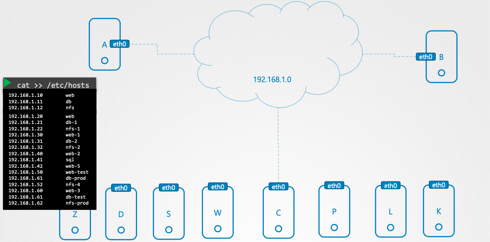

# 1 Networking


# 2 Switching

- 두 개의 컴퓨터가 있을 때 어떻게 컴퓨터 A 가 컴퓨터 B에 접근할 수 있을까?
- 두 컴퓨터가 통신하기 위해선 스위치가 필요하다
- 또한 각각의 컴퓨터마다 네트워크 인터페이스가 필요하다
- 호스트의 네트워크 인터페이스는 `ip link` 명령어로 확인할 수 있다.


**ip link**

- 네트워크 인터페이스 en7을 볼 수 있다.

```bash
$ ip link
en7: flags=8863<UP,BROADCAST,SMART,RUNNING,SIMPLEX,MULTICAST> mtu 1500
	options=6467<RXCSUM,TXCSUM,VLAN_MTU,TSO4,TSO6,CHANNEL_IO,PARTIAL_CSUM,ZEROINVERT_CSUM>
	ether 45:4b:a0:18:g6:6e
	nd6 options=201<PERFORMNUD,DAD>
	media: autoselect (1000baseT <full-duplex,flow-control,energy-efficient-ethernet>)
	status: active
```


**스위치**

- 스위치는 같은 네트워크에 있는 컴퓨터 끼리의 통신을 가능하게 한다.
- 다른 네트워크의 컴퓨터와 통신하려면 라우터가 필요하다.


# 3 Gateway

- 같은 네트워크 상의 통신은 스위치를 통해 가능했다
- 컴퓨터B가 다른 네트워크의 컴퓨터C와 통신하려면 라우터가 필요하기 때문에 컴퓨터B는 라우터의 위치를 알아야한다.
- 이 처럼 다른 네트워크와 연결시켜주는 라우터를 Gateway라고 하며  `ip route` 명령어로 확인 할 수 있다.


**예시**


- 컴퓨터B와 컴퓨터C는 같은 네트워크가 아니다.
- 따라서 컴퓨터B가 컴퓨터C에게 메시지를 전달하려면 Gateway가 필요하다.
- 컴퓨터B의 Gateway의 주소는 `192.168.1.1`이다
- `ip route` 명령어로 라우팅 테이블을 볼 수 있다.
- 게이트웨이 설정이 안된경우 아래와 같이 게이트웨이를 설정할 수 있다.
  - `ip route add 192.168.2.0/24 via 192.168.1.1`
  - `192.168.2.0/24` 네트워크로 전송되는 메시지는 `192.168.1.1` 게이트웨이로 라우팅하는 명령이다.


`ip route`

- 라우팅 테이블을 보여준다.
- defaultGateway로 `192.168.155.1`이 지정되었다.
- 어디로 라우팅 해야될지 모르는 경우 defaultGateway로 라우팅 된다.
- defaultGateway는 일치하는 네트워크가 없는 경우 사용할 기본 게이트웨이를 의미한다.

```bash
$ ip route
default via 192.168.155.1 dev en7
127.0.0.0/8 via 127.0.0.1 dev lo0
127.0.0.1/32 via 127.0.0.1 dev lo0
169.254.0.0/16 dev en7  scope link
192.168.155.0/24 dev en7  scope link
192.168.155.1/32 dev en7  scope link
192.168.155.67/32 dev en7  scope link
224.0.0.0/4 dev en7  scope link
255.255.255.255/32 dev en7  scope link
```


# 4 hosts file


- 컴퓨터 A가 컴퓨터B의 실행되고 있는 데이터베이스와 통신하고 있다.
- 두 컴퓨터는 같은 네트워크에 속하고 IP 주소는 각각 `192.168.1.10`, `192.168.1.11 `이다


컴퓨터 A에서 컴퓨터 B의 아이피 주소로 통신하면 잘 된다.


컴퓨터 A에서 컴퓨터 B와 db라는 도메인 이름으로 통신하고 싶다. 하지만 아래처럼 실패한다.


`/etc/hosts` 파일에 `192.168.1.11 db` 을 한줄 추가하면 통신이 성공한다.


## 4.1 hosts file의 단점

- 호스트 네임을 IP 주소로 변환하는 방식은 `Name Resolution`이라고 한다.

- 작은 네트워크상에서 이렇게 호스트 파일을 통해 `Name Resolution`이 가능할 수 있지만 네트워크가 커지면 관리가 어려워진다.


**컴퓨터가 3개인 네트워크**


네트워크가 커지면 그만큼 hosts파일의 엔트리가 많아지고 관리가 어려워진다. 하나의 서버가 IP 주소가 바뀌면 네트워크에 존재하는 모든 서버의 hosts파일을 수정해야 한다.



따라서 hosts 파일을 사용해 모든 노드가 각자 관리하는 것이 아니라 Name Resolution 기능을 담당하는 중앙집중화된 서버가 필요해졌다. 이 중앙 집중화된 서버가 DNS다. 우리는 도메인을 IP 주소로 변환하는 Name Resolution기능이 필요할 때 이 DNS 서버에 물어보기만 하면 된다.


# 5 Network Namespace

- 네트워크 네임스페이스는 프로세스 간에 네트워크 환경을 격리할 수 있는 매우 강력한 기능들을 제공한다.
- 리눅스에서는 이 가상 인터페이스를 veth(Virtual Ethernet Device)라고 부르며 `ip` 명령어로 생성하는 것이 가능합니다.
- 컨테이너를 생성할 때 네트워크 네임스페이스를 통해 다른 환경과 격리된 가상의 인터페이스, 라우팅 테이블, ARP 테이블등을 갖는다.


## 5.1 Namespace 생성

```bash
# red 네트워크 인터페이스 생성
$ ip netns add red
$ ip netns add blue

# 네트워크 네임스페이스 확인
$ ip netns
blue
red
```


## 5.2 격리상태 확인

**네트워크 인터페이스 확인**

- 호스트의 네트워크 인터페이스를 확인하고 각각의 네임스페이스의 네트워크 인터페이스 확인하면 네트워크가 격리됨을 알 수 있다
- 네트워크 네임스페이스의 네트워크 인터페이스를 조회하면 LOOPBACK 인터페이스를 제외하고 다른 인터페이스가 없다.

```bash
$ ip link
1: lo: <LOOPBACK,UP,LOWER_UP> mtu 65536 qdisc noqueue state UNKNOWN mode DEFAULT group default qlen 1000
    link/loopback 00:00:00:00:00:00 brd 00:00:00:00:00:00
2: eno1: <BROADCAST,MULTICAST,UP,LOWER_UP> mtu 1500 qdisc fq_codel state UP mode DEFAULT group default qlen 1000
    link/ether b4:2e:99:ce:db:e0 brd ff:ff:ff:ff:ff:ff
    altname enp0s31f6
3: docker0: <NO-CARRIER,BROADCAST,MULTICAST,UP> mtu 1500 qdisc noqueue state DOWN mode DEFAULT group default
    link/ether 02:42:b6:16:d8:8a brd ff:ff:ff:ff:ff:ff
4: flannel.1: <BROADCAST,MULTICAST,UP,LOWER_UP> mtu 1450 qdisc noqueue state UNKNOWN mode DEFAULT group default
    link/ether 1e:da:0f:74:b9:32 brd ff:ff:ff:ff:ff:ff
5: cni0: <BROADCAST,MULTICAST,UP,LOWER_UP> mtu 1450 qdisc noqueue state UP mode DEFAULT group default qlen 1000
    link/ether ea:d1:1b:2b:41:f0 brd ff:ff:ff:ff:ff:ff
7: veth23f0bd56@if3: <BROADCAST,MULTICAST,UP,LOWER_UP> mtu 1450 qdisc noqueue master cni0 state UP mode DEFAULT group default
    link/ether e6:34:b0:57:3b:8d brd ff:ff:ff:ff:ff:ff link-netns cni-f19ccce1-8e3a-5c5f-0f72-c996e35d3a2b
```

```bash
$ ip -n red link
1: lo: <LOOPBACK> mtu 65536 qdisc noop state DOWN mode DEFAULT group default qlen 1000
    link/loopback 00:00:00:00:00:00 brd 00:00:00:00:00:00
```

```bash
$ ip -n blue link
1: lo: <LOOPBACK> mtu 65536 qdisc noop state DOWN mode DEFAULT group default qlen 1000
    link/loopback 00:00:00:00:00:00 brd 00:00:00:00:00:00
```


**ARP 테이블 확인**

```bash
# 호스트의 ARP 테이블 확인
$ arp
Address                  HWtype  HWaddress           Flags Mask            Iface
192.168.154.2            ether   61:9c:9f:47:61:10   C                     eno1
10.244.4.0               ether   c3:b6:ac:d3:8c:b8   CM                    flannel.1
10.244.1.2                       (incomplete)                              cni0

# 두 네임스페이스의 ARP 테이블은 비어있다.
$ ip netns exec red arp
$ ip netns exec blue arp
```


**라우팅 테이블 확인**

```bash
# 호스트 라우팅 테이블 확인
$ route
Kernel IP routing table
Destination     Gateway         Genmask         Flags Metric Ref    Use Iface
default         _gateway        0.0.0.0         UG    100    0        0 eno1
10.244.0.0      10.244.0.0      255.255.255.0   UG    0      0        0 flannel.1

# 네임스페이스 확인
$ ip netns exec red route
Kernel IP routing table
Destination     Gateway         Genmask         Flags Metric Ref    Use Iface

$ ip netns exec blue route
Kernel IP routing table
Destination     Gateway         Genmask         Flags Metric Ref    Use Iface
```


## 5.3 네임스페이스 연결


먼저 두개의 네트워크 인터페이스를 연결하는 파이프 만든다.

```bash
$ ip link add veth-red type veth peer name veth-blue
```


두개의 인터페이스를 각각의 네임스페이스에 할당한다.

```bash
$ ip link set veth-red netns red
$ ip link set veth-blue netns blue
```


각각의 인터페이스에 Ip 주소를 할당한다.

````bash
$ ip -n red addr add 192.168.15.1/24 dev veth-red
$ ip -n blue addr add 192.168.15.2/24 dev veth-blue
````


인터페이스의 상태를 UP 시켜준다,

```bash
$ ip -n red  link set veth-red up
$ ip -n blue  link set veth-blue up

# ping으로 통신한다.
$ ip netns exec red ping 192.168.15.2
PING 192.168.15.2 (192.168.15.2) 56(84) bytes of data.
64 bytes from 192.168.15.2: icmp_seq=1 ttl=64 time=0.022 ms
64 bytes from 192.168.15.2: icmp_seq=2 ttl=64 time=0.043 ms
64 bytes from 192.168.15.2: icmp_seq=3 ttl=64 time=0.042 ms
64 bytes from 192.168.15.2: icmp_seq=4 ttl=64 time=0.042 ms
```

**ARP 테이블 확인**

```bash
$ ip netns exec red arp
Address                  HWtype  HWaddress           Flags Mask            Iface
192.168.15.2             ether   2a:00:72:80:33:24   C                     veth-red
$ ip netns exec blue arp
Address                  HWtype  HWaddress           Flags Mask            Iface
192.168.15.1             ether   e6:00:14:0d:07:71   C                     veth-blue
```


**인터페이스 삭제**

```bash
# 한쪽만 삭제하면 나머지 한쪽은 자동 삭제됨
$ ip -n red link del veth-red
```


# 6 BRIDGE

- 앞선 예시에서 두 네임스페이스를 연결해봤다.
- 만약 네임스페이스가 더 많다면 어떻게 해야될까?
  - 호스트 안에 가상 네트워크를 만들면 된다.
  - 즉 가상 스위치를 만들고 네임스페이스를 연결하면 된다.
- 호스트 상에서 가상 스위치를 만드는 방법은 여러가지가 있지만 Linux의 BRIDGE를 알아보자.


## 6.1 브리지 실습


**bridge 타입의 네트워크 인터페이스 생성**

```bash
$ ip link add v-net-0 type bridge
```


**네트워크 인터페이스 확인**

- 호스트의 네트워크 인터페이스가 아래와 같이 추가됨

```bash
$ ip link
10: v-net-0: <BROADCAST,MULTICAST> mtu 1500 qdisc noop state DOWN mode DEFAULT group default qlen 1000
    link/ether 5e:02:45:c0:34:79 brd ff:ff:ff:ff:ff:ff
```


**파이프 만들기**


- 네임스페이스와 브릿지를 연결할 파이프를 만든다.

```bash
$ ip link add veth-red type veth peer name veth-red-br
$ ip link add veth-blue type veth peer name veth-blue-br

# 총 5개의 네트워크 인터페이스가 생겼다.
$ ip link
10: v-net-0: <BROADCAST,MULTICAST> mtu 1500 qdisc noop state DOWN mode DEFAULT group default qlen 1000
    link/ether 5e:02:45:c0:34:79 brd ff:ff:ff:ff:ff:ff
15: veth-red-br@veth-red: <BROADCAST,MULTICAST,M-DOWN> mtu 1500 qdisc noop state DOWN mode DEFAULT group default qlen 1000
    link/ether c2:0f:43:a6:1a:34 brd ff:ff:ff:ff:ff:ff
16: veth-red@veth-red-br: <BROADCAST,MULTICAST,M-DOWN> mtu 1500 qdisc noop state DOWN mode DEFAULT group default qlen 1000
    link/ether e6:00:14:0d:07:71 brd ff:ff:ff:ff:ff:ff
17: veth-blue-br@veth-blue: <BROADCAST,MULTICAST,M-DOWN> mtu 1500 qdisc noop state DOWN mode DEFAULT group default qlen 1000
    link/ether 62:a2:2a:c3:19:af brd ff:ff:ff:ff:ff:ff
18: veth-blue@veth-blue-br: <BROADCAST,MULTICAST,M-DOWN> mtu 1500 qdisc noop state DOWN mode DEFAULT group default qlen 1000
    link/ether 2a:00:72:80:33:24 brd ff:ff:ff:ff:ff:ff
```


**네트워크 인터페이스**


- 한쪽은 네임스페이스에 한쪽은 브리지에 연결한다.

```bash
$ ip link set veth-red netns red
$ ip link set veth-red-br master v-net-0
$ ip link set veth-blue netns blue
$ ip link set veth-blue-br master v-net-0
$ ip -n red link set veth-red up
$ ip -n blue link set veth-blue up
```


**네트워크 인터페이스에 IP 주소 할당**

```bash
$ ip -n red addr add 192.168.15.1/24 dev veth-red
$ ip -n blue addr add 192.168.15.2/24 dev veth-blue
```


