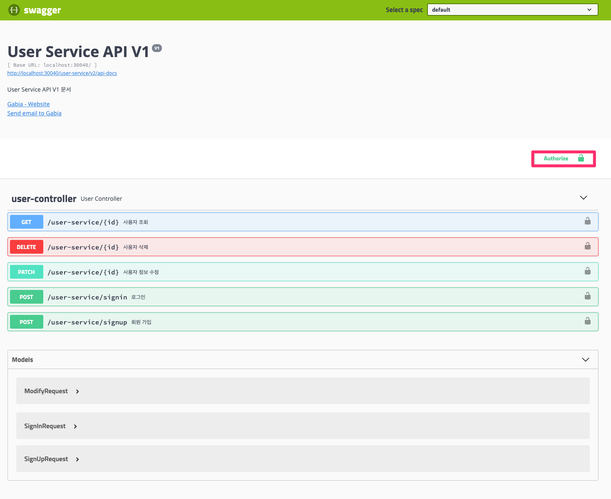
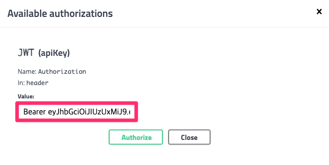
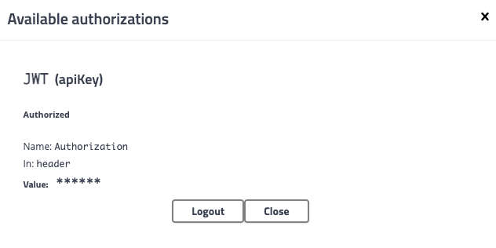

# 스웨거에서 JWT 사용하기


## 디펜던시

```xml
<dependency>
    <groupId>org.springframework.boot</groupId>
    <artifactId>spring-boot-starter-web</artifactId>
</dependency>
<dependency>
    <groupId>io.springfox</groupId>
    <artifactId>springfox-boot-starter</artifactId>
    <version>3.0.0</version>
</dependency>
```


## 스웨거 설정

```java
import org.springframework.context.annotation.Bean;
import org.springframework.context.annotation.Configuration;
import springfox.documentation.builders.PathSelectors;
import springfox.documentation.builders.RequestHandlerSelectors;
import springfox.documentation.service.*;
import springfox.documentation.spi.DocumentationType;
import springfox.documentation.spi.service.contexts.SecurityContext;
import springfox.documentation.spring.web.plugins.Docket;
import springfox.documentation.swagger2.annotations.EnableSwagger2;

import java.util.Arrays;
import java.util.Collections;
import java.util.List;

@Configuration
@EnableSwagger2
public class SwaggerConfig {
    
    @Bean
    public Docket api() {
        return new Docket(DocumentationType.SWAGGER_2)
                .apiInfo(apiInfo())
                .securityContexts(Arrays.asList(securityContext()))
                .securitySchemes(Arrays.asList(apiKey()))
                .select()
                .apis(RequestHandlerSelectors.any())
                .paths(PathSelectors.any())
                .build();
    }

    private ApiInfo apiInfo() {
        return new ApiInfo(
                "My REST API",
                "Some custom description of API.",
                "1.0",
                "Terms of service",
                new Contact("Sallo Szrajbman", "www.baeldung.com", "salloszraj@gmail.com"),
                "License of API",
                "API license URL",
                Collections.emptyList());
    }
    
    private ApiKey apiKey() {
        return new ApiKey("JWT", "Authorization", "header");
    }

    private SecurityContext securityContext() {
        return SecurityContext.builder().securityReferences(defaultAuth()).build();
    }

    private List<SecurityReference> defaultAuth() {
        AuthorizationScope authorizationScope = new AuthorizationScope("global", "accessEverything");
        AuthorizationScope[] authorizationScopes = new AuthorizationScope[1];
        authorizationScopes[0] = authorizationScope;
        return Arrays.asList(new SecurityReference("JWT", authorizationScopes));
    }
}

```


## Swagger에서 JWT token 사용하기







참고

* https://www.baeldung.com/spring-boot-swagger-jwt