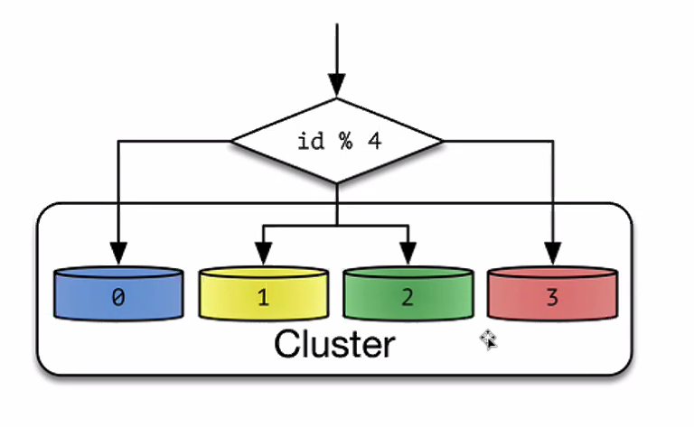
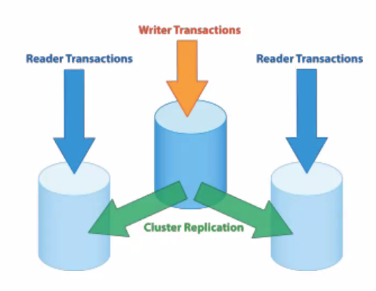

가용성

확장성


읽기와 쓰기를 나눠야한다.

SPOF를 방지하기위해 최소 두개로 구성함 -> 이중화

DB 튜닝 -> IO를 테이블에서 균등하게 나누는게 중요하다

파티셔닝

* 데이터가 어떤 샤드에 저장되는 가?

* 나머지로 샤드를 나눈다.

  

* Range based partitioning

* 해시함수로 샤드를 나눈다.

1. horizental paritioning
   * Sharing 2개로 나누면 샤드가 2개다. 
   * io처리량이 부족할 때 쪼갠다.
2. vertical partitioning
   * 이미지같은 큰 필드를 따로 나눈다.

nosql

* 컴퓨팅 환경의 변화 scale up -> scale out
* Cap 이론
  * 두가지 속성만 만족 시킬 수 있다.
  * Consistency
  * Availability
  * PartitionTolerance
    * 네트워크 장애
* mongodb
  * 쓰기가 3배 빠르다 mysql
  * 읽기가 2배 느리다

master slave



* 쓰기 후 slave에 복제
  * real real time
* 쓰기가 많으면
  * 마스터 마스터 구조도 가능하다.
* 읽기가 많으면
  * 마스터 슬래이브 구조로


mysql

* proxy mysql


OLTP

*  많은 읽기를 위한 구조

OLAP

* 많은 쓰기를 위한 구조

cache

* 두가지 방식 A, B타입
* B타입
  * 레디스를 잘 사용해야 된다.
  * 자료형을 잘 사용하면 성능을 높일 수 있다.

레디스

* 먼저 레디스에 캐시되어 있는지 확인 후 DB로

인덱스

* 주기적으로 DB 인덱싱을 해야된다
* 새벽시간이 사람이 적을 때

hyperloglog

* DAU, MAU를 뽑을 때 쓴다
* 풀 스캔을 피하고 근사치를 추정한다.

이미지, 영상 파일 저장

* 로컬에 저장하는 일 없다
* cloud front도 잘 안쓴다
* Akamai
* 한국에서만 서비스 한다. -> LG U+ CDN

Proxy

* Forward 
* reverse
* Nginx, haproxy

Queue

* 업도적으로 쓰기가 많은 경우
  * 큐에 넣고 나중에 처리해도 된다.
* 예) 열차 예매할 때 앞에 몇분 남았다
  * api를 리다이렉트 시켜준다.


```
plugins {
    id 'org.springframework.boot' version '2.4.7'
    id 'io.spring.dependency-management' version '1.0.11.RELEASE'
    id 'java'
    id 'jacoco'
}

group = 'com.gabia'
version = '0.0.1-SNAPSHOT'
sourceCompatibility = '11'

configurations {
    compileOnly {
        extendsFrom annotationProcessor
    }
}

repositories {
    mavenCentral()
}

jacoco {
    toolVersion = "0.8.7"
}

ext {
    set('springCloudVersion', "2020.0.3")
}

dependencies {
    //jwt
    implementation group: 'io.jsonwebtoken', name: 'jjwt', version: '0.9.1'
    implementation group: 'javax.xml.bind', name: 'jaxb-api'
    
    implementation 'org.springframework.cloud:spring-cloud-starter-gateway'
    implementation 'org.springframework.cloud:spring-cloud-starter-netflix-eureka-client'

    // config
    implementation 'org.springframework.cloud:spring-cloud-starter-config'
    implementation 'org.springframework.cloud:spring-cloud-starter-bootstrap'

    // lombok
    annotationProcessor 'org.projectlombok:lombok'
    compileOnly 'org.projectlombok:lombok'
    testCompileOnly 'org.projectlombok:lombok'
    testAnnotationProcessor 'org.projectlombok:lombok'

    // swagger
    implementation group: 'io.springfox', name: 'springfox-swagger2', version: '2.9.2'
    implementation group: 'io.springfox', name: 'springfox-swagger-ui', version: '2.9.2'

    // test
    testImplementation 'org.springframework.boot:spring-boot-starter-test'
    testImplementation 'org.springframework.cloud:spring-cloud-starter-contract-stub-runner'
}

dependencyManagement {
    imports {
        mavenBom "org.springframework.cloud:spring-cloud-dependencies:${springCloudVersion}"
    }
}

test {
    useJUnitPlatform()
    finalizedBy 'jacocoTestReport'
}

jacocoTestReport {
    reports {
        html.enabled true
        xml.enabled true
        csv.enabled true
        xml.destination file("$buildDir/jacoco/jacoco.xml")
    }

    finalizedBy 'jacocoTestCoverageVerification'
}

jacocoTestCoverageVerification {
    violationRules {
        rule {
            enabled = true
            element = 'CLASS'
            // includes = []

            limit {
                counter = 'LINE'
                value = 'COVEREDRATIO'
                minimum = 0.70
            }

            excludes = ['com.gabia.apigateway.ApiGatewayApplication',
                        'com.gabia.apigateway.configuration.SwaggerHandler',
                        'com.gabia.apigateway.configuration.SwaggerProvider',
                        'com.gabia.apigateway.filter.*',
                        'com.gabia.apigateway.util.*']
        }
    }
}
```
